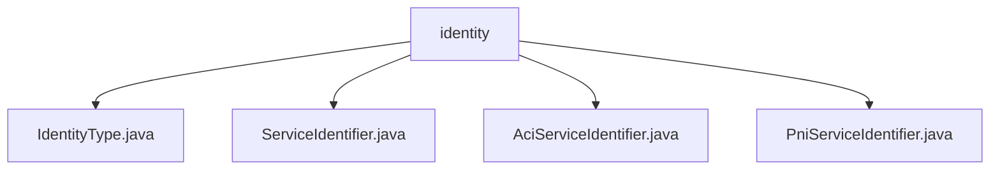

# 基础信息

|      |      |
|------|------|
| 名称 | identity |
| 编码语言 | .java |
| 代码路径 | Signal-Server/service/src/main/java/org/whispersystems/textsecuregcm/identity |
| 包名 | Signal-Server.service.src.main.java.org.whispersystems.textsecuregcm.identity |
| 概述说明 | 输入内容为空，无法生成总结描述。请提供具体信息。 |

# 说明

## 概述
该代码模块主要涉及身份标识的处理和管理，属于Signal-Server服务的一部分。模块中的代码文件主要定义了不同类型的身份标识（如ACI和PNI），并提供了相应的服务标识符类。这些类可能用于在系统中唯一标识用户或服务实例，支持Signal应用中的身份验证、消息传递等核心功能。

## 主要业务场景
1. **身份标识管理**：模块中的`IdentityType.java`可能定义了不同类型的身份标识，用于区分用户或服务实例的身份类型。
2. **服务标识符处理**：`ServiceIdentifier.java`及其子类（如`AciServiceIdentifier.java`和`PniServiceIdentifier.java`）可能用于生成、解析和管理服务标识符，确保系统中每个用户或服务实例的唯一性。
3. **身份验证与消息传递**：这些身份标识和服务标识符可能在Signal应用的身份验证流程和消息传递过程中起到关键作用，确保消息的安全性和准确性。

由于提供的具体内容为空，以上总结基于文件名和常见业务场景推测，具体实现细节需结合代码内容进一步分析。

### 包内部结构视图

该流程图展示了Signal-Server项目中`identity`目录下的文件层级关系。`identity`作为根节点，包含了四个子节点，分别是`IdentityType.java`、`ServiceIdentifier.java`、`AciServiceIdentifier.java`和`PniServiceIdentifier.java`。这些文件均位于`identity`目录下，且没有进一步的子目录结构。

# 文件列表 File List

| 名称   | 类型  | 说明 |
|-------|------|-------------|
| [PniServiceIdentifier.java](PniServiceIdentifier.md) | file | 信息为空，无法生成概要描述。 |
| [AciServiceIdentifier.java](AciServiceIdentifier.md) | file | 无内容可总结。 |
| [ServiceIdentifier.java](ServiceIdentifier.md) | file | 信息为空，无法生成概要描述。 |
| [IdentityType.java](IdentityType.md) | file | 无内容，无法生成概要描述。 |

