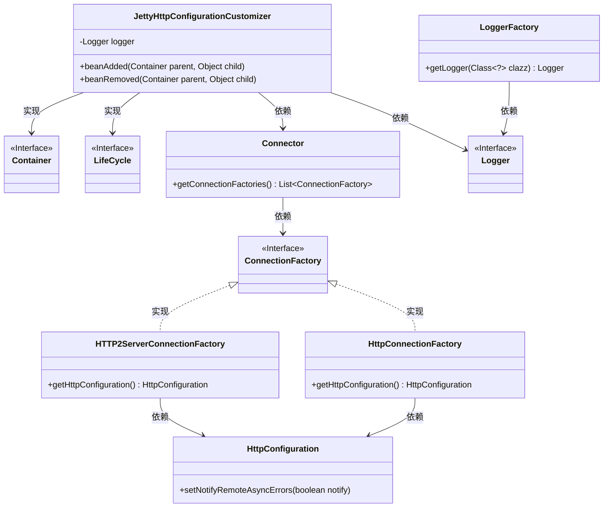
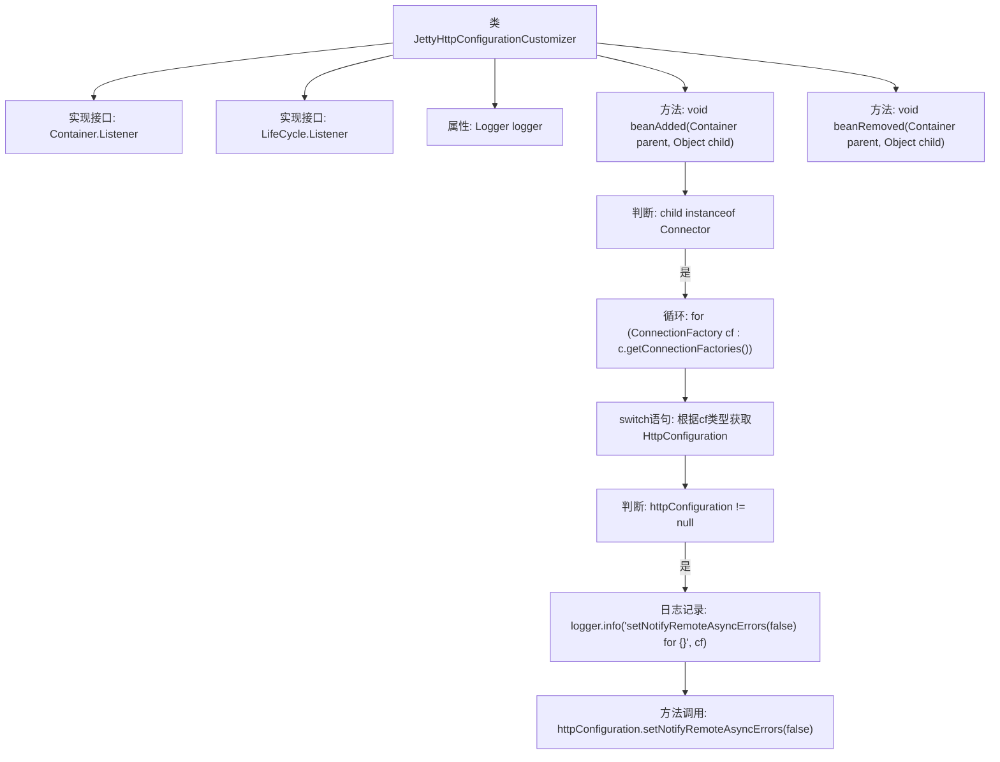

# 基础信息

|      |      |
|------|------|
| 名称 | JettyHttpConfigurationCustomizer |
| 编码语言 | .java |
| 代码路径 | Signal-Server/service/src/main/java/org/whispersystems/textsecuregcm/jetty/JettyHttpConfigurationCustomizer.java |
| 包名 | org.whispersystems.textsecuregcm.jetty |
| 依赖项 | ['org.eclipse.jetty.http2.server.HTTP2ServerConnectionFactory', 'org.eclipse.jetty.server.ConnectionFactory', 'org.eclipse.jetty.server.Connector', 'org.eclipse.jetty.server.HttpConfiguration', 'org.eclipse.jetty.server.HttpConnectionFactory', 'org.eclipse.jetty.util.component.Container', 'org.eclipse.jetty.util.component.LifeCycle', 'org.slf4j.Logger', 'org.slf4j.LoggerFactory'] |
| 概述说明 | JettyHttpConfigurationCustomizer类禁止远程异步错误通知。 |

# 说明

JettyHttpConfigurationCustomizer类的主要功能是自定义Jetty HTTP配置，其核心作用是禁用远程异步错误通知。通过该类，用户可以对Jetty服务器的HTTP行为进行细粒度控制，确保不向远程客户端发送异步错误信息，从而增强系统的安全性和隐私保护。

# 类列表 Class Summary

| 名称   | 类型  | 说明 |
|-------|------|-------------|
| JettyHttpConfigurationCustomizer | class | JettyHttpConfigurationCustomizer类用于自定义Jetty HTTP配置，禁止远程异步错误通知。 |

## 类 JettyHttpConfigurationCustomizer

|      |      |
|------|------|
| 访问范围 | public |
| 类型 | class |
| 名称 | JettyHttpConfigurationCustomizer |
| 说明 | JettyHttpConfigurationCustomizer类用于自定义Jetty HTTP配置，禁止远程异步错误通知。 |

### UML类图

### 描述
`JettyHttpConfigurationCustomizer` 类实现了 `Container.Listener` 和 `LifeCycle.Listener` 接口，用于监听容器的生命周期事件。该类通过 `beanAdded` 方法在容器中添加 `Connector` 时，检查其 `ConnectionFactory`，并根据不同类型的 `ConnectionFactory` 获取 `HttpConfiguration` 对象，然后设置 `NotifyRemoteAsyncErrors` 为 `false`。`Logger` 用于记录日志信息，`LoggerFactory` 用于获取 `Logger` 实例。类图展示了各个类之间的依赖关系和接口实现关系。

### 内部方法调用关系图

**描述：**
这段代码定义了一个名为 `JettyHttpConfigurationCustomizer` 的类，实现了 `Container.Listener` 和 `LifeCycle.Listener` 接口。类中包含两个主要方法：`beanAdded` 和 `beanRemoved`。`beanAdded` 方法在检测到 `child` 是 `Connector` 类型时，遍历其 `ConnectionFactory` 列表，通过 `switch` 语句获取 `HttpConfiguration` 对象，并在其不为 `null` 时调用 `setNotifyRemoteAsyncErrors(false)` 方法，同时记录日志。`beanRemoved` 方法目前为空实现。

### 字段列表 Field List

| 名称  | 类型  | 说明 |
|-------|-------|------|
| logger = LoggerFactory.getLogger(JettyHttpConfigurationCustomizer.class) | Logger | JettyHttpConfigurationCustomizer类中定义了一个静态的日志记录器。 |

### 方法列表 Method List

| 名称  | 类型  | 说明 |
|-------|-------|------|
| beanRemoved | void | 重写beanRemoved方法，处理容器中对象移除事件。 |
| beanAdded | void | 方法`beanAdded`在子对象为`Connector`时，遍历其连接工厂，设置HTTP配置的远程异步错误通知为false。 |

