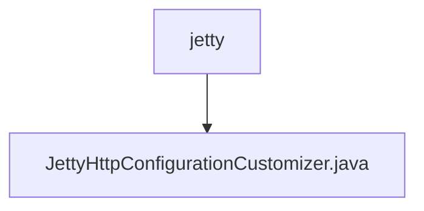

# 基础信息

|      |      |
|------|------|
| 名称 | jetty |
| 编码语言 | .java |
| 代码路径 | Signal-Server/service/src/main/java/org/whispersystems/textsecuregcm/jetty |
| 包名 | Signal-Server.service.src.main.java.org.whispersystems.textsecuregcm.jetty |
| 概述说明 | JettyHttpConfigurationCustomizer类禁止远程异步错误通知。 |

# 说明

JettyHttpConfigurationCustomizer类的主要功能是自定义Jetty HTTP配置，其核心作用是禁用远程异步错误通知。通过该类，用户可以对Jetty服务器的HTTP行为进行细粒度控制，确保不向远程客户端发送异步错误信息，从而增强系统的安全性和隐私保护。

### 包内部结构视图

该流程图展示了`jetty`文件夹与`JettyHttpConfigurationCustomizer.java`文件之间的层级关系。`jetty`是父节点，而`JettyHttpConfigurationCustomizer.java`是其子节点，表示该文件位于`jetty`文件夹内。这种结构清晰地反映了文件在项目中的位置关系。

# 文件列表 File List

| 名称   | 类型  | 说明 |
|-------|------|-------------|
| [JettyHttpConfigurationCustomizer.java](JettyHttpConfigurationCustomizer.md) | file | JettyHttpConfigurationCustomizer类禁止远程异步错误通知。 |

