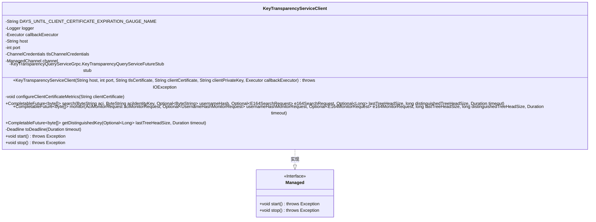

# 基础信息

|      |      |
|------|------|
| 名称 | KeyTransparencyServiceClient |
| 编码语言 | .java |
| 代码路径 | Signal-Server/service/src/main/java/org/whispersystems/textsecuregcm/keytransparency/KeyTransparencyServiceClient.java |
| 包名 | org.whispersystems.textsecuregcm.keytransparency |
| 依赖项 | ['com.google.protobuf.AbstractMessageLite', 'com.google.protobuf.ByteString', 'io.dropwizard.lifecycle.Managed', 'io.grpc.ChannelCredentials', 'io.grpc.Deadline', 'io.grpc.Grpc', 'io.grpc.ManagedChannel', 'io.grpc.TlsChannelCredentials', 'io.micrometer.core.instrument.Metrics', 'java.io.ByteArrayInputStream', 'java.io.IOException', 'java.nio.charset.StandardCharsets', 'java.security.cert.Certificate', 'java.security.cert.CertificateException', 'java.security.cert.CertificateFactory', 'java.security.cert.X509Certificate', 'java.time.Duration', 'java.time.Instant', 'java.util.Collection', 'java.util.Optional', 'java.util.concurrent.CompletableFuture', 'java.util.concurrent.Executor', 'java.util.concurrent.TimeUnit', 'org.signal.keytransparency.client.AciMonitorRequest', 'org.signal.keytransparency.client.ConsistencyParameters', 'org.signal.keytransparency.client.DistinguishedRequest', 'org.signal.keytransparency.client.E164MonitorRequest', 'org.signal.keytransparency.client.E164SearchRequest', 'org.signal.keytransparency.client.KeyTransparencyQueryServiceGrpc', 'org.signal.keytransparency.client.MonitorRequest', 'org.signal.keytransparency.client.SearchRequest', 'org.signal.keytransparency.client.UsernameHashMonitorRequest', 'org.slf4j.Logger', 'org.slf4j.LoggerFactory', 'org.whispersystems.textsecuregcm.metrics.MetricsUtil', 'org.whispersystems.textsecuregcm.util.CompletableFutureUtil'] |
| 概述说明 | KeyTransparencyServiceClient管理客户端证书并支持gRPC通信。 |

# 说明

KeyTransparencyServiceClient主要负责客户端证书的管理以及与服务器之间的gRPC通信。该客户端通过处理证书的生成、存储和验证，确保通信的安全性。同时，它利用gRPC协议进行高效的数据传输，支持双向流、流控制和认证机制，保障了通信的可靠性和完整性。这一实现结合了证书管理和通信协议的优势，提供了安全且高效的客户端服务。

# 类列表 Class Summary

| 名称   | 类型  | 说明 |
|-------|------|-------------|
| KeyTransparencyServiceClient | class | KeyTransparencyServiceClient实现客户端证书管理和gRPC通信。 |

## 类 KeyTransparencyServiceClient

|      |      |
|------|------|
| 访问范围 | public |
| 类型 | class |
| 名称 | KeyTransparencyServiceClient |
| 说明 | KeyTransparencyServiceClient实现客户端证书管理和gRPC通信。 |

### UML类图

### 描述
`KeyTransparencyServiceClient` 是一个实现了 `Managed` 接口的类，用于管理与密钥透明性服务的通信。它通过 gRPC 与远程服务进行交互，提供了搜索、监控和获取密钥的功能。类中包含了多个私有成员变量，如日志记录器、执行器、主机地址、端口号等，并提供了构造方法用于初始化这些变量。此外，类中还定义了多个公共方法，如 `search`、`monitor` 和 `getDistinguishedKey`，用于执行不同的操作，并返回 `CompletableFuture` 类型的结果。类还实现了 `Managed` 接口的 `start` 和 `stop` 方法，用于启动和停止服务。

### 内部方法调用关系图

```mermaid
graph TD
    A["类KeyTransparencyServiceClient"]
    B["属性: String DAYS_UNTIL_CLIENT_CERTIFICATE_EXPIRATION_GAUGE_NAME"]
    C["属性: Logger logger"]
    D["属性: Executor callbackExecutor"]
    E["属性: String host"]
    F["属性: int port"]
    G["属性: ChannelCredentials tlsChannelCredentials"]
    H["属性: ManagedChannel channel"]
    I["属性: KeyTransparencyQueryServiceGrpc.KeyTransparencyQueryServiceFutureStub stub"]
    J["构造方法: KeyTransparencyServiceClient(String host, int port, String tlsCertificate, String clientCertificate, String clientPrivateKey, Executor callbackExecutor)"]
    K["方法: private void configureClientCertificateMetrics(String clientCertificate)"]
    L["方法: public CompletableFuture<byte[]> search(ByteString aci, ByteString aciIdentityKey, Optional<ByteString> usernameHash, Optional<E164SearchRequest> e164SearchRequest, Optional<Long> lastTreeHeadSize, long distinguishedTreeHeadSize, Duration timeout)"]
    M["方法: public CompletableFuture<byte[]> monitor(AciMonitorRequest aciMonitorRequest, Optional<UsernameHashMonitorRequest> usernameHashMonitorRequest, Optional<E164MonitorRequest> e164MonitorRequest, long lastTreeHeadSize, long distinguishedTreeHeadSize, Duration timeout)"]
    N["方法: public CompletableFuture<byte[]> getDistinguishedKey(Optional<Long> lastTreeHeadSize, Duration timeout)"]
    O["方法: private static Deadline toDeadline(Duration timeout)"]
    P["方法: public void start()"]
    Q["方法: public void stop()"]

    A --> B
    A --> C
    A --> D
    A --> E
    A --> F
    A --> G
    A --> H
    A --> I
    A --> J
    A --> K
    A --> L
    A --> M
    A --> N
    A --> O
    A --> P
    A --> Q
```

**描述：**
`KeyTransparencyServiceClient` 类是一个用于与密钥透明服务进行交互的客户端。它包含多个属性，如主机地址、端口、TLS证书等，以及构造方法和多个功能方法。构造方法用于初始化客户端，`configureClientCertificateMetrics` 方法用于配置客户端证书的监控指标。`search`、`monitor` 和 `getDistinguishedKey` 方法分别用于执行搜索、监控和获取特定密钥的操作。`start` 和 `stop` 方法用于启动和停止客户端服务。

### 字段列表 Field List

| 名称  | 类型  | 说明 |
|-------|-------|------|
| channel | ManagedChannel | 私有管理通道变量声明。 |
| DAYS_UNTIL_CLIENT_CERTIFICATE_EXPIRATION_GAUGE_NAME =      MetricsUtil.name(KeyTransparencyServiceClient.class, "daysUntilClientCertificateExpiration") | String | 密钥透明服务客户端证书到期天数指标名称定义。 |
| host | String | 私有字符串变量host声明。 |
| port | int | 私有整型变量port。 |
| logger = LoggerFactory.getLogger(KeyTransparencyServiceClient.class) | Logger | KeyTransparencyServiceClient类中定义了一个私有的静态日志记录器。 |
| tlsChannelCredentials | ChannelCredentials | 私有最终变量tlsChannelCredentials用于存储TLS通道凭据。 |
| stub | KeyTransparencyQueryServiceGrpc.KeyTransparencyQueryServiceFutureStub | 私有变量stub用于KeyTransparency查询服务的未来存根。 |
| callbackExecutor | Executor | 私有且不可变的回调执行器实例。 |

### 方法列表 Method List

| 名称  | 类型  | 说明 |
|-------|-------|------|
| monitor | CompletableFuture<byte[]> | 监控请求构建并返回字节数组的异步操作。 |
| search | CompletableFuture<byte[]> | 异步搜索方法，构建请求并设置参数，返回字节数组结果。 |
| getDistinguishedKey | CompletableFuture<byte[]> | 异步获取指定密钥，支持超时设置和可选参数。 |
| stop | void | 重写stop方法，关闭非空channel。 |
| configureClientCertificateMetrics | void | 配置客户端证书指标，检查证书有效性和类型，计算过期天数并记录日志。 |
| toDeadline | Deadline | 将Duration对象转换为Deadline对象，时间单位为毫秒。 |
| start | void | 重写start方法，创建gRPC通道并设置超时，初始化查询服务存根。 |

