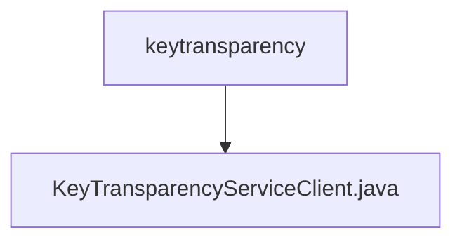

# 基础信息

|      |      |
|------|------|
| 名称 | keytransparency |
| 编码语言 | .java |
| 代码路径 | Signal-Server/service/src/main/java/org/whispersystems/textsecuregcm/keytransparency |
| 包名 | Signal-Server.service.src.main.java.org.whispersystems.textsecuregcm.keytransparency |
| 概述说明 | KeyTransparencyServiceClient管理客户端证书并支持gRPC通信。 |

# 说明

KeyTransparencyServiceClient主要负责客户端证书的管理以及与服务器之间的gRPC通信。该客户端通过处理证书的生成、存储和验证，确保通信的安全性。同时，它利用gRPC协议进行高效的数据传输，支持双向流、流控制和认证机制，保障了通信的可靠性和完整性。这一实现结合了证书管理和通信协议的优势，提供了安全且高效的客户端服务。

### 包内部结构视图

流程图描述：该流程图展示了Signal-Server项目中keytransparency文件夹与KeyTransparencyServiceClient.java文件之间的层级关系。keytransparency文件夹作为父节点，包含了KeyTransparencyServiceClient.java文件，表示该文件位于keytransparency文件夹内。

# 文件列表 File List

| 名称   | 类型  | 说明 |
|-------|------|-------------|
| [KeyTransparencyServiceClient.java](KeyTransparencyServiceClient.md) | file | KeyTransparencyServiceClient管理客户端证书并支持gRPC通信。 |

