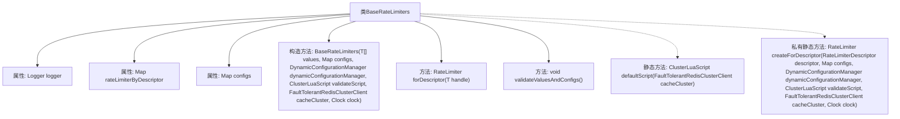
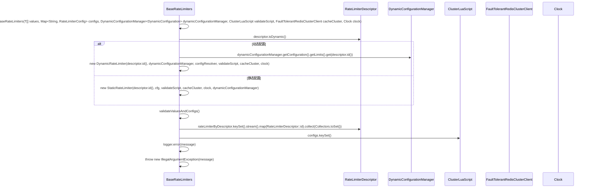

# 基础信息

|      |      |
|------|------|
| 名称 | BaseRateLimiters |
| 编码语言 | .java |
| 代码路径 | Signal-Server/service/src/main/java/org/whispersystems/textsecuregcm/limits/BaseRateLimiters.java |
| 包名 | org.whispersystems.textsecuregcm.limits |
| 依赖项 | ['java.util.Objects.requireNonNull', 'io.lettuce.core.ScriptOutputType', 'java.io.IOException', 'java.io.UncheckedIOException', 'java.lang.invoke.MethodHandles', 'java.time.Clock', 'java.util.Arrays', 'java.util.Map', 'java.util.Set', 'java.util.function.Supplier', 'java.util.stream.Collectors', 'org.apache.commons.lang3.tuple.Pair', 'org.slf4j.Logger', 'org.slf4j.LoggerFactory', 'org.whispersystems.textsecuregcm.configuration.dynamic.DynamicConfiguration', 'org.whispersystems.textsecuregcm.redis.ClusterLuaScript', 'org.whispersystems.textsecuregcm.redis.FaultTolerantRedisClusterClient', 'org.whispersystems.textsecuregcm.storage.DynamicConfigurationManager'] |
| 概述说明 | BaseRateLimiters管理限流器，支持动态与静态配置，通过描述符获取并验证。 |

# 说明

抽象类BaseRateLimiters负责管理限流器，支持动态和静态两种配置方式。通过描述符获取限流器实例，并验证配置的有效性，确保限流功能按预期工作。

# 类列表 Class Summary

| 名称   | 类型  | 说明 |
|-------|------|-------------|
| BaseRateLimiters | class | 抽象类BaseRateLimiters管理限流器，支持动态配置与静态配置，通过描述符获取限流器并验证配置。 |

## 类 BaseRateLimiters

|      |      |
|------|------|
| 访问范围 | public abstract |
| 类型 | class |
| 名称 | BaseRateLimiters |
| 说明 | 抽象类BaseRateLimiters管理限流器，支持动态配置与静态配置，通过描述符获取限流器并验证配置。 |

### UML类图

```mermaid
classDiagram
    class BaseRateLimiters~T~ {
        -Logger logger
        -Map~T, RateLimiter~ rateLimiterByDescriptor
        -Map~String, RateLimiterConfig~ configs
        +BaseRateLimiters(T[] values, Map~String, RateLimiterConfig~ configs, DynamicConfigurationManager~DynamicConfiguration~ dynamicConfigurationManager, ClusterLuaScript validateScript, FaultTolerantRedisClusterClient cacheCluster, Clock clock)
        +RateLimiter forDescriptor(T handle)
        +void validateValuesAndConfigs()
        +ClusterLuaScript defaultScript(FaultTolerantRedisClusterClient cacheCluster)
        -RateLimiter createForDescriptor(RateLimiterDescriptor descriptor, Map~String, RateLimiterConfig~ configs, DynamicConfigurationManager~DynamicConfiguration~ dynamicConfigurationManager, ClusterLuaScript validateScript, FaultTolerantRedisClusterClient cacheCluster, Clock clock)
    }

    class RateLimiterDescriptor {
        <<Interface>>
        +String id()
        +boolean isDynamic()
        +RateLimiterConfig defaultConfig()
    }

    class RateLimiter {
        <<Interface>>
    }

    class DynamicRateLimiter {
        +DynamicRateLimiter(String id, DynamicConfigurationManager~DynamicConfiguration~ dynamicConfigurationManager, Supplier~RateLimiterConfig~ configResolver, ClusterLuaScript validateScript, FaultTolerantRedisClusterClient cacheCluster, Clock clock)
    }

    class StaticRateLimiter {
        +StaticRateLimiter(String id, RateLimiterConfig cfg, ClusterLuaScript validateScript, FaultTolerantRedisClusterClient cacheCluster, Clock clock, DynamicConfigurationManager~DynamicConfiguration~ dynamicConfigurationManager)
    }

    class DynamicConfigurationManager~T~ {
        <<Interface>>
        +T getConfiguration()
    }

    class ClusterLuaScript {
        <<Interface>>
    }

    class FaultTolerantRedisClusterClient {
        <<Interface>>
    }

    class Clock {
        <<Interface>>
    }

    BaseRateLimiters --> RateLimiterDescriptor : 依赖
    BaseRateLimiters --> RateLimiter : 依赖
    BaseRateLimiters --> DynamicConfigurationManager : 依赖
    BaseRateLimiters --> ClusterLuaScript : 依赖
    BaseRateLimiters --> FaultTolerantRedisClusterClient : 依赖
    BaseRateLimiters --> Clock : 依赖
    DynamicRateLimiter --> DynamicConfigurationManager : 依赖
    StaticRateLimiter --> DynamicConfigurationManager : 依赖
```

### 类图描述
`BaseRateLimiters` 是一个抽象类，用于管理基于 `RateLimiterDescriptor` 的限流器。它通过 `DynamicConfigurationManager`、`ClusterLuaScript`、`FaultTolerantRedisClusterClient` 和 `Clock` 等依赖项来创建和管理 `RateLimiter` 实例。`RateLimiter` 接口有两个实现类：`DynamicRateLimiter` 和 `StaticRateLimiter`，分别处理动态和静态配置的限流器。`BaseRateLimiters` 还提供了验证配置与描述符是否匹配的功能。

### 内部方法调用关系图

**描述：**
`BaseRateLimiters` 类是一个抽象类，用于管理基于描述符的限流器。它通过构造方法初始化限流器，并根据描述符的类型（动态或静态）创建相应的限流器实例。类中包含验证配置的方法，确保配置与描述符匹配，并在不匹配时抛出异常。流程图展示了类的结构和方法的调用关系，时序图则详细描述了限流器的创建和配置验证过程。

### 字段列表 Field List

| 名称  | 类型  | 说明 |
|-------|-------|------|
| logger = LoggerFactory.getLogger(MethodHandles.lookup().lookupClass()) | Logger | 私有日志记录器初始化为当前类的日志实例。 |
| configs | Map<String, RateLimiterConfig> | 私有最终映射，键为字符串，值为限流配置。 |
| rateLimiterByDescriptor | Map<T, RateLimiter> | 私有映射存储限流器，键为类型T。 |

### 方法列表 Method List

| 名称  | 类型  | 说明 |
|-------|-------|------|
| createForDescriptor | RateLimiter | 根据描述符创建动态或静态限流器，使用配置、脚本、集群和时钟。 |
| validateValuesAndConfigs | void | 验证配置与限流器描述符是否匹配，不匹配则报错并抛出异常。 |
| forDescriptor | RateLimiter | 方法`RateLimiter forDescriptor`根据给定句柄返回对应的限流器实例。 |
| defaultScript | ClusterLuaScript | 静态方法加载Lua脚本，用于验证速率限制，异常时抛出未检查IO异常。 |

