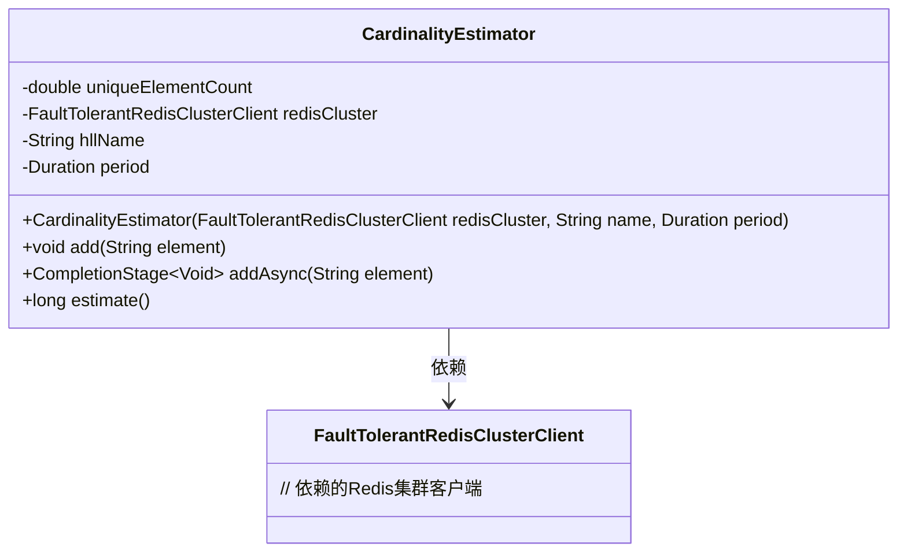
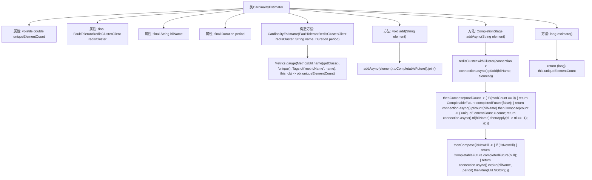

# 基础信息

|      |      |
|------|------|
| 名称 | CardinalityEstimator |
| 编码语言 | .java |
| 代码路径 | Signal-Server/service/src/main/java/org/whispersystems/textsecuregcm/limits/CardinalityEstimator.java |
| 包名 | org.whispersystems.textsecuregcm.limits |
| 依赖项 | ['com.google.common.annotations.VisibleForTesting', 'io.micrometer.core.instrument.Metrics', 'io.micrometer.core.instrument.Tags', 'java.time.Duration', 'java.util.concurrent.CompletableFuture', 'java.util.concurrent.CompletionStage', 'org.whispersystems.textsecuregcm.metrics.MetricsUtil', 'org.whispersystems.textsecuregcm.redis.FaultTolerantRedisClusterClient', 'org.whispersystems.textsecuregcm.util.Util'] |
| 概述说明 | CardinalityEstimator类通过Redis集群操作HyperLogLog，异步添加元素并更新本地计数。 |

# 说明

CardinalityEstimator类主要用于估算唯一元素的数量，它通过Redis集群操作HyperLogLog数据结构来实现这一功能。该类支持异步添加元素，并在添加后更新本地计数，从而高效地处理大规模数据的唯一性估算任务。

# 类列表 Class Summary

| 名称   | 类型  | 说明 |
|-------|------|-------------|
| CardinalityEstimator | class | CardinalityEstimator类用于估算唯一元素数量，通过Redis集群操作HyperLogLog数据结构，支持异步添加元素并更新本地计数。 |

## 类 CardinalityEstimator

|      |      |
|------|------|
| 访问范围 | public |
| 类型 | class |
| 名称 | CardinalityEstimator |
| 说明 | CardinalityEstimator类用于估算唯一元素数量，通过Redis集群操作HyperLogLog数据结构，支持异步添加元素并更新本地计数。 |

### UML类图

**描述：**  
`CardinalityEstimator` 类用于估计集合中唯一元素的数量，通过 Redis 的 HyperLogLog 数据结构实现。它包含一个 `FaultTolerantRedisClusterClient` 实例，用于与 Redis 集群进行交互。`add` 方法用于同步添加元素，`addAsync` 方法用于异步添加元素，并更新本地唯一元素计数。`estimate` 方法用于返回当前估计的唯一元素数量。

### 内部方法调用关系图

这段代码实现了一个基数估计器（CardinalityEstimator），用于估计集合中唯一元素的数量。它通过Redis的HyperLogLog数据结构来高效地计算基数，并在需要时更新本地视图和设置TTL。代码中包含了构造方法、添加元素的方法、异步添加元素的方法以及用于测试的估计方法。

### 字段列表 Field List

| 名称  | 类型  | 说明 |
|-------|-------|------|
| redisCluster | FaultTolerantRedisClusterClient | 私有终态的容错Redis集群客户端实例。 |
| hllName | String | 私有不可变字符串变量hllName。 |
| period | Duration | 私有不可变时间周期变量。 |
| uniqueElementCount | double | 私有易变双精度变量用于存储唯一元素数量。 |

### 方法列表 Method List

| 名称  | 类型  | 说明 |
|-------|-------|------|
| add | void | 异步添加元素并同步等待完成。 |
| estimate | long | 测试可见方法，返回唯一元素计数的长整型估计值。 |
| addAsync | CompletionStage<Void> | 异步添加元素到Redis集群的HyperLogLog，更新基数并设置TTL。 |

