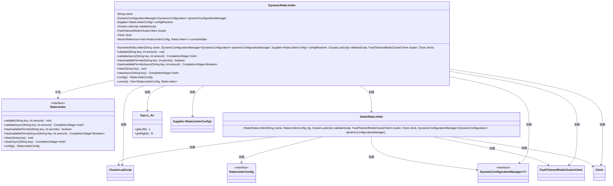

# 基础信息

|      |      |
|------|------|
| 名称 | DynamicRateLimiter |
| 编码语言 | .java |
| 代码路径 | Signal-Server/service/src/main/java/org/whispersystems/textsecuregcm/limits/DynamicRateLimiter.java |
| 包名 | org.whispersystems.textsecuregcm.limits |
| 依赖项 | ['java.util.Objects.requireNonNull', 'java.time.Clock', 'java.util.concurrent.CompletionStage', 'java.util.concurrent.atomic.AtomicReference', 'java.util.function.Supplier', 'org.apache.commons.lang3.tuple.Pair', 'org.whispersystems.textsecuregcm.configuration.dynamic.DynamicConfiguration', 'org.whispersystems.textsecuregcm.controllers.RateLimitExceededException', 'org.whispersystems.textsecuregcm.redis.ClusterLuaScript', 'org.whispersystems.textsecuregcm.redis.FaultTolerantRedisClusterClient', 'org.whispersystems.textsecuregcm.storage.DynamicConfigurationManager'] |
| 概述说明 | 动态限流器支持同步异步验证、清除及配置更新功能。 |

# 说明

动态限流器是一种支持同步和异步验证、清除和配置更新的工具。它能够实时调整流量限制，确保系统在高负载时仍能稳定运行。通过同步验证，可以立即判断请求是否被允许；异步验证则适用于需要延迟处理的场景。清除功能用于重置限流状态，确保限流器在必要时恢复到初始状态。配置更新功能允许动态调整限流规则，无需重启系统，提高了系统的灵活性和响应速度。整体设计旨在提升系统的可靠性和可维护性。

# 类列表 Class Summary

| 名称   | 类型  | 说明 |
|-------|------|-------------|
| DynamicRateLimiter | class | 动态限流器实现，支持同步异步验证、清除和配置更新。 |

## 类 DynamicRateLimiter

|      |      |
|------|------|
| 访问范围 | public |
| 类型 | class |
| 名称 | DynamicRateLimiter |
| 说明 | 动态限流器实现，支持同步异步验证、清除和配置更新。 |

### UML类图

类图描述：`DynamicRateLimiter` 类实现了 `RateLimiter` 接口，用于动态管理限流器的配置和行为。它依赖于 `DynamicConfigurationManager`、`Supplier`、`ClusterLuaScript`、`FaultTolerantRedisClusterClient` 和 `Clock` 等组件来获取配置和执行限流操作。`DynamicRateLimiter` 通过 `StaticRateLimiter` 实现具体的限流逻辑，并使用 `Pair` 类来管理当前的限流器配置和实例。

### 内部方法调用关系图

```mermaid
graph TD
    A["类DynamicRateLimiter"]
    B["属性: String name"]
    C["属性: DynamicConfigurationManager<DynamicConfiguration> dynamicConfigurationManager"]
    D["属性: Supplier<RateLimiterConfig> configResolver"]
    E["属性: ClusterLuaScript validateScript"]
    F["属性: FaultTolerantRedisClusterClient cluster"]
    G["属性: Clock clock"]
    H["属性: AtomicReference<Pair<RateLimiterConfig, RateLimiter>> currentHolder"]
    I["构造方法: DynamicRateLimiter(String name, DynamicConfigurationManager<DynamicConfiguration> dynamicConfigurationManager, Supplier<RateLimiterConfig> configResolver, ClusterLuaScript validateScript, FaultTolerantRedisClusterClient cluster, Clock clock)"]
    J["方法: void validate(String key, int amount)"]
    K["方法: CompletionStage<Void> validateAsync(String key, int amount)"]
    L["方法: boolean hasAvailablePermits(String key, int permits)"]
    M["方法: CompletionStage<Boolean> hasAvailablePermitsAsync(String key, int amount)"]
    N["方法: void clear(String key)"]
    O["方法: CompletionStage<Void> clearAsync(String key)"]
    P["方法: RateLimiterConfig config()"]
    Q["私有方法: Pair<RateLimiterConfig, RateLimiter> current()"]

    A --> B
    A --> C
    A --> D
    A --> E
    A --> F
    A --> G
    A --> H
    A --> I
    A --> J
    A --> K
    A --> L
    A --> M
    A --> N
    A --> O
    A --> P
    A --> Q
    Q --> P
    Q --> J
    Q --> K
    Q --> L
    Q --> M
    Q --> N
    Q --> O
```

**描述：**  
`DynamicRateLimiter`类是一个动态速率限制器，用于管理请求的速率限制。它包含多个属性，如`name`、`dynamicConfigurationManager`、`configResolver`等，用于配置和管理速率限制策略。类中的`current()`方法用于获取当前的速率限制配置和实例，并确保配置更新时重新创建实例。其他方法如`validate`、`validateAsync`、`hasAvailablePermits`等，用于验证请求是否超出速率限制、异步验证、检查可用许可等操作。

### 字段列表 Field List

| 名称  | 类型  | 说明 |
|-------|-------|------|
| validateScript | ClusterLuaScript | 私有最终类ClusterLuaScript验证脚本。 |
| name | String | 定义了一个私有的不可变字符串变量name。 |
| currentHolder = new AtomicReference<>() | AtomicReference<Pair<RateLimiterConfig, RateLimiter>> | 使用AtomicReference存储限流器配置和实例对。 |
| clock | Clock | 类中包含一个私有的不可变Clock类型变量clock。 |
| cluster | FaultTolerantRedisClusterClient | 私有且不可变的容错Redis集群客户端实例。 |
| dynamicConfigurationManager | DynamicConfigurationManager<DynamicConfiguration> | 动态配置管理器存储动态配置实例。 |
| configResolver | Supplier<RateLimiterConfig> | 私有字段，类型为Supplier<RateLimiterConfig>，用于解析限流器配置。 |

### 方法列表 Method List

| 名称  | 类型  | 说明 |
|-------|-------|------|
| current | Pair<RateLimiterConfig, RateLimiter> | 获取当前限流器配置并更新限流器实例。 |
| clear | void | 该方法清除指定键的当前右侧数据。 |
| config | RateLimiterConfig | 重写方法返回当前配置的限流器设置。 |
| validate | void | 验证键值和数量，若超出限制则抛出异常。 |
| clearAsync | CompletionStage<Void> | 重写方法`clearAsync`，异步清除指定键的值。 |
| hasAvailablePermits | boolean | 方法检查指定键的许可是否足够。 |
| hasAvailablePermitsAsync | CompletionStage<Boolean> | 异步检查指定键的许可数量是否足够。 |
| validateAsync | CompletionStage<Void> | 异步验证方法，调用当前对象的验证功能。 |

