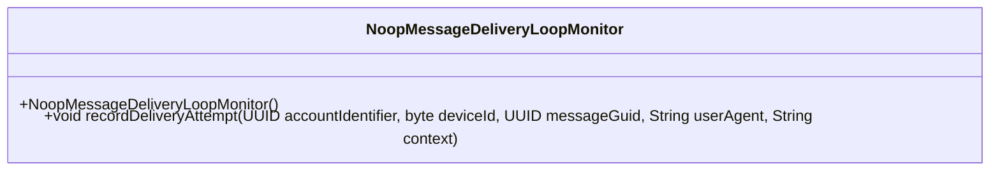
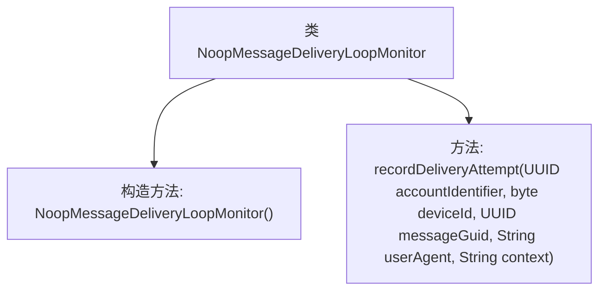

# 基础信息

|      |      |
|------|------|
| 名称 | NoopMessageDeliveryLoopMonitor |
| 编码语言 | .java |
| 代码路径 | Signal-Server/service/src/main/java/org/whispersystems/textsecuregcm/limits/NoopMessageDeliveryLoopMonitor.java |
| 包名 | org.whispersystems.textsecuregcm.limits |
| 依赖项 | ['java.util.UUID'] |
| 概述说明 | NoopMessageDeliveryLoopMonitor实现MessageDeliveryLoopMonitor接口，无实际功能。 |

# 说明

NoopMessageDeliveryLoopMonitor类实现了MessageDeliveryLoopMonitor接口，但并未执行任何实际的操作。该类的设计可能是为了提供一个占位符或默认实现，以便在不需具体功能时使用，或者作为其他实现的基类。通过这种方式，开发者可以确保接口的兼容性，同时避免不必要的操作或资源消耗。

# 类列表 Class Summary

| 名称   | 类型  | 说明 |
|-------|------|-------------|
| NoopMessageDeliveryLoopMonitor | class | NoopMessageDeliveryLoopMonitor类实现MessageDeliveryLoopMonitor接口，无实际操作。 |

## 类 NoopMessageDeliveryLoopMonitor

|      |      |
|------|------|
| 访问范围 | public |
| 类型 | class |
| 名称 | NoopMessageDeliveryLoopMonitor |
| 说明 | NoopMessageDeliveryLoopMonitor类实现MessageDeliveryLoopMonitor接口，无实际操作。 |

### UML类图

这段代码定义了一个名为 `NoopMessageDeliveryLoopMonitor` 的类，它实现了 `MessageDeliveryLoopMonitor` 接口。该类包含一个无参构造函数和一个 `recordDeliveryAttempt` 方法，该方法接受多个参数但不执行任何操作。这个类可能用于模拟或占位，以确保在不需要实际监控消息传递循环的情况下，代码仍然能够正常运行。

### 内部方法调用关系图

这段代码定义了一个名为 `NoopMessageDeliveryLoopMonitor` 的类，它实现了 `MessageDeliveryLoopMonitor` 接口。该类包含一个默认的构造方法和一个 `recordDeliveryAttempt` 方法，后者接受多个参数（如账户标识符、设备ID、消息GUID、用户代理和上下文）但不执行任何操作。这个类可能用于模拟或占位，以便在不需要实际监控消息传递循环时使用。

### 字段列表 Field List

| 名称  | 类型  | 说明 |
|-------|-------|------|

### 方法列表 Method List

| 名称  | 类型  | 说明 |
|-------|-------|------|
| recordDeliveryAttempt | void | 记录投递尝试的方法，参数包括账户标识、设备ID、消息GUID、用户代理和上下文。 |

