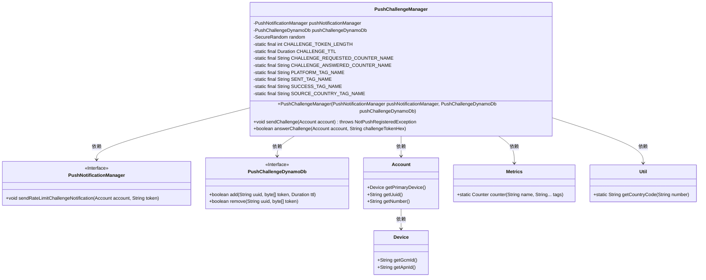

# 基础信息

|      |      |
|------|------|
| 名称 | PushChallengeManager |
| 编码语言 | .java |
| 代码路径 | Signal-Server/service/src/main/java/org/whispersystems/textsecuregcm/limits/PushChallengeManager.java |
| 包名 | org.whispersystems.textsecuregcm.limits |
| 依赖项 | ['com.codahale.metrics.MetricRegistry.name', 'io.micrometer.core.instrument.Metrics', 'java.security.SecureRandom', 'java.time.Duration', 'java.util.HexFormat', 'org.apache.commons.lang3.StringUtils', 'org.whispersystems.textsecuregcm.push.NotPushRegisteredException', 'org.whispersystems.textsecuregcm.push.PushNotificationManager', 'org.whispersystems.textsecuregcm.storage.Account', 'org.whispersystems.textsecuregcm.storage.Device', 'org.whispersystems.textsecuregcm.storage.PushChallengeDynamoDb', 'org.whispersystems.textsecuregcm.util.Util', 'org.whispersystems.textsecuregcm.util.ua.ClientPlatform'] |
| 概述说明 | PushChallengeManager类负责推送挑战管理，生成令牌并验证用户响应。 |

# 说明

PushChallengeManager类负责管理和处理推送挑战的相关任务。其主要功能包括生成用于推送挑战的令牌，以及验证用户对挑战的响应。通过这种方式，确保用户身份验证过程的安全性和有效性。

# 类列表 Class Summary

| 名称   | 类型  | 说明 |
|-------|------|-------------|
| PushChallengeManager | class | PushChallengeManager类管理推送挑战，生成令牌并验证用户响应。 |

## 类 PushChallengeManager

|      |      |
|------|------|
| 访问范围 | public |
| 类型 | class |
| 名称 | PushChallengeManager |
| 说明 | PushChallengeManager类管理推送挑战，生成令牌并验证用户响应。 |

### UML类图

这段代码定义了一个 `PushChallengeManager` 类，用于管理推送挑战的发送和验证。它依赖于 `PushNotificationManager` 和 `PushChallengeDynamoDb` 接口来处理通知发送和数据存储。`PushChallengeManager` 通过生成随机的挑战令牌并将其存储在 DynamoDB 中，然后通过 `PushNotificationManager` 发送通知。`answerChallenge` 方法用于验证用户提供的挑战令牌，并根据验证结果更新计数器。代码还涉及 `Account` 和 `Device` 类，用于获取设备信息和用户信息，以及 `Metrics` 和 `Util` 类，用于记录指标和处理国家代码。

### 内部方法调用关系图

```mermaid
graph TD
    A["类PushChallengeManager"]
    B["属性: PushNotificationManager pushNotificationManager"]
    C["属性: PushChallengeDynamoDb pushChallengeDynamoDb"]
    D["属性: SecureRandom random"]
    E["常量: int CHALLENGE_TOKEN_LENGTH"]
    F["常量: Duration CHALLENGE_TTL"]
    G["常量: String CHALLENGE_REQUESTED_COUNTER_NAME"]
    H["常量: String CHALLENGE_ANSWERED_COUNTER_NAME"]
    I["常量: String PLATFORM_TAG_NAME"]
    J["常量: String SENT_TAG_NAME"]
    K["常量: String SUCCESS_TAG_NAME"]
    L["常量: String SOURCE_COUNTRY_TAG_NAME"]
    M["构造方法: PushChallengeManager(PushNotificationManager, PushChallengeDynamoDb)"]
    N["方法: void sendChallenge(Account)"]
    O["方法: boolean answerChallenge(Account, String)"]
    P["步骤: 获取主设备 primaryDevice"]
    Q["步骤: 生成随机token"]
    R["步骤: 调用pushChallengeDynamoDb.add()"]
    S["步骤: 调用pushNotificationManager.sendRateLimitChallengeNotification()"]
    T["步骤: 判断设备平台 platform"]
    U["步骤: 调用Metrics.counter()"]
    V["步骤: 调用pushChallengeDynamoDb.remove()"]
    W["步骤: 判断设备平台 platform"]
    X["步骤: 调用Metrics.counter()"]

    A --> B
    A --> C
    A --> D
    A --> E
    A --> F
    A --> G
    A --> H
    A --> I
    A --> J
    A --> K
    A --> L
    A --> M
    A --> N
    A --> O
    N --> P
    N --> Q
    N --> R
    N --> S
    N --> T
    N --> U
    O --> V
    O --> W
    O --> X
```

**流程图描述：**  
该流程图展示了`PushChallengeManager`类的结构及其主要方法的执行流程。`sendChallenge`方法首先获取账户的主设备，生成随机token，并将其存储在DynamoDB中，随后发送通知并判断设备平台，最后记录指标。`answerChallenge`方法则尝试从DynamoDB中移除token，判断设备平台，并记录指标。整个过程涉及多个步骤和条件判断，确保挑战的发送和验证过程安全可靠。

### 字段列表 Field List

| 名称  | 类型  | 说明 |
|-------|-------|------|
| pushNotificationManager | PushNotificationManager | 私有推送通知管理器实例。 |
| random = new SecureRandom() | SecureRandom | 使用SecureRandom生成安全的随机数。 |
| CHALLENGE_TOKEN_LENGTH = 16 | int | 定义常量CHALLENGE_TOKEN_LENGTH，值为16。 |
| CHALLENGE_REQUESTED_COUNTER_NAME = name(PushChallengeManager.class, "requested") | String | PushChallengeManager类中定义了一个名为"requested"的静态计数器。 |
| pushChallengeDynamoDb | PushChallengeDynamoDb | 私有PushChallengeDynamoDb对象pushChallengeDynamoDb。 |
| CHALLENGE_TTL = Duration.ofMinutes(5) | Duration | 私有静态常量CHALLENGE_TTL设置为5分钟。 |
| SOURCE_COUNTRY_TAG_NAME = "sourceCountry" | String | 定义常量SOURCE_COUNTRY_TAG_NAME，值为"sourceCountry"。 |
| PLATFORM_TAG_NAME = "platform" | String | 定义私有静态常量PLATFORM_TAG_NAME，值为"platform"。 |
| SENT_TAG_NAME = "sent" | String | 定义了一个私有静态常量字符串变量SENT_TAG_NAME，值为"sent"。 |
| SUCCESS_TAG_NAME = "success" | String | 定义私有静态常量字符串SUCCESS_TAG_NAME，值为"success"。 |
| CHALLENGE_ANSWERED_COUNTER_NAME = name(PushChallengeManager.class, "answered") | String | PushChallengeManager类中定义了一个名为answered的静态常量CHALLENGE_ANSWERED_COUNTER_NAME。 |

### 方法列表 Method List

| 名称  | 类型  | 说明 |
|-------|-------|------|
| sendChallenge | void | 发送挑战验证，处理设备平台并记录指标。 |
| answerChallenge | boolean | 方法验证挑战，移除DynamoDB记录，根据设备ID确定平台，记录指标并返回成功状态。 |

