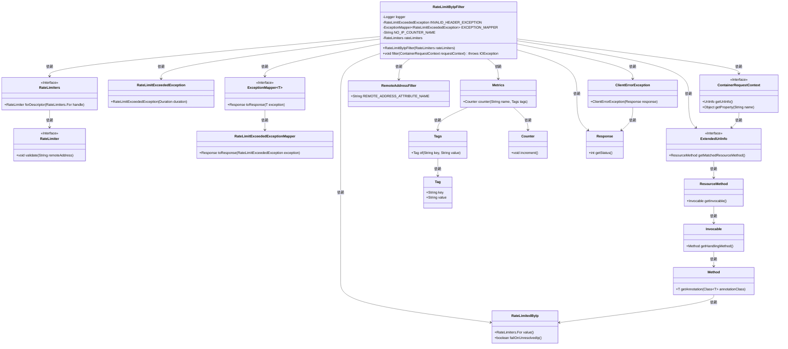
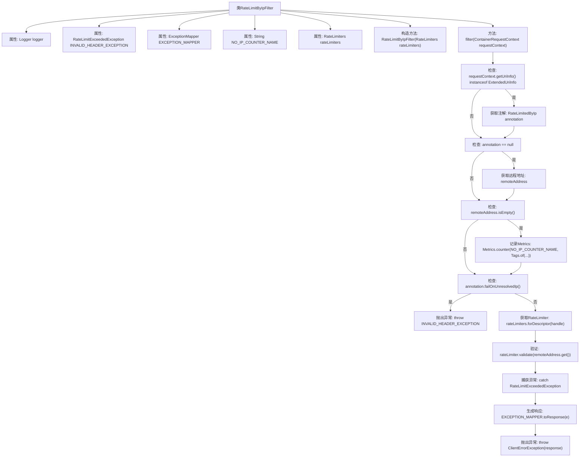

# 基础信息

|      |      |
|------|------|
| 名称 | RateLimitByIpFilter |
| 编码语言 | .java |
| 代码路径 | Signal-Server/service/src/main/java/org/whispersystems/textsecuregcm/limits/RateLimitByIpFilter.java |
| 包名 | org.whispersystems.textsecuregcm.limits |
| 依赖项 | ['java.util.Objects.requireNonNull', 'com.google.common.annotations.VisibleForTesting', 'io.micrometer.core.instrument.Metrics', 'io.micrometer.core.instrument.Tag', 'io.micrometer.core.instrument.Tags', 'jakarta.ws.rs.ClientErrorException', 'jakarta.ws.rs.container.ContainerRequestContext', 'jakarta.ws.rs.container.ContainerRequestFilter', 'jakarta.ws.rs.core.Response', 'jakarta.ws.rs.ext.ExceptionMapper', 'java.io.IOException', 'java.time.Duration', 'java.util.Optional', 'org.glassfish.jersey.server.ExtendedUriInfo', 'org.slf4j.Logger', 'org.slf4j.LoggerFactory', 'org.whispersystems.textsecuregcm.controllers.RateLimitExceededException', 'org.whispersystems.textsecuregcm.filters.RemoteAddressFilter', 'org.whispersystems.textsecuregcm.mappers.RateLimitExceededExceptionMapper', 'org.whispersystems.textsecuregcm.metrics.MetricsUtil'] |
| 概述说明 | IP请求速率限制过滤器实现控制流量。 |

# 说明

基于IP的请求速率限制过滤器是一种用于控制网络请求频率的机制。它通过识别请求的IP地址，对来自同一IP的请求进行计数和监控，确保在特定时间窗口内的请求数量不超过预设的阈值。当请求速率超过限制时，系统会自动采取相应的措施，如拒绝请求或延迟处理，以防止服务器过载或遭受恶意攻击。该过滤器通常用于保护Web应用程序、API服务等，确保系统资源的合理分配和稳定运行。

# 类列表 Class Summary

| 名称   | 类型  | 说明 |
|-------|------|-------------|
| RateLimitByIpFilter | class | 基于IP的请求速率限制过滤器实现。 |

## 类 RateLimitByIpFilter

|      |      |
|------|------|
| 访问范围 | public |
| 类型 | class |
| 名称 | RateLimitByIpFilter |
| 说明 | 基于IP的请求速率限制过滤器实现。 |

### UML类图

这段代码定义了一个 `RateLimitByIpFilter` 类，用于根据IP地址进行请求速率限制。它实现了 `ContainerRequestFilter` 接口，通过检查请求的IP地址和注解配置来决定是否允许请求。如果请求速率超过限制，则会抛出 `RateLimitExceededException` 异常，并通过 `ExceptionMapper` 转换为响应。代码中使用了多个依赖类，如 `RateLimiters`、`RateLimiter`、`ContainerRequestContext` 等，来处理请求的IP地址、速率限制和异常映射。

### 内部方法调用关系图

这段代码实现了一个基于IP地址的速率限制过滤器。它首先检查请求的URI信息是否为`ExtendedUriInfo`类型，然后获取并检查`RateLimitedByIp`注解。如果注解存在，它会尝试获取远程IP地址并进行验证。如果IP地址为空，它会根据注解配置决定是否抛出异常。如果IP地址有效，它会使用`RateLimiter`进行速率限制验证。如果速率限制被触发，它会生成并抛出相应的异常响应。

### 字段列表 Field List

| 名称  | 类型  | 说明 |
|-------|-------|------|
| logger = LoggerFactory.getLogger(RateLimitByIpFilter.class) | Logger | RateLimitByIpFilter类中声明了一个私有的静态Logger常量。 |
| rateLimiters | RateLimiters | 私有且不可变的限流器实例。 |
| INVALID_HEADER_EXCEPTION = new RateLimitExceededException(Duration.ofHours(1)  ) | RateLimitExceededException | 测试用静态变量，限速异常，持续1小时。 |
| EXCEPTION_MAPPER = new RateLimitExceededExceptionMapper() | ExceptionMapper<RateLimitExceededException> | 定义了一个静态的异常映射器，用于处理RateLimitExceededException。 |
| NO_IP_COUNTER_NAME = MetricsUtil.name(RateLimitByIpFilter.class, "noIpAddress") | String | 定义常量NO_IP_COUNTER_NAME，用于无IP地址的计数器名称。 |

### 方法列表 Method List

| 名称  | 类型  | 说明 |
|-------|-------|------|
| filter | void | 过滤器检查请求IP限速，若IP未解析则记录并决定是否拒绝请求。 |

