# 基础信息

|      |      |
|------|------|
| 名称 | RateLimitChallengeManager |
| 编码语言 | .java |
| 代码路径 | Signal-Server/service/src/main/java/org/whispersystems/textsecuregcm/limits/RateLimitChallengeManager.java |
| 包名 | org.whispersystems.textsecuregcm.limits |
| 依赖项 | ['com.codahale.metrics.MetricRegistry.name', 'io.micrometer.core.instrument.Metrics', 'io.micrometer.core.instrument.Tag', 'io.micrometer.core.instrument.Tags', 'java.io.IOException', 'java.util.List', 'java.util.Optional', 'org.whispersystems.textsecuregcm.captcha.Action', 'org.whispersystems.textsecuregcm.captcha.CaptchaChecker', 'org.whispersystems.textsecuregcm.controllers.RateLimitExceededException', 'org.whispersystems.textsecuregcm.metrics.UserAgentTagUtil', 'org.whispersystems.textsecuregcm.push.NotPushRegisteredException', 'org.whispersystems.textsecuregcm.spam.ChallengeType', 'org.whispersystems.textsecuregcm.spam.RateLimitChallengeListener', 'org.whispersystems.textsecuregcm.storage.Account', 'org.whispersystems.textsecuregcm.util.Util'] |
| 概述说明 | RateLimitChallengeManager负责推送、验证码挑战及速率限制管理。 |

# 说明

RateLimitChallengeManager负责管理推送和验证码挑战，其主要功能包括验证速率限制并在必要时进行重置。该管理器确保系统在处理推送和验证码请求时，能够有效控制请求频率，防止滥用和过度使用，同时保障系统的稳定性和安全性。通过验证速率限制，RateLimitChallengeManager能够及时识别异常行为，并采取相应的重置措施，以维持系统的正常运行和用户体验。

# 类列表 Class Summary

| 名称   | 类型  | 说明 |
|-------|------|-------------|
| RateLimitChallengeManager | class | RateLimitChallengeManager管理推送和验证码挑战，验证速率限制并重置。 |

## 类 RateLimitChallengeManager

|      |      |
|------|------|
| 访问范围 | public |
| 类型 | class |
| 名称 | RateLimitChallengeManager |
| 说明 | RateLimitChallengeManager管理推送和验证码挑战，验证速率限制并重置。 |

### UML类图

```mermaid
classDiagram
    class RateLimitChallengeManager {
        -PushChallengeManager pushChallengeManager
        -CaptchaChecker captchaChecker
        -RateLimiters rateLimiters
        -List~RateLimitChallengeListener~ rateLimitChallengeListeners
        -static final String CAPTCHA_ATTEMPT_COUNTER_NAME
        -static final String RESET_RATE_LIMIT_EXCEEDED_COUNTER_NAME
        -static final String SOURCE_COUNTRY_TAG_NAME
        -static final String SUCCESS_TAG_NAME
        +RateLimitChallengeManager(PushChallengeManager pushChallengeManager, CaptchaChecker captchaChecker, RateLimiters rateLimiters, List~RateLimitChallengeListener~ rateLimitChallengeListeners)
        +void answerPushChallenge(Account account, String challenge) throws RateLimitExceededException
        +boolean answerCaptchaChallenge(Account account, String captcha, String mostRecentProxyIp, String userAgent, Optional~Float~ scoreThreshold) throws RateLimitExceededException, IOException
        -void resetRateLimits(Account account, ChallengeType type) throws RateLimitExceededException
        +void sendPushChallenge(Account account) throws NotPushRegisteredException
    }

    class PushChallengeManager {
        <<Interface>>
        +boolean answerChallenge(Account account, String challenge)
        +void sendChallenge(Account account) throws NotPushRegisteredException
    }

    class CaptchaChecker {
        <<Interface>>
        +CaptchaResponse verify(Optional~String~ accountUuid, Action action, String captcha, String mostRecentProxyIp, String userAgent)
    }

    class RateLimiters {
        <<Interface>>
        +RateLimiter getPushChallengeAttemptLimiter()
        +RateLimiter getPushChallengeSuccessLimiter()
        +RateLimiter getCaptchaChallengeAttemptLimiter()
        +RateLimiter getCaptchaChallengeSuccessLimiter()
        +RateLimiter getRateLimitResetLimiter()
    }

    class RateLimitChallengeListener {
        <<Interface>>
        +void handleRateLimitChallengeAnswered(Account account, ChallengeType type)
    }

    class Account {
        +String getUuid()
        +String getNumber()
    }

    class ChallengeType {
        <<Enum>>
    }

    class RateLimitExceededException {
        <<Exception>>
    }

    class NotPushRegisteredException {
        <<Exception>>
    }

    class Metrics {
        +static Counter counter(String name, Tags tags)
    }

    class Tags {
        +static Tags of(Tag... tags)
    }

    class Tag {
        +static Tag of(String key, String value)
    }

    class UserAgentTagUtil {
        +static Tag getPlatformTag(String userAgent)
    }

    class Util {
        +static String getCountryCode(String number)
    }

    class Optional~T~ {
        <<Generic>>
    }

    class CaptchaResponse {
        +boolean isValid(Optional~Float~ scoreThreshold)
    }

    class Action {
        <<Enum>>
    }

    RateLimitChallengeManager --> PushChallengeManager : 依赖
    RateLimitChallengeManager --> CaptchaChecker : 依赖
    RateLimitChallengeManager --> RateLimiters : 依赖
    RateLimitChallengeManager --> RateLimitChallengeListener : 依赖
    RateLimitChallengeManager --> Account : 依赖
    RateLimitChallengeManager --> ChallengeType : 依赖
    RateLimitChallengeManager --> Metrics : 依赖
    RateLimitChallengeManager --> Tags : 依赖
    RateLimitChallengeManager --> Tag : 依赖
    RateLimitChallengeManager --> UserAgentTagUtil : 依赖
    RateLimitChallengeManager --> Util : 依赖
    RateLimitChallengeManager --> Optional~Float~ : 依赖
    RateLimitChallengeManager --> CaptchaResponse : 依赖
    RateLimitChallengeManager --> Action : 依赖
    RateLimitChallengeManager --> RateLimitExceededException : 依赖
    RateLimitChallengeManager --> NotPushRegisteredException : 依赖
```

这段代码定义了一个`RateLimitChallengeManager`类，用于管理速率限制挑战。它依赖于多个接口和类，如`PushChallengeManager`、`CaptchaChecker`、`RateLimiters`等，来处理推送挑战和验证码挑战。代码通过`RateLimiters`来验证速率限制，并通过`Metrics`来记录相关指标。`RateLimitChallengeManager`还包含一个监听器列表，用于处理速率限制挑战的响应。

### 内部方法调用关系图

```mermaid
graph TD
    A["类RateLimitChallengeManager"]
    B["属性: PushChallengeManager pushChallengeManager"]
    C["属性: CaptchaChecker captchaChecker"]
    D["属性: RateLimiters rateLimiters"]
    E["属性: List<RateLimitChallengeListener> rateLimitChallengeListeners"]
    F["构造方法: RateLimitChallengeManager(PushChallengeManager, CaptchaChecker, RateLimiters, List<RateLimitChallengeListener>)"]
    G["方法: void answerPushChallenge(Account, String)"]
    H["方法: boolean answerCaptchaChallenge(Account, String, String, String, Optional<Float>)"]
    I["方法: void resetRateLimits(Account, ChallengeType)"]
    J["方法: void sendPushChallenge(Account)"]
    K["调用: rateLimiters.getPushChallengeAttemptLimiter().validate(account.getUuid())"]
    L["调用: pushChallengeManager.answerChallenge(account, challenge)"]
    M["调用: rateLimiters.getPushChallengeSuccessLimiter().validate(account.getUuid())"]
    N["调用: resetRateLimits(account, ChallengeType.PUSH)"]
    O["调用: rateLimiters.getCaptchaChallengeAttemptLimiter().validate(account.getUuid())"]
    P["调用: captchaChecker.verify(Optional.of(account.getUuid()), Action.CHALLENGE, captcha, mostRecentProxyIp, userAgent).isValid(scoreThreshold)"]
    Q["调用: Metrics.counter(CAPTCHA_ATTEMPT_COUNTER_NAME, tags).increment()"]
    R["调用: rateLimiters.getCaptchaChallengeSuccessLimiter().validate(account.getUuid())"]
    S["调用: resetRateLimits(account, ChallengeType.CAPTCHA)"]
    T["调用: rateLimiters.getRateLimitResetLimiter().validate(account.getUuid())"]
    U["调用: Metrics.counter(RESET_RATE_LIMIT_EXCEEDED_COUNTER_NAME, SOURCE_COUNTRY_TAG_NAME, Util.getCountryCode(account.getNumber())).increment()"]
    V["调用: rateLimitChallengeListeners.forEach(listener -> listener.handleRateLimitChallengeAnswered(account, type))"]
    W["调用: pushChallengeManager.sendChallenge(account)"]

    A --> B
    A --> C
    A --> D
    A --> E
    A --> F
    A --> G
    A --> H
    A --> I
    A --> J
    G --> K
    G --> L
    G --> M
    G --> N
    H --> O
    H --> P
    H --> Q
    H --> R
    H --> S
    I --> T
    I --> U
    I --> V
    J --> W
```

**描述：**
该流程图展示了`RateLimitChallengeManager`类的结构及其内部方法的调用关系。类包含多个属性和方法，用于处理不同类型的挑战（如推送挑战和验证码挑战）以及速率限制的管理。每个方法调用都清晰地映射到相应的步骤，展示了从挑战验证到速率限制重置的完整流程。

### 字段列表 Field List

| 名称  | 类型  | 说明 |
|-------|-------|------|
| pushChallengeManager | PushChallengeManager | 私有不可变的PushChallengeManager实例。 |
| RESET_RATE_LIMIT_EXCEEDED_COUNTER_NAME = name(RateLimitChallengeManager.class, "resetRateLimitExceeded") | String | 定义重置速率限制超计数器的静态常量名称。 |
| rateLimiters | RateLimiters | 私有且不可变的限流器实例。 |
| SOURCE_COUNTRY_TAG_NAME = "sourceCountry" | String | 定义静态常量SOURCE_COUNTRY_TAG_NAME，值为"sourceCountry"。 |
| CAPTCHA_ATTEMPT_COUNTER_NAME = name(RateLimitChallengeManager.class, "captcha",      "attempt") | String | CAPTCHA尝试计数器命名为captcha_attempt。 |
| captchaChecker | CaptchaChecker | 私有且不可变的验证码检查器实例。 |
| SUCCESS_TAG_NAME = "success" | String | 定义常量SUCCESS_TAG_NAME，值为"success"。 |
| rateLimitChallengeListeners | List<RateLimitChallengeListener> | 私有最终列表存储限速挑战监听器。 |

### 方法列表 Method List

| 名称  | 类型  | 说明 |
|-------|-------|------|
| sendPushChallenge | void | 推送挑战方法，通过账户发送挑战，若未注册则抛出异常。 |
| resetRateLimits | void | 重置账户速率限制，验证并处理异常，触发监听器。 |
| answerPushChallenge | void | 验证账户推送挑战，成功则重置速率限制。 |
| answerCaptchaChallenge | boolean | 该方法用于验证账户的验证码挑战，包含速率限制、验证码检查、标签记录和成功重置限速。 |

