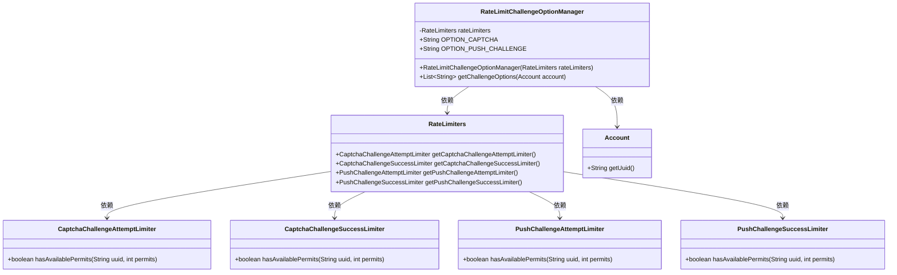
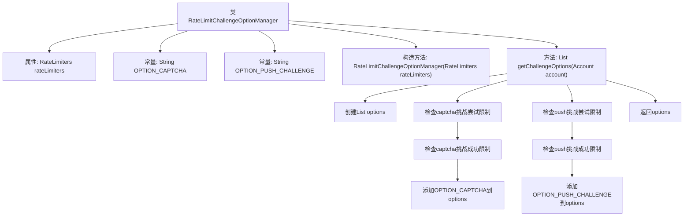

# 基础信息

|      |      |
|------|------|
| 名称 | RateLimitChallengeOptionManager |
| 编码语言 | .java |
| 代码路径 | Signal-Server/service/src/main/java/org/whispersystems/textsecuregcm/limits/RateLimitChallengeOptionManager.java |
| 包名 | org.whispersystems.textsecuregcm.limits |
| 依赖项 | ['java.util.ArrayList', 'java.util.List', 'org.whispersystems.textsecuregcm.storage.Account'] |
| 概述说明 | 管理限流挑战，支持验证码和推送验证。 |

# 说明

管理限流挑战选项支持验证码和推送挑战两种方式。验证码挑战通过要求用户输入验证码来验证其身份，确保请求的合法性。推送挑战则通过向用户的设备发送通知，要求用户确认操作，从而进一步验证其身份。这两种方式都能有效应对限流问题，确保系统在高并发情况下的稳定性和安全性。

# 类列表 Class Summary

| 名称   | 类型  | 说明 |
|-------|------|-------------|
| RateLimitChallengeOptionManager | class | 管理限流挑战选项，支持验证码和推送挑战。 |

## 类 RateLimitChallengeOptionManager

|      |      |
|------|------|
| 访问范围 | public |
| 类型 | class |
| 名称 | RateLimitChallengeOptionManager |
| 说明 | 管理限流挑战选项，支持验证码和推送挑战。 |

### UML类图

**描述：**  
`RateLimitChallengeOptionManager` 类负责根据账户的限流状态返回可用的挑战选项。它依赖于 `RateLimiters` 类来获取不同类型的限流器，如 `CaptchaChallengeAttemptLimiter` 和 `PushChallengeSuccessLimiter`，并通过 `Account` 类获取账户的唯一标识符。根据限流器的状态，决定是否将 `captcha` 或 `pushChallenge` 添加到可用的挑战选项列表中。

### 内部方法调用关系图

这段代码定义了一个`RateLimitChallengeOptionManager`类，用于管理账户的挑战选项。通过检查账户的`captcha`和`push`挑战的尝试和成功限制，决定是否将`captcha`和`push`挑战添加到可选列表中。流程图展示了类的结构和方法调用关系，清晰地描述了从创建选项列表到最终返回结果的完整流程。

### 字段列表 Field List

| 名称  | 类型  | 说明 |
|-------|-------|------|
| OPTION_CAPTCHA = "captcha" | String | 定义常量OPTION_CAPTCHA，值为"captcha"。 |
| rateLimiters | RateLimiters | 私有且不可变的速率限制器实例。 |
| OPTION_PUSH_CHALLENGE = "pushChallenge" | String | OPTION_PUSH_CHALLENGE定义为常量字符串"pushChallenge"。 |

### 方法列表 Method List

| 名称  | 类型  | 说明 |
|-------|-------|------|
| getChallengeOptions | List<String> | 获取账户的验证选项列表，包含验证码和推送挑战。 |

