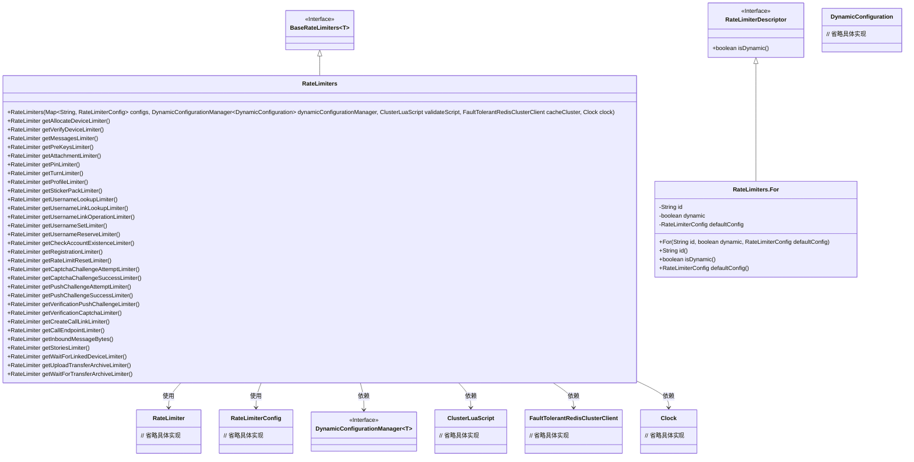

# 基础信息

|      |      |
|------|------|
| 名称 | RateLimiters |
| 编码语言 | .java |
| 代码路径 | Signal-Server/service/src/main/java/org/whispersystems/textsecuregcm/limits/RateLimiters.java |
| 包名 | org.whispersystems.textsecuregcm.limits |
| 依赖项 | ['com.google.common.annotations.VisibleForTesting', 'java.time.Clock', 'java.time.Duration', 'java.util.Map', 'org.whispersystems.textsecuregcm.configuration.dynamic.DynamicConfiguration', 'org.whispersystems.textsecuregcm.redis.ClusterLuaScript', 'org.whispersystems.textsecuregcm.redis.FaultTolerantRedisClusterClient', 'org.whispersystems.textsecuregcm.storage.DynamicConfigurationManager'] |
| 概述说明 | RateLimiters类提供动态配置和默认限流策略。 |

# 说明

RateLimiters类定义了一系列限流器，支持动态配置和默认限流策略。该类通过灵活的配置选项，允许用户根据具体需求调整限流规则，同时提供了默认策略以确保在未配置情况下的稳定运行。这种设计使得限流器能够适应不同的应用场景，既保证了系统的稳定性，又提供了高度的可定制性。

# 类列表 Class Summary

| 名称   | 类型  | 说明 |
|-------|------|-------------|
| RateLimiters | class | RateLimiters类定义多种限流器，包含动态配置和默认限流策略。 |

## 类 RateLimiters

|      |      |
|------|------|
| 访问范围 | public |
| 类型 | class |
| 名称 | RateLimiters |
| 说明 | RateLimiters类定义多种限流器，包含动态配置和默认限流策略。 |

### UML类图

### 描述
该代码定义了一个 `RateLimiters` 类，继承自 `BaseRateLimiters`，并实现了多种限流器的获取方法。`RateLimiters` 类通过枚举 `For` 来定义不同的限流器配置，并使用 `RateLimiterConfig` 来配置限流器的参数。`RateLimiters` 类依赖于 `DynamicConfigurationManager`、`ClusterLuaScript`、`FaultTolerantRedisClusterClient` 和 `Clock` 等外部组件来实现限流器的创建和验证。该设计允许灵活地管理和控制不同操作的请求速率。

### 内部方法调用关系图

```mermaid
graph TD
    A["类RateLimiters"]
    B["枚举For"]
    C["构造方法: RateLimiters(Map<String, RateLimiterConfig>, DynamicConfigurationManager<DynamicConfiguration>, ClusterLuaScript, FaultTolerantRedisClusterClient, Clock)"]
    D["方法: createAndValidate(Map<String, RateLimiterConfig>, DynamicConfigurationManager<DynamicConfiguration>, FaultTolerantRedisClusterClient)"]
    E["方法: getAllocateDeviceLimiter()"]
    F["方法: getVerifyDeviceLimiter()"]
    G["方法: getMessagesLimiter()"]
    H["方法: getPreKeysLimiter()"]
    I["方法: getAttachmentLimiter()"]
    J["方法: getPinLimiter()"]
    K["方法: getTurnLimiter()"]
    L["方法: getProfileLimiter()"]
    M["方法: getStickerPackLimiter()"]
    N["方法: getUsernameLookupLimiter()"]
    O["方法: getUsernameLinkLookupLimiter()"]
    P["方法: getUsernameLinkOperationLimiter()"]
    Q["方法: getUsernameSetLimiter()"]
    R["方法: getUsernameReserveLimiter()"]
    S["方法: getCheckAccountExistenceLimiter()"]
    T["方法: getRegistrationLimiter()"]
    U["方法: getRateLimitResetLimiter()"]
    V["方法: getCaptchaChallengeAttemptLimiter()"]
    W["方法: getCaptchaChallengeSuccessLimiter()"]
    X["方法: getPushChallengeAttemptLimiter()"]
    Y["方法: getPushChallengeSuccessLimiter()"]
    Z["方法: getVerificationPushChallengeLimiter()"]
    AA["方法: getVerificationCaptchaLimiter()"]
    AB["方法: getCreateCallLinkLimiter()"]
    AC["方法: getCallEndpointLimiter()"]
    AD["方法: getInboundMessageBytes()"]
    AE["方法: getStoriesLimiter()"]
    AF["方法: getWaitForLinkedDeviceLimiter()"]
    AG["方法: getUploadTransferArchiveLimiter()"]
    AH["方法: getWaitForTransferArchiveLimiter()"]
    AI["方法: forDescriptor(For)"]

    A --> B
    A --> C
    A --> D
    A --> E
    A --> F
    A --> G
    A --> H
    A --> I
    A --> J
    A --> K
    A --> L
    A --> M
    A --> N
    A --> O
    A --> P
    A --> Q
    A --> R
    A --> S
    A --> T
    A --> U
    A --> V
    A --> W
    A --> X
    A --> Y
    A --> Z
    A --> AA
    A --> AB
    A --> AC
    A --> AD
    A --> AE
    A --> AF
    A --> AG
    A --> AH
    E --> AI
    F --> AI
    G --> AI
    H --> AI
    I --> AI
    J --> AI
    K --> AI
    L --> AI
    M --> AI
    N --> AI
    O --> AI
    P --> AI
    Q --> AI
    R --> AI
    S --> AI
    T --> AI
    U --> AI
    V --> AI
    W --> AI
    X --> AI
    Y --> AI
    Z --> AI
    AA --> AI
    AB --> AI
    AC --> AI
    AD --> AI
    AE --> AI
    AF --> AI
    AG --> AI
    AH --> AI
```

这段代码定义了一个名为 `RateLimiters` 的类，该类继承自 `BaseRateLimiters`，并包含一个枚举 `For`，用于描述不同的限流器类型。`RateLimiters` 类提供了多个方法，用于获取特定类型的限流器，这些方法最终都调用了 `forDescriptor(For)` 方法来返回相应的限流器实例。`createAndValidate` 方法用于创建并验证 `RateLimiters` 实例，确保配置的正确性。

### 字段列表 Field List

| 名称  | 类型  | 说明 |
|-------|-------|------|

### 方法列表 Method List

| 名称  | 类型  | 说明 |
|-------|-------|------|
| getAllocateDeviceLimiter | RateLimiter | 获取设备分配限流器的方法。 |
| getProfileLimiter | RateLimiter | 获取配置文件限流器的方法。 |
| getCaptchaChallengeSuccessLimiter | RateLimiter | 获取验证码挑战成功限流器的方法。 |
| getStickerPackLimiter | RateLimiter | 获取贴纸包限流器的方法。 |
| getUsernameReserveLimiter | RateLimiter | 获取用户名保留限流器实例。 |
| getPushChallengeAttemptLimiter | RateLimiter | 获取推送挑战尝试的限流器实例。 |
| getUsernameLinkLookupLimiter | RateLimiter | 获取用户名链接查找限流器的方法。 |
| getCallEndpointLimiter | RateLimiter | 获取调用端点的限流器实例。 |
| getUsernameSetLimiter | RateLimiter | 获取用户名设置限流器的方法。 |
| getCreateCallLinkLimiter | RateLimiter | 获取创建通话链接的限流器实例。 |
| getUploadTransferArchiveLimiter | RateLimiter | 获取上传传输归档的限流器实例。 |
| getWaitForTransferArchiveLimiter | RateLimiter | 获取等待传输归档的限流器实例。 |
| getWaitForLinkedDeviceLimiter | RateLimiter | 获取等待关联设备限流器的方法。 |
| getCheckAccountExistenceLimiter | RateLimiter | 获取检查账户存在性的限流器。 |
| getPinLimiter | RateLimiter | 获取PIN限流器的公共方法。 |
| getVerificationPushChallengeLimiter | RateLimiter | 获取验证推送挑战的速率限制器。 |
| getUsernameLinkOperationLimiter | RateLimiter | 获取用户名链接操作限流器实例。 |
| getTurnLimiter | RateLimiter | 获取TURN限流器的公共方法。 |
| getAttachmentLimiter | RateLimiter | 获取附件限流器的方法，返回针对附件的限流器实例。 |
| getRegistrationLimiter | RateLimiter | 获取注册限流器的方法。 |
| getRateLimitResetLimiter | RateLimiter | 获取速率限制重置限流器的方法。 |
| getMessagesLimiter | RateLimiter | 获取消息限流器的方法，返回消息描述符的限流器实例。 |
| getPushChallengeSuccessLimiter | RateLimiter | 获取推送挑战成功限流器的方法。 |
| getUsernameLookupLimiter | RateLimiter | 获取用户名查找限流器的方法，返回指定描述符的限流器。 |
| getCaptchaChallengeAttemptLimiter | RateLimiter | 获取验证码挑战尝试的限流器实例。 |
| getVerificationCaptchaLimiter | RateLimiter | 获取验证码限流器的方法，返回指定描述符的限流器实例。 |
| createAndValidate | RateLimiters | 创建并验证限流器实例，包含配置、动态配置管理和缓存集群参数。 |
| getVerifyDeviceLimiter | RateLimiter | 获取设备验证限流器的方法，返回指定描述符的限流器实例。 |
| getStoriesLimiter | RateLimiter | 获取故事限流器的方法，返回STORIES描述符。 |
| getPreKeysLimiter | RateLimiter | 获取预密钥限流器实例的方法。 |
| getInboundMessageBytes | RateLimiter | 获取入站消息字节数的限流器实例。 |

