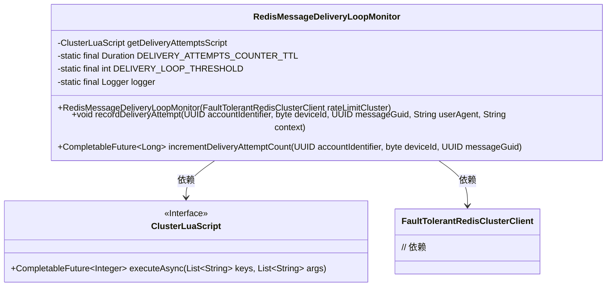
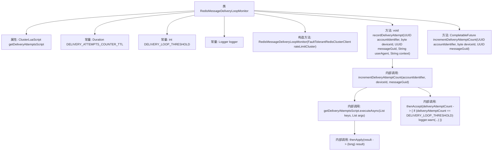

# 基础信息

|      |      |
|------|------|
| 名称 | RedisMessageDeliveryLoopMonitor |
| 编码语言 | .java |
| 代码路径 | Signal-Server/service/src/main/java/org/whispersystems/textsecuregcm/limits/RedisMessageDeliveryLoopMonitor.java |
| 包名 | org.whispersystems.textsecuregcm.limits |
| 依赖项 | ['com.google.common.annotations.VisibleForTesting', 'io.lettuce.core.ScriptOutputType', 'java.io.IOException', 'java.io.UncheckedIOException', 'java.time.Duration', 'java.util.List', 'java.util.UUID', 'java.util.concurrent.CompletableFuture', 'org.slf4j.Logger', 'org.slf4j.LoggerFactory', 'org.whispersystems.textsecuregcm.redis.ClusterLuaScript', 'org.whispersystems.textsecuregcm.redis.FaultTolerantRedisClusterClient'] |
| 概述说明 | Redis监控类，检测重复投递并记录警告。 |

# 说明

Redis消息投递循环监控类是一个用于检测消息重复投递的工具。它通过监控消息的投递过程，识别并记录重复投递的情况，同时生成警告信息。该类的核心功能是确保消息投递的准确性和唯一性，防止因重复投递导致的系统异常或数据不一致问题。通过实时监控和记录，开发者可以及时发现并处理潜在的投递问题，提升系统的稳定性和可靠性。

# 类列表 Class Summary

| 名称   | 类型  | 说明 |
|-------|------|-------------|
| RedisMessageDeliveryLoopMonitor | class | Redis消息投递循环监控类，检测重复投递并记录警告。 |

## 类 RedisMessageDeliveryLoopMonitor

|      |      |
|------|------|
| 访问范围 | public |
| 类型 | class |
| 名称 | RedisMessageDeliveryLoopMonitor |
| 说明 | Redis消息投递循环监控类，检测重复投递并记录警告。 |

### UML类图

**描述：**  
`RedisMessageDeliveryLoopMonitor` 类用于监控消息传递循环，通过 `ClusterLuaScript` 接口与 Redis 集群进行交互，记录消息传递尝试次数并检测是否进入循环。该类包含两个主要方法：`recordDeliveryAttempt` 用于记录传递尝试并检测循环，`incrementDeliveryAttemptCount` 用于异步增加传递尝试计数。`ClusterLuaScript` 接口定义了与 Lua 脚本交互的方法，`FaultTolerantRedisClusterClient` 是 Redis 集群客户端，用于加载脚本。

### 内部方法调用关系图

这段代码定义了一个`RedisMessageDeliveryLoopMonitor`类，用于监控消息的传递尝试次数，并在检测到传递循环时记录警告。类中包含一个构造方法和两个主要方法：`recordDeliveryAttempt`和`incrementDeliveryAttemptCount`。`recordDeliveryAttempt`方法用于记录传递尝试并检查是否达到传递循环的阈值，而`incrementDeliveryAttemptCount`方法则通过执行Lua脚本异步增加传递尝试次数并返回结果。整个流程通过异步调用和回调机制实现，确保在高并发环境下也能有效监控消息传递状态。

### 字段列表 Field List

| 名称  | 类型  | 说明 |
|-------|-------|------|
| getDeliveryAttemptsScript | ClusterLuaScript | 私有最终变量getDeliveryAttemptsScript用于获取投递尝试脚本。 |
| DELIVERY_LOOP_THRESHOLD = 5 | int | 私有静态常量DELIVERY_LOOP_THRESHOLD值为5。 |
| DELIVERY_ATTEMPTS_COUNTER_TTL = Duration.ofHours(1) | Duration | 私有静态常量DELIVERY_ATTEMPTS_COUNTER_TTL设置为1小时。 |
| logger = LoggerFactory.getLogger(MessageDeliveryLoopMonitor.class) | Logger | MessageDeliveryLoopMonitor类中定义了一个私有的静态日志记录器。 |

### 方法列表 Method List

| 名称  | 类型  | 说明 |
|-------|-------|------|
| recordDeliveryAttempt | void | 记录消息投递尝试，超过阈值时警告检测到投递循环。 |
| incrementDeliveryAttemptCount | CompletableFuture<Long> | 测试可见方法，异步增加消息投递尝试计数，返回结果。 |

