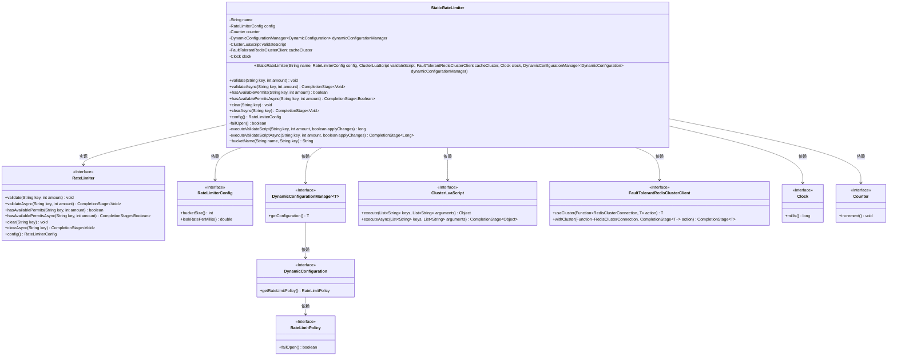

# 基础信息

|      |      |
|------|------|
| 名称 | StaticRateLimiter |
| 编码语言 | .java |
| 代码路径 | Signal-Server/service/src/main/java/org/whispersystems/textsecuregcm/limits/StaticRateLimiter.java |
| 包名 | org.whispersystems.textsecuregcm.limits |
| 依赖项 | ['java.util.Objects.requireNonNull', 'java.util.concurrent.CompletableFuture.completedFuture', 'java.util.concurrent.CompletableFuture.failedFuture', 'com.google.common.annotations.VisibleForTesting', 'io.lettuce.core.RedisException', 'io.micrometer.core.instrument.Counter', 'io.micrometer.core.instrument.Metrics', 'java.time.Clock', 'java.time.Duration', 'java.util.List', 'java.util.concurrent.CompletionStage', 'org.whispersystems.textsecuregcm.configuration.dynamic.DynamicConfiguration', 'org.whispersystems.textsecuregcm.controllers.RateLimitExceededException', 'org.whispersystems.textsecuregcm.metrics.MetricsUtil', 'org.whispersystems.textsecuregcm.redis.ClusterLuaScript', 'org.whispersystems.textsecuregcm.redis.FaultTolerantRedisClusterClient', 'org.whispersystems.textsecuregcm.storage.DynamicConfigurationManager', 'org.whispersystems.textsecuregcm.util.ExceptionUtils', 'org.whispersystems.textsecuregcm.util.Util'] |
| 概述说明 | 静态限流器实现同步异步验证、清理及配置管理功能。 |

# 说明

静态限流器实现了一个高效的流量控制机制，支持同步和异步的请求验证，确保系统在高并发场景下的稳定性。该限流器具备自动清理功能，能够及时释放不再需要的资源，避免内存泄漏。同时，配置管理功能允许用户灵活调整限流策略，包括限流阈值和时间窗口等参数，以适应不同的业务需求。整体设计旨在提供可靠、可扩展的限流解决方案，适用于各种复杂的应用场景。

# 类列表 Class Summary

| 名称   | 类型  | 说明 |
|-------|------|-------------|
| StaticRateLimiter | class | 静态限流器实现，包含同步异步验证、清理及配置管理功能。 |

## 类 StaticRateLimiter

|      |      |
|------|------|
| 访问范围 | public |
| 类型 | class |
| 名称 | StaticRateLimiter |
| 说明 | 静态限流器实现，包含同步异步验证、清理及配置管理功能。 |

### UML类图

### 描述
`StaticRateLimiter`类实现了`RateLimiter`接口，用于限制请求速率。它依赖于`RateLimiterConfig`配置、`DynamicConfigurationManager`动态配置管理、`ClusterLuaScript`脚本执行、`FaultTolerantRedisClusterClient` Redis集群客户端、`Clock`时间管理以及`Counter`计数器。通过同步和异步方法，`StaticRateLimiter`可以验证请求是否超出速率限制，并处理相关异常。

### 内部方法调用关系图

```mermaid
graph TD
    A["类StaticRateLimiter"]
    B["属性: String name"]
    C["属性: RateLimiterConfig config"]
    D["属性: Counter counter"]
    E["属性: DynamicConfigurationManager<DynamicConfiguration> dynamicConfigurationManager"]
    F["属性: ClusterLuaScript validateScript"]
    G["属性: FaultTolerantRedisClusterClient cacheCluster"]
    H["属性: Clock clock"]
    I["构造方法: StaticRateLimiter(String name, RateLimiterConfig config, ClusterLuaScript validateScript, FaultTolerantRedisClusterClient cacheCluster, Clock clock, DynamicConfigurationManager<DynamicConfiguration> dynamicConfigurationManager)"]
    J["方法: void validate(String key, int amount)"]
    K["方法: CompletionStage<Void> validateAsync(String key, int amount)"]
    L["方法: boolean hasAvailablePermits(String key, int amount)"]
    M["方法: CompletionStage<Boolean> hasAvailablePermitsAsync(String key, int amount)"]
    N["方法: void clear(String key)"]
    O["方法: CompletionStage<Void> clearAsync(String key)"]
    P["方法: RateLimiterConfig config()"]
    Q["方法: boolean failOpen()"]
    R["方法: long executeValidateScript(String key, int amount, boolean applyChanges)"]
    S["方法: CompletionStage<Long> executeValidateScriptAsync(String key, int amount, boolean applyChanges)"]
    T["方法: static String bucketName(String name, String key)"]

    A --> B
    A --> C
    A --> D
    A --> E
    A --> F
    A --> G
    A --> H
    A --> I
    A --> J
    A --> K
    A --> L
    A --> M
    A --> N
    A --> O
    A --> P
    A --> Q
    A --> R
    A --> S
    A --> T
```

该流程图展示了`StaticRateLimiter`类的结构及其方法调用关系。`StaticRateLimiter`类实现了`RateLimiter`接口，包含了多个属性和方法，用于处理限流逻辑。构造方法初始化了类的属性，而其他方法则分别用于同步和异步的限流验证、清除操作以及配置获取。`executeValidateScript`和`executeValidateScriptAsync`方法用于执行Lua脚本进行限流验证，`failOpen`方法用于判断是否在异常情况下开放限流。

### 字段列表 Field List

| 名称  | 类型  | 说明 |
|-------|-------|------|
| config | RateLimiterConfig | 包含私有且不可变的限流配置对象。 |
| counter | Counter | 私有且不可变的计数器实例。 |
| clock | Clock | 私有且不可变的时钟对象。 |
| validateScript | ClusterLuaScript | 私有终态ClusterLuaScript验证脚本 |
| name | String | 定义了一个受保护的不可变字符串变量name。 |
| dynamicConfigurationManager | DynamicConfigurationManager<DynamicConfiguration> | 动态配置管理器用于管理动态配置实例。 |
| cacheCluster | FaultTolerantRedisClusterClient | 私有且不可变的容错Redis集群客户端实例。 |

### 方法列表 Method List

| 名称  | 类型  | 说明 |
|-------|-------|------|
| config | RateLimiterConfig | 该方法返回RateLimiterConfig配置对象。 |
| clear | void | 清除指定键的缓存数据。 |
| validateAsync | CompletionStage<Void> | 异步验证key和amount，成功返回空，失败则重试或抛出异常。 |
| bucketName | String | 测试可见的受保护方法，生成包含名称和键的桶名。 |
| validate | void | 验证请求速率，超限抛出异常，失败时根据配置处理。 |
| executeValidateScriptAsync | CompletionStage<Long> | 异步执行验证脚本，传入键、数量和变更标志，返回结果。 |
| clearAsync | CompletionStage<Void> | 异步清除指定键的缓存数据，完成后执行空操作。 |
| hasAvailablePermits | boolean | 检查指定键的许可是否足够，不足时根据配置决定返回或抛出异常。 |
| failOpen | boolean | 方法failOpen返回动态配置管理器中速率限制策略的failOpen值。 |
| hasAvailablePermitsAsync | CompletionStage<Boolean> | 异步检查许可是否可用，异常时根据RedisException和failOpen返回true或抛出异常。 |
| executeValidateScript | long | 执行验证脚本，传入键、数量和应用更改参数，返回长整型结果。 |

