# 基础信息

|      |      |
|------|------|
| 名称 | limits |
| 编码语言 | .java |
| 代码路径 | Signal-Server/service/src/main/java/org/whispersystems/textsecuregcm/limits |
| 包名 | Signal-Server.service.src.main.java.org.whispersystems.textsecuregcm.limits |
| 概述说明 | Signal-Server限流器类管理请求速率，确保系统稳定性和安全性。 |

# 说明

## 概述
该代码模块主要围绕限流、唯一性估算和消息投递监控等核心功能展开，旨在提升系统的稳定性、安全性和性能。模块中包含了多种限流器实现（如动态限流器、静态限流器、基于IP的限流器等），支持同步和异步的请求验证，并提供了灵活的配置管理功能。此外，模块还通过Redis集群操作HyperLogLog数据结构，实现了高效的大规模数据唯一性估算。消息投递监控功能则通过检测重复投递情况，确保消息投递的准确性和唯一性。整体设计注重高并发场景下的系统稳定性和资源优化。

## 主要业务场景
1. **限流管理**：通过动态和静态限流器，控制请求的速率，防止系统过载或遭受恶意攻击。支持基于IP的限流策略，确保来自同一IP的请求在特定时间窗口内不超过预设阈值。
2. **唯一性估算**：利用HyperLogLog数据结构，估算大规模数据集中唯一元素的数量，适用于需要高效处理唯一性统计的场景。
3. **消息投递监控**：监控消息的投递过程，识别并记录重复投递的情况，生成警告信息，确保消息投递的准确性和唯一性。
4. **挑战管理**：通过验证码和推送挑战，验证用户身份，防止滥用和过度使用系统资源。推送挑战管理器生成和验证令牌，确保身份验证过程的安全性。
5. **限流挑战管理**：管理推送和验证码挑战，验证速率限制并在必要时进行重置，确保系统在处理高并发请求时的稳定性和安全性。
6. **资源优化**：通过自动清理功能和灵活的配置管理，及时释放不再需要的资源，避免内存泄漏，并动态调整限流规则，提升系统的可维护性和响应速度。

### 包内部结构视图

```mermaid
graph TD
    limits --> RateLimiter.java
    limits --> CardinalityEstimator.java
    limits --> NoopMessageDeliveryLoopMonitor.java
    limits --> RedisMessageDeliveryLoopMonitor.java
    limits --> DynamicRateLimiter.java
    limits --> BaseRateLimiters.java
    limits --> MessageDeliveryLoopMonitor.java
    limits --> RateLimiterDescriptor.java
    limits --> RateLimitChallengeManager.java
    limits --> StaticRateLimiter.java
    limits --> RateLimitedByIp.java
    limits --> RateLimitChallengeOptionManager.java
    limits --> RateLimiterConfig.java
    limits --> RateLimitByIpFilter.java
    limits --> RateLimiters.java
    limits --> PushChallengeManager.java
```

该流程图展示了`limits`目录下的所有文件及其层级关系。`limits`作为根节点，包含了多个与速率限制相关的Java文件，如`RateLimiter.java`、`DynamicRateLimiter.java`、`RateLimiters.java`等。这些文件共同构成了一个完整的速率限制功能模块，用于管理和控制系统的请求速率。

# 文件列表 File List

| 名称   | 类型  | 说明 |
|-------|------|-------------|
| [CardinalityEstimator.java](CardinalityEstimator.md) | file | CardinalityEstimator类通过Redis集群操作HyperLogLog，异步添加元素并更新本地计数。 |
| [StaticRateLimiter.java](StaticRateLimiter.md) | file | 静态限流器实现同步异步验证、清理及配置管理功能。 |
| [RateLimitChallengeManager.java](RateLimitChallengeManager.md) | file | RateLimitChallengeManager负责推送、验证码挑战及速率限制管理。 |
| [RateLimiterDescriptor.java](RateLimiterDescriptor.md) | file | 信息为空，无法生成概要描述。 |
| [MessageDeliveryLoopMonitor.java](MessageDeliveryLoopMonitor.md) | file | 信息为空，无法生成概要描述。 |
| [BaseRateLimiters.java](BaseRateLimiters.md) | file | BaseRateLimiters管理限流器，支持动态与静态配置，通过描述符获取并验证。 |
| [PushChallengeManager.java](PushChallengeManager.md) | file | PushChallengeManager类负责推送挑战管理，生成令牌并验证用户响应。 |
| [RateLimiters.java](RateLimiters.md) | file | RateLimiters类提供动态配置和默认限流策略。 |
| [RateLimitByIpFilter.java](RateLimitByIpFilter.md) | file | IP请求速率限制过滤器实现控制流量。 |
| [RateLimiterConfig.java](RateLimiterConfig.md) | file | 信息为空，无法生成概要描述。 |
| [RateLimitChallengeOptionManager.java](RateLimitChallengeOptionManager.md) | file | 管理限流挑战，支持验证码和推送验证。 |
| [RateLimitedByIp.java](RateLimitedByIp.md) | file | 信息为空，无法生成概要描述。 |
| [DynamicRateLimiter.java](DynamicRateLimiter.md) | file | 动态限流器支持同步异步验证、清除及配置更新功能。 |
| [RedisMessageDeliveryLoopMonitor.java](RedisMessageDeliveryLoopMonitor.md) | file | Redis监控类，检测重复投递并记录警告。 |
| [NoopMessageDeliveryLoopMonitor.java](NoopMessageDeliveryLoopMonitor.md) | file | NoopMessageDeliveryLoopMonitor实现MessageDeliveryLoopMonitor接口，无实际功能。 |
| [RateLimiter.java](RateLimiter.md) | file | 输入内容为空，请提供具体信息以生成概要描述。 |

