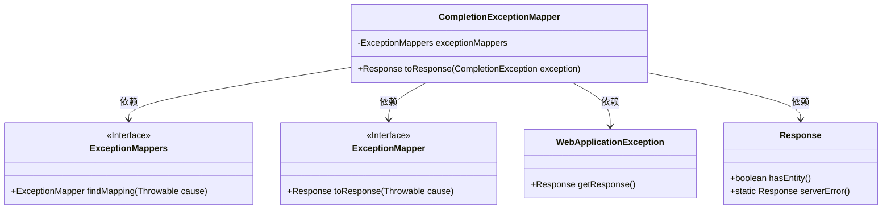
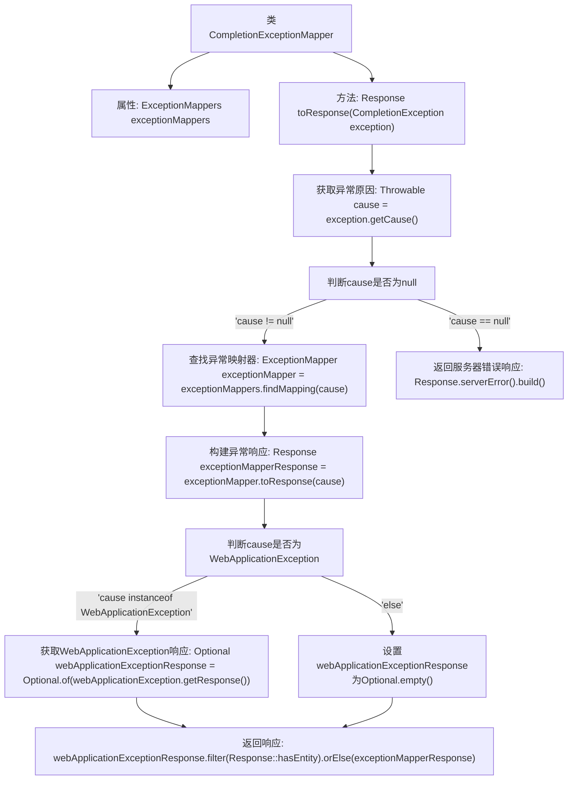

# 基础信息

|      |      |
|------|------|
| 名称 | CompletionExceptionMapper |
| 编码语言 | .java |
| 代码路径 | Signal-Server/service/src/main/java/org/whispersystems/textsecuregcm/mappers/CompletionExceptionMapper.java |
| 包名 | org.whispersystems.textsecuregcm.mappers |
| 依赖项 | ['jakarta.ws.rs.WebApplicationException', 'jakarta.ws.rs.core.Context', 'jakarta.ws.rs.core.Response', 'jakarta.ws.rs.ext.ExceptionMapper', 'jakarta.ws.rs.ext.Provider', 'java.util.Optional', 'java.util.concurrent.CompletionException', 'org.glassfish.jersey.spi.ExceptionMappers'] |
| 概述说明 | CompletionExceptionMapper处理异常，映射原因并返回响应。 |

# 说明

CompletionExceptionMapper负责处理CompletionException，通过分析异常原因并将其映射为相应的响应信息，确保系统在遇到此类异常时能够返回恰当的反馈。该机制有助于提升系统的健壮性和用户体验，使异常处理更加精准和高效。

# 类列表 Class Summary

| 名称   | 类型  | 说明 |
|-------|------|-------------|
| CompletionExceptionMapper | class | CompletionExceptionMapper处理CompletionException，映射异常原因并返回相应响应。 |

## 类 CompletionExceptionMapper

|      |      |
|------|------|
| 访问范围 | @Provider;public |
| 类型 | class |
| 名称 | CompletionExceptionMapper |
| 说明 | CompletionExceptionMapper处理CompletionException，映射异常原因并返回相应响应。 |

### UML类图

**描述：**
`CompletionExceptionMapper` 类实现了 `ExceptionMapper` 接口，用于处理 `CompletionException` 异常。它依赖于 `ExceptionMappers` 接口来查找适合的异常映射器，并依赖于 `ExceptionMapper` 接口来处理异常。如果异常原因是 `WebApplicationException`，则优先使用其响应，否则使用映射器的响应。最终返回一个 `Response` 对象，表示服务器错误或处理后的响应。

### 内部方法调用关系图

这段代码是一个异常映射器类，用于处理`CompletionException`异常。它首先获取异常的原因，然后根据原因查找相应的异常映射器并构建响应。如果原因是`WebApplicationException`，则优先返回其响应，否则返回映射器构建的响应。如果异常原因为空，则返回服务器错误响应。

### 字段列表 Field List

| 名称  | 类型  | 说明 |
|-------|-------|------|
| exceptionMappers | ExceptionMappers | 包含私有成员变量exceptionMappers。 |

### 方法列表 Method List

| 名称  | 类型  | 说明 |
|-------|-------|------|
| toResponse | Response | 处理异常映射，优先保留WebApplicationException的响应实体。 |

