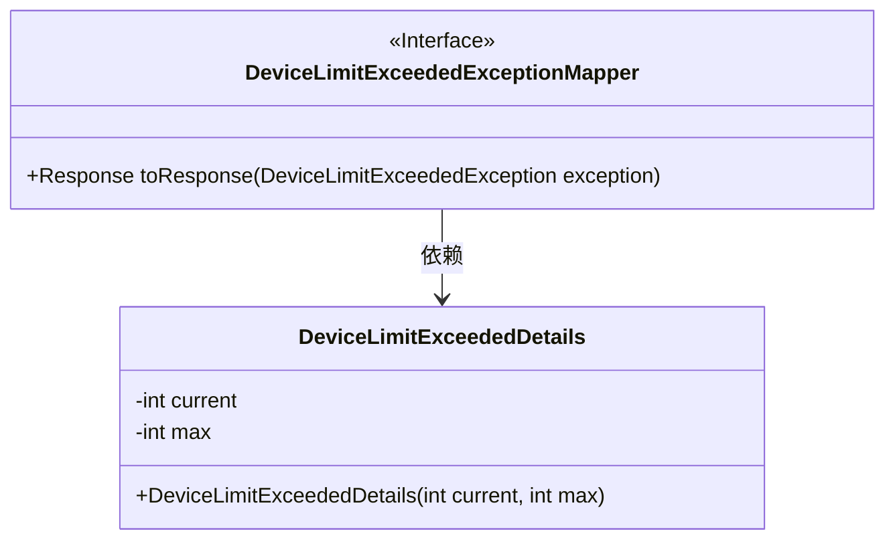
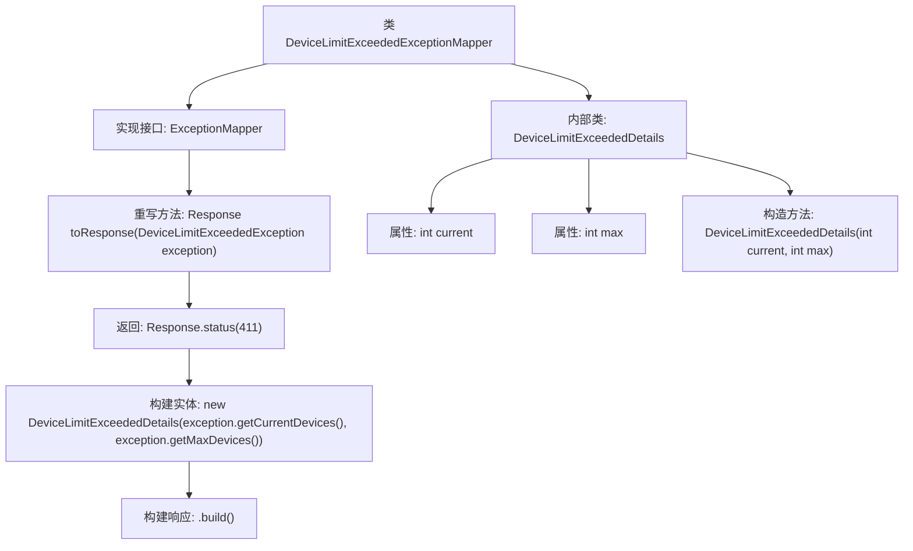

# 基础信息

|      |      |
|------|------|
| 名称 | DeviceLimitExceededExceptionMapper |
| 编码语言 | .java |
| 代码路径 | Signal-Server/service/src/main/java/org/whispersystems/textsecuregcm/mappers/DeviceLimitExceededExceptionMapper.java |
| 包名 | org.whispersystems.textsecuregcm.mappers |
| 依赖项 | ['com.fasterxml.jackson.annotation.JsonProperty', 'jakarta.ws.rs.core.Response', 'jakarta.ws.rs.ext.ExceptionMapper', 'jakarta.ws.rs.ext.Provider', 'org.whispersystems.textsecuregcm.controllers.DeviceLimitExceededException'] |
| 概述说明 | 设备超限异常映射器返回411状态码及当前与最大设备数信息。 |

# 说明

设备超限异常映射器用于处理设备数量超过最大限制的情况。当设备数量超过预设的最大值时，该映射器会返回HTTP状态码411，表示请求的长度不符合要求。同时，映射器还会提供当前设备数量和最大允许设备数的信息，以便用户了解具体超限情况。这种机制有助于及时识别和处理设备超限问题，确保系统资源的合理分配和使用。

# 类列表 Class Summary

| 名称   | 类型  | 说明 |
|-------|------|-------------|
| DeviceLimitExceededExceptionMapper | class | 设备超限异常映射器，返回411状态码及当前与最大设备数。 |

## 类 DeviceLimitExceededExceptionMapper

|      |      |
|------|------|
| 访问范围 | @Provider;public |
| 类型 | class |
| 名称 | DeviceLimitExceededExceptionMapper |
| 说明 | 设备超限异常映射器，返回411状态码及当前与最大设备数。 |

### UML类图

这段代码定义了一个`DeviceLimitExceededExceptionMapper`类，它实现了`ExceptionMapper`接口，用于处理`DeviceLimitExceededException`异常。`toResponse`方法将异常信息转换为HTTP响应，状态码为411，并包含一个`DeviceLimitExceededDetails`对象，该对象封装了当前设备数量和最大设备数量。`DeviceLimitExceededDetails`是一个内部类，用于存储和传递设备数量信息。

### 内部方法调用关系图

该流程图描述了`DeviceLimitExceededExceptionMapper`类的结构及其内部类`DeviceLimitExceededDetails`的组成。`DeviceLimitExceededExceptionMapper`实现了`ExceptionMapper`接口，并重写了`toResponse`方法，用于将`DeviceLimitExceededException`异常转换为HTTP响应。响应状态码为411，并包含一个`DeviceLimitExceededDetails`实体，该实体由异常中的当前设备数和最大设备数构造。内部类`DeviceLimitExceededDetails`包含两个属性`current`和`max`，并通过构造方法进行初始化。

### 字段列表 Field List

| 名称  | 类型  | 说明 |
|-------|-------|------|

### 方法列表 Method List

| 名称  | 类型  | 说明 |
|-------|-------|------|
| toResponse | Response | 重写方法返回设备超限异常响应，包含当前和最大设备数。 |

