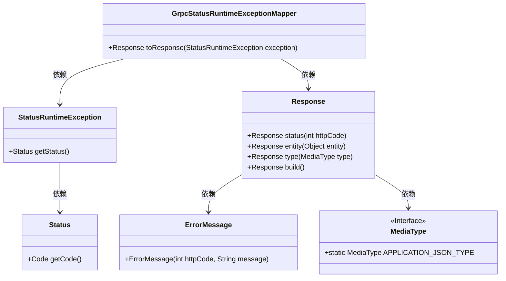
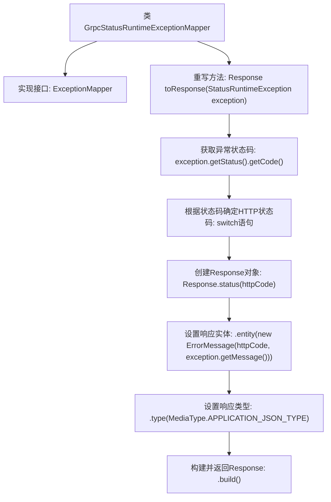

# 基础信息

|      |      |
|------|------|
| 名称 | GrpcStatusRuntimeExceptionMapper |
| 编码语言 | .java |
| 代码路径 | Signal-Server/service/src/main/java/org/whispersystems/textsecuregcm/mappers/GrpcStatusRuntimeExceptionMapper.java |
| 包名 | org.whispersystems.textsecuregcm.mappers |
| 依赖项 | ['io.dropwizard.jersey.errors.ErrorMessage', 'io.grpc.StatusRuntimeException', 'jakarta.ws.rs.core.MediaType', 'jakarta.ws.rs.core.Response', 'jakarta.ws.rs.ext.ExceptionMapper', 'jakarta.ws.rs.ext.Provider'] |
| 概述说明 | Grpc异常映射器转换gRPC状态码为HTTP状态码，返回JSON响应。 |

# 说明

Grpc异常映射器的主要功能是将gRPC协议中的状态码转换为HTTP状态码，并在处理过程中生成相应的JSON格式响应。这一机制确保了在gRPC服务与HTTP客户端之间的通信中，状态信息能够被正确理解和处理，从而提升系统的兼容性和用户体验。通过这种映射，开发者可以更方便地调试和监控服务间的交互，同时保持前后端通信的一致性。

# 类列表 Class Summary

| 名称   | 类型  | 说明 |
|-------|------|-------------|
| GrpcStatusRuntimeExceptionMapper | class | Grpc异常映射器将gRPC状态码转换为HTTP状态码并返回JSON响应。 |

## 类 GrpcStatusRuntimeExceptionMapper

|      |      |
|------|------|
| 访问范围 | @Provider;public |
| 类型 | class |
| 名称 | GrpcStatusRuntimeExceptionMapper |
| 说明 | Grpc异常映射器将gRPC状态码转换为HTTP状态码并返回JSON响应。 |

### UML类图

这段代码定义了一个`GrpcStatusRuntimeExceptionMapper`类，该类实现了将`StatusRuntimeException`映射为HTTP响应的功能。`toResponse`方法根据异常的状态码生成相应的HTTP状态码，并构建一个包含错误信息的JSON响应。类图中展示了`GrpcStatusRuntimeExceptionMapper`与`StatusRuntimeException`、`Status`、`Response`、`ErrorMessage`和`MediaType`之间的依赖关系。

### 内部方法调用关系图

这段代码定义了一个`GrpcStatusRuntimeExceptionMapper`类，实现了`ExceptionMapper<StatusRuntimeException>`接口。它重写了`toResponse`方法，根据传入的`StatusRuntimeException`异常的状态码，映射到相应的HTTP状态码，并构建一个包含错误信息的JSON响应。流程图展示了从获取异常状态码到最终构建并返回响应的完整流程。

### 字段列表 Field List

| 名称  | 类型  | 说明 |
|-------|-------|------|

### 方法列表 Method List

| 名称  | 类型  | 说明 |
|-------|-------|------|
| toResponse | Response | 将StatusRuntimeException映射为HTTP状态码并返回JSON格式错误信息。 |

