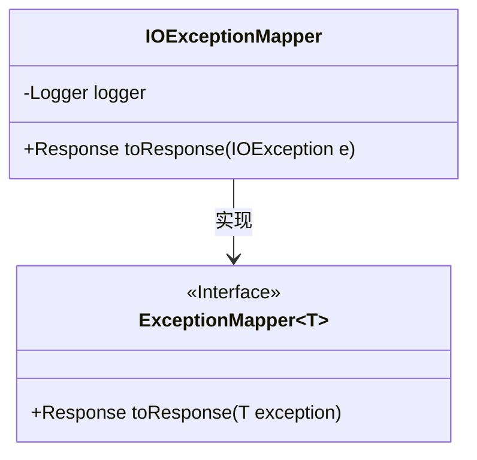
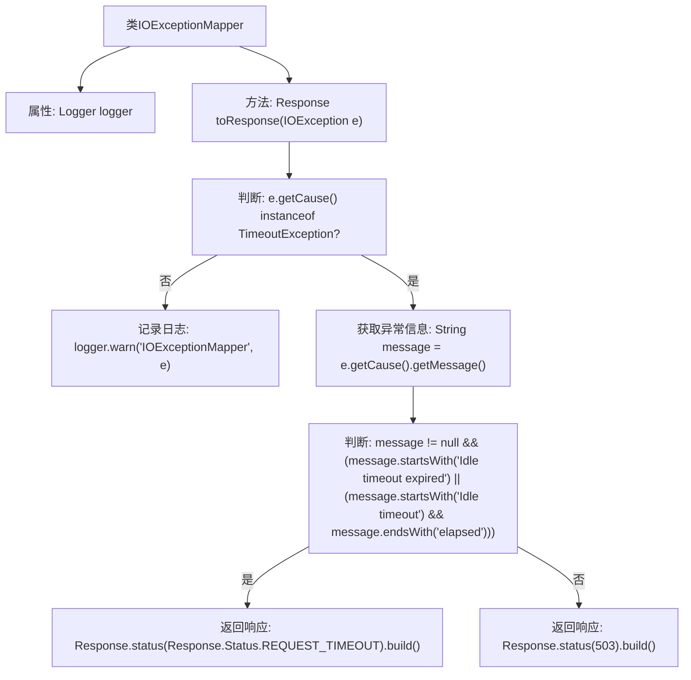

# 基础信息

|      |      |
|------|------|
| 名称 | IOExceptionMapper |
| 编码语言 | .java |
| 代码路径 | Signal-Server/service/src/main/java/org/whispersystems/textsecuregcm/mappers/IOExceptionMapper.java |
| 包名 | org.whispersystems.textsecuregcm.mappers |
| 依赖项 | ['jakarta.ws.rs.core.Response', 'jakarta.ws.rs.ext.ExceptionMapper', 'jakarta.ws.rs.ext.Provider', 'java.io.IOException', 'org.slf4j.Logger', 'org.slf4j.LoggerFactory'] |
| 概述说明 | 处理IO异常，记录日志并返回HTTP状态码。 |

# 说明

在处理IO异常时，系统会首先捕获异常信息，并将其记录到日志中，以便后续分析和排查问题。随后，系统会根据异常类型返回相应的HTTP状态码，以确保客户端能够准确了解请求的处理结果。这种方法不仅有助于快速定位和解决问题，还能提升系统的可靠性和用户体验。

# 类列表 Class Summary

| 名称   | 类型  | 说明 |
|-------|------|-------------|
| IOExceptionMapper | class | 处理IO异常，记录日志并返回相应HTTP状态码。 |

## 类 IOExceptionMapper

|      |      |
|------|------|
| 访问范围 | @Provider;public |
| 类型 | class |
| 名称 | IOExceptionMapper |
| 说明 | 处理IO异常，记录日志并返回相应HTTP状态码。 |

### UML类图

### 描述：
`IOExceptionMapper` 类实现了 `ExceptionMapper<IOException>` 接口，用于处理 `IOException` 异常并将其转换为 HTTP 响应。类中包含一个私有的 `Logger` 实例，用于记录日志。`toResponse` 方法根据异常的类型和消息内容，返回不同的 HTTP 状态码。如果异常是由 `TimeoutException` 引起的，并且消息表明是空闲超时，则返回 `REQUEST_TIMEOUT` 状态码；否则返回 `503` 状态码。

### 内部方法调用关系图

这段代码定义了一个`IOExceptionMapper`类，用于处理`IOException`异常。它通过`toResponse`方法根据异常的不同类型和消息内容，返回不同的HTTP响应。如果异常是由`TimeoutException`引起的，并且消息内容包含特定的超时信息，则返回`REQUEST_TIMEOUT`状态码；否则，返回`503`状态码。日志记录仅在异常不是`TimeoutException`时进行。

### 字段列表 Field List

| 名称  | 类型  | 说明 |
|-------|-------|------|
| logger = LoggerFactory.getLogger(IOExceptionMapper.class) | Logger | 定义私有日志记录器，用于IOExceptionMapper类的日志输出。 |

### 方法列表 Method List

| 名称  | 类型  | 说明 |
|-------|-------|------|
| toResponse | Response | 处理IO异常，区分超时原因并返回相应HTTP状态码。 |

