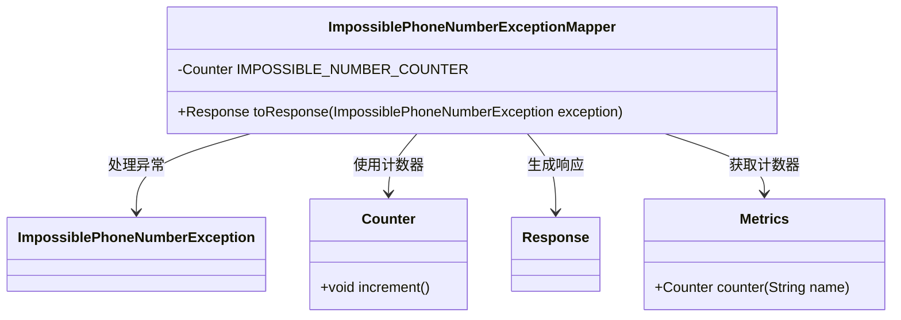
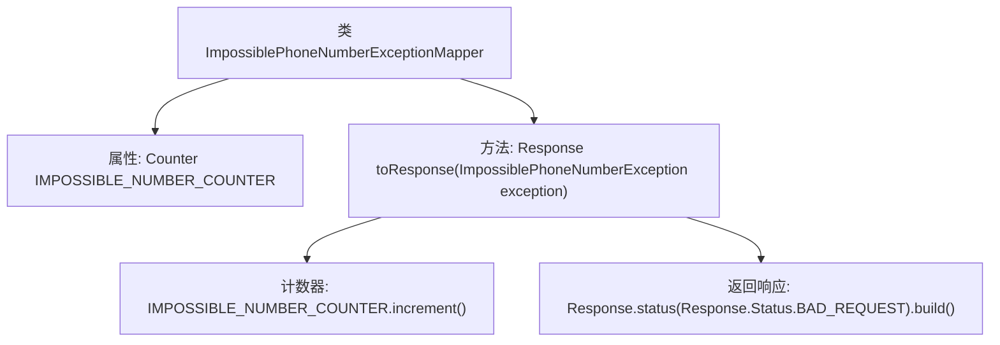

# 基础信息

|      |      |
|------|------|
| 名称 | ImpossiblePhoneNumberExceptionMapper |
| 编码语言 | .java |
| 代码路径 | Signal-Server/service/src/main/java/org/whispersystems/textsecuregcm/mappers/ImpossiblePhoneNumberExceptionMapper.java |
| 包名 | org.whispersystems.textsecuregcm.mappers |
| 依赖项 | ['org.whispersystems.textsecuregcm.metrics.MetricsUtil.name', 'io.micrometer.core.instrument.Counter', 'io.micrometer.core.instrument.Metrics', 'jakarta.ws.rs.core.Response', 'jakarta.ws.rs.ext.ExceptionMapper', 'org.whispersystems.textsecuregcm.util.ImpossiblePhoneNumberException'] |
| 概述说明 | 处理无效电话号码异常，计数并返回错误响应。 |

# 说明

类处理无效电话号码异常，主要负责捕获和计数无效电话号码的错误，并返回相应的错误响应。该功能旨在确保系统在处理电话号码时能够识别并记录无效格式，从而提高数据的准确性和系统的稳定性。通过计数功能，可以统计无效电话号码的发生频率，便于后续分析和改进。返回的错误响应将帮助调用方快速识别问题并进行相应处理。

# 类列表 Class Summary

| 名称   | 类型  | 说明 |
|-------|------|-------------|
| ImpossiblePhoneNumberExceptionMapper | class | 类处理无效电话号码异常，计数并返回错误响应。 |

## 类 ImpossiblePhoneNumberExceptionMapper

|      |      |
|------|------|
| 访问范围 | public |
| 类型 | class |
| 名称 | ImpossiblePhoneNumberExceptionMapper |
| 说明 | 类处理无效电话号码异常，计数并返回错误响应。 |

### UML类图

这段代码定义了一个 `ImpossiblePhoneNumberExceptionMapper` 类，它实现了 `ExceptionMapper` 接口，用于处理 `ImpossiblePhoneNumberException` 异常。类中包含一个私有的 `Counter` 类型的静态变量 `IMPOSSIBLE_NUMBER_COUNTER`，用于记录异常发生的次数。`toResponse` 方法在异常发生时递增计数器，并返回一个状态为 `BAD_REQUEST` 的 `Response` 对象。该类依赖于 `Metrics` 类来获取计数器实例，并通过 `Counter` 类来管理计数器的状态。

### 内部方法调用关系图

这段代码定义了一个`ImpossiblePhoneNumberExceptionMapper`类，该类实现了`ExceptionMapper`接口，用于处理`ImpossiblePhoneNumberException`异常。类中包含一个静态计数器`IMPOSSIBLE_NUMBER_COUNTER`，用于记录异常发生的次数。在`toResponse`方法中，首先递增计数器，然后返回一个状态为`BAD_REQUEST`的HTTP响应。流程图展示了类的结构和方法调用关系。

### 字段列表 Field List

| 名称  | 类型  | 说明 |
|-------|-------|------|
| IMPOSSIBLE_NUMBER_COUNTER =      Metrics.counter(name(ImpossiblePhoneNumberExceptionMapper.class, "impossibleNumbers")) | Counter | 定义一个名为IMPOSSIBLE_NUMBER_COUNTER的静态计数器。 |

### 方法列表 Method List

| 名称  | 类型  | 说明 |
|-------|-------|------|
| toResponse | Response | 处理无效电话号码异常，计数器增加，返回错误响应。 |

