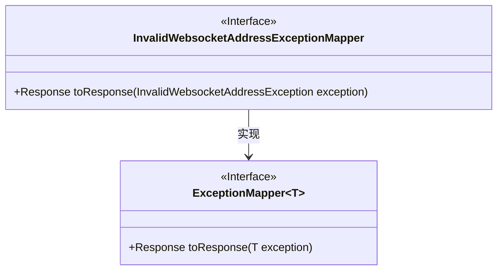
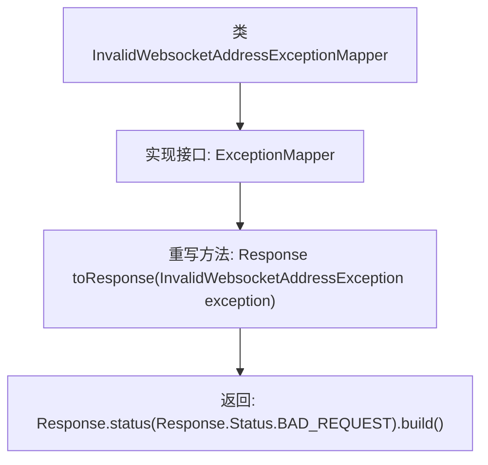

# 基础信息

|      |      |
|------|------|
| 名称 | InvalidWebsocketAddressExceptionMapper |
| 编码语言 | .java |
| 代码路径 | Signal-Server/service/src/main/java/org/whispersystems/textsecuregcm/mappers/InvalidWebsocketAddressExceptionMapper.java |
| 包名 | org.whispersystems.textsecuregcm.mappers |
| 依赖项 | ['jakarta.ws.rs.core.Response', 'jakarta.ws.rs.ext.ExceptionMapper', 'jakarta.ws.rs.ext.Provider', 'org.whispersystems.textsecuregcm.websocket.InvalidWebsocketAddressException'] |
| 概述说明 | InvalidWebsocketAddressExceptionMapper类将异常映射为HTTP 400响应。 |

# 说明

InvalidWebsocketAddressExceptionMapper类的主要功能是将特定的异常映射为HTTP 400响应。该类的作用是捕获并处理无效的WebSocket地址异常，将其转换为客户端错误响应，确保系统能够正确处理并反馈相关错误信息。

# 类列表 Class Summary

| 名称   | 类型  | 说明 |
|-------|------|-------------|
| InvalidWebsocketAddressExceptionMapper | class | InvalidWebsocketAddressExceptionMapper类将异常映射为HTTP 400响应。 |

## 类 InvalidWebsocketAddressExceptionMapper

|      |      |
|------|------|
| 访问范围 | @Provider;public |
| 类型 | class |
| 名称 | InvalidWebsocketAddressExceptionMapper |
| 说明 | InvalidWebsocketAddressExceptionMapper类将异常映射为HTTP 400响应。 |

### UML类图

**描述：**  
`InvalidWebsocketAddressExceptionMapper` 类实现了 `ExceptionMapper` 接口，用于处理 `InvalidWebsocketAddressException` 异常。该类通过 `toResponse` 方法将异常转换为 HTTP 响应，返回状态码为 `BAD_REQUEST`。类图展示了 `InvalidWebsocketAddressExceptionMapper` 与 `ExceptionMapper` 接口之间的实现关系，体现了泛型接口的使用。

### 内部方法调用关系图

这段代码定义了一个名为 `InvalidWebsocketAddressExceptionMapper` 的类，该类实现了 `ExceptionMapper<InvalidWebsocketAddressException>` 接口。它重写了 `toResponse` 方法，当捕获到 `InvalidWebsocketAddressException` 异常时，返回一个状态码为 `BAD_REQUEST` 的 `Response` 对象。该类的核心功能是将特定的异常映射为HTTP响应，便于在Web服务中处理异常情况。

### 字段列表 Field List

| 名称  | 类型  | 说明 |
|-------|-------|------|

### 方法列表 Method List

| 名称  | 类型  | 说明 |
|-------|-------|------|
| toResponse | Response | 重写方法，处理无效Websocket地址异常，返回400状态码。 |

