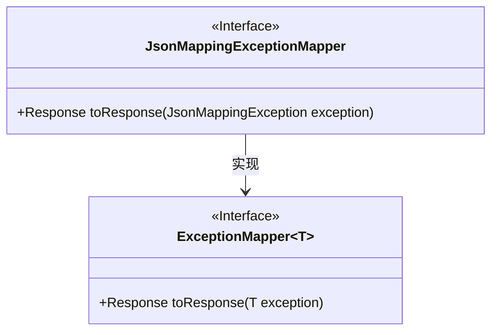
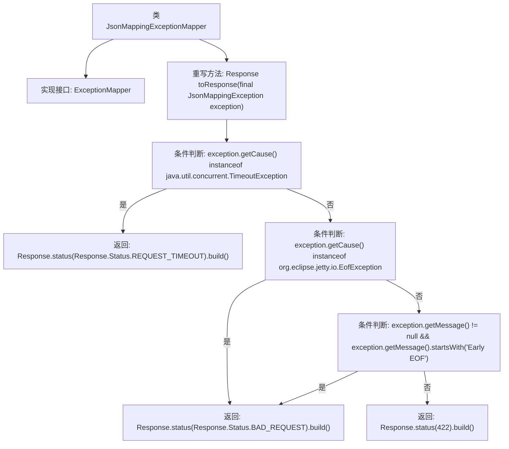

# 基础信息

|      |      |
|------|------|
| 名称 | JsonMappingExceptionMapper |
| 编码语言 | .java |
| 代码路径 | Signal-Server/service/src/main/java/org/whispersystems/textsecuregcm/mappers/JsonMappingExceptionMapper.java |
| 包名 | org.whispersystems.textsecuregcm.mappers |
| 依赖项 | ['com.fasterxml.jackson.databind.JsonMappingException', 'jakarta.ws.rs.core.Response', 'jakarta.ws.rs.ext.ExceptionMapper'] |
| 概述说明 | JsonMappingExceptionMapper根据异常原因返回不同HTTP状态码。 |

# 说明

JsonMappingExceptionMapper用于处理JsonMappingException异常，根据异常的具体原因返回不同的HTTP状态码。该异常通常发生在JSON数据映射到Java对象时出现问题，如字段类型不匹配或数据格式错误。通过捕获这些异常，JsonMappingExceptionMapper能够识别异常类型并返回相应的HTTP状态码，如400 Bad Request表示客户端请求数据格式错误，或500 Internal Server Error表示服务器内部处理错误。这种机制有助于提高API的健壮性和用户体验。

# 类列表 Class Summary

| 名称   | 类型  | 说明 |
|-------|------|-------------|
| JsonMappingExceptionMapper | class | JsonMappingExceptionMapper处理异常，根据异常原因返回不同HTTP状态码。 |

## 类 JsonMappingExceptionMapper

|      |      |
|------|------|
| 访问范围 | public |
| 类型 | class |
| 名称 | JsonMappingExceptionMapper |
| 说明 | JsonMappingExceptionMapper处理异常，根据异常原因返回不同HTTP状态码。 |

### UML类图

类图描述：
`JsonMappingExceptionMapper` 类实现了 `ExceptionMapper<JsonMappingException>` 接口，并重写了 `toResponse` 方法。该方法根据 `JsonMappingException` 的不同原因返回不同的 HTTP 响应状态码。如果异常原因是 `TimeoutException`，则返回 `REQUEST_TIMEOUT` 状态码；如果异常原因是 `EofException` 或异常消息以 "Early EOF" 开头，则返回 `BAD_REQUEST` 状态码；否则返回 `422` 状态码。

### 内部方法调用关系图

这段代码定义了一个`JsonMappingExceptionMapper`类，实现了`ExceptionMapper<JsonMappingException>`接口，并重写了`toResponse`方法。该方法根据`JsonMappingException`异常的原因或消息内容，返回不同的HTTP状态码。如果异常原因是`TimeoutException`，返回`REQUEST_TIMEOUT`状态码；如果异常原因是`EofException`或消息以"Early EOF"开头，返回`BAD_REQUEST`状态码；否则返回`422`状态码。

### 字段列表 Field List

| 名称  | 类型  | 说明 |
|-------|-------|------|

### 方法列表 Method List

| 名称  | 类型  | 说明 |
|-------|-------|------|
| toResponse | Response | 处理JsonMappingException，根据异常原因返回不同HTTP状态码。 |

