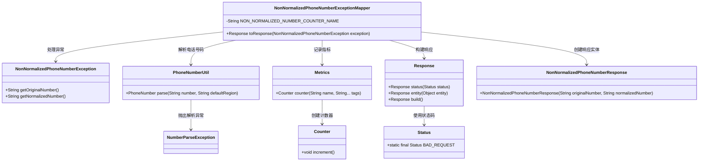
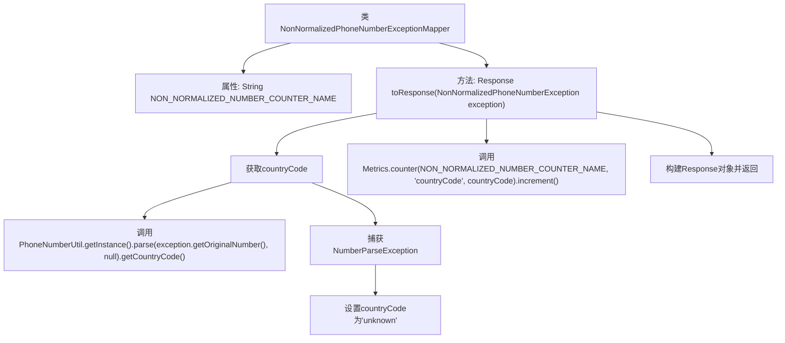

# 基础信息

|      |      |
|------|------|
| 名称 | NonNormalizedPhoneNumberExceptionMapper |
| 编码语言 | .java |
| 代码路径 | Signal-Server/service/src/main/java/org/whispersystems/textsecuregcm/mappers/NonNormalizedPhoneNumberExceptionMapper.java |
| 包名 | org.whispersystems.textsecuregcm.mappers |
| 依赖项 | ['org.whispersystems.textsecuregcm.metrics.MetricsUtil.name', 'com.google.i18n.phonenumbers.NumberParseException', 'com.google.i18n.phonenumbers.PhoneNumberUtil', 'io.micrometer.core.instrument.Metrics', 'jakarta.ws.rs.core.Response', 'jakarta.ws.rs.core.Response.Status', 'jakarta.ws.rs.ext.ExceptionMapper', 'org.whispersystems.textsecuregcm.util.NonNormalizedPhoneNumberException'] |
| 概述说明 | 非标电话号码异常映射器记录异常并返回错误。 |

# 说明

非标准化电话号码异常映射器用于检测和处理非标准格式的电话号码。当系统识别到电话号码不符合预设标准时，该映射器会记录异常信息，并生成相应的错误响应。这一机制确保系统能够有效识别并处理不合规的电话号码，从而提高数据处理的准确性和可靠性。通过记录异常，系统管理员可以及时了解问题并进行必要的调整和优化。

# 类列表 Class Summary

| 名称   | 类型  | 说明 |
|-------|------|-------------|
| NonNormalizedPhoneNumberExceptionMapper | class | 非标准化电话号码异常映射器，记录异常并返回错误响应。 |

## 类 NonNormalizedPhoneNumberExceptionMapper

|      |      |
|------|------|
| 访问范围 | public |
| 类型 | class |
| 名称 | NonNormalizedPhoneNumberExceptionMapper |
| 说明 | 非标准化电话号码异常映射器，记录异常并返回错误响应。 |

### UML类图

这段代码定义了一个`NonNormalizedPhoneNumberExceptionMapper`类，用于处理`NonNormalizedPhoneNumberException`异常。该类通过`PhoneNumberUtil`解析电话号码的国家代码，并使用`Metrics`记录非规范化电话号码的指标。最终，它构建并返回一个包含原始号码和规范化号码的`Response`对象。该类的核心功能是将异常信息转换为HTTP响应，并记录相关指标。

### 内部方法调用关系图

这段代码定义了一个`NonNormalizedPhoneNumberExceptionMapper`类，用于处理`NonNormalizedPhoneNumberException`异常。在`toResponse`方法中，首先尝试解析异常中的原始电话号码，获取其国家代码。如果解析失败，则将国家代码设置为“unknown”。随后，通过`Metrics.counter`方法记录非规范化电话号码的计数。最后，构建并返回一个包含原始号码和规范化号码的`Response`对象，状态码为`BAD_REQUEST`。

### 字段列表 Field List

| 名称  | 类型  | 说明 |
|-------|-------|------|
| NON_NORMALIZED_NUMBER_COUNTER_NAME =      name(NonNormalizedPhoneNumberExceptionMapper.class, "nonNormalizedNumbers") | String | 非规范化号码计数器名称定义为非规范化号码异常映射器类的计数器。 |

### 方法列表 Method List

| 名称  | 类型  | 说明 |
|-------|-------|------|
| toResponse | Response | 处理非标准化电话号码异常，提取国家代码并记录指标，返回错误响应。 |

