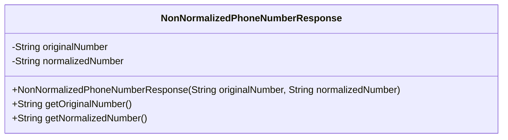
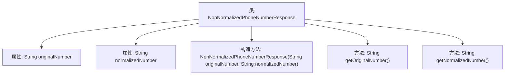

# 基础信息

|      |      |
|------|------|
| 名称 | NonNormalizedPhoneNumberResponse |
| 编码语言 | .java |
| 代码路径 | Signal-Server/service/src/main/java/org/whispersystems/textsecuregcm/mappers/NonNormalizedPhoneNumberResponse.java |
| 包名 | org.whispersystems.textsecuregcm.mappers |
| 依赖项 | ['com.fasterxml.jackson.annotation.JsonCreator', 'com.fasterxml.jackson.annotation.JsonProperty'] |
| 概述说明 | 类NonNormalizedPhoneNumberResponse包含原始号码和标准化号码，并提供获取方法。 |

# 说明

类NonNormalizedPhoneNumberResponse包含两个主要属性：原始号码和标准化号码。该类提供了获取这两个属性的方法，使得用户可以方便地访问和操作这些数据。原始号码属性存储未经处理的电话号码，而标准化号码属性则存储经过规范化处理后的电话号码。通过提供获取方法，该类确保了数据的封装性和易用性，便于在应用程序中进行进一步的处理和分析。

# 类列表 Class Summary

| 名称   | 类型  | 说明 |
|-------|------|-------------|
| NonNormalizedPhoneNumberResponse | class | 类NonNormalizedPhoneNumberResponse包含原始号码和标准化号码两个属性，提供获取方法。 |

## 类 NonNormalizedPhoneNumberResponse

|      |      |
|------|------|
| 访问范围 | public |
| 类型 | class |
| 名称 | NonNormalizedPhoneNumberResponse |
| 说明 | 类NonNormalizedPhoneNumberResponse包含原始号码和标准化号码两个属性，提供获取方法。 |

### UML类图

这段代码定义了一个名为 `NonNormalizedPhoneNumberResponse` 的类，用于存储和处理非规范化电话号码的响应数据。该类包含两个私有属性：`originalNumber` 和 `normalizedNumber`，分别表示原始电话号码和规范化后的电话号码。类中提供了一个构造函数，用于初始化这两个属性，并通过 `@JsonCreator` 和 `@JsonProperty` 注解支持 JSON 反序列化。此外，类中还提供了两个公有方法 `getOriginalNumber` 和 `getNormalizedNumber`，用于获取原始电话号码和规范化后的电话号码。

### 内部方法调用关系图

该流程图描述了`NonNormalizedPhoneNumberResponse`类的结构，包括两个私有属性`originalNumber`和`normalizedNumber`，一个带有`@JsonCreator`注解的构造方法，以及两个分别用于获取原始号码和规范化号码的公共方法。该类的设计主要用于处理非规范化电话号码的响应数据。

### 字段列表 Field List

| 名称  | 类型  | 说明 |
|-------|-------|------|
| originalNumber | String | 定义私有不可变字符串变量originalNumber。 |
| normalizedNumber | String | 私有且不可变的字符串变量normalizedNumber。 |

### 方法列表 Method List

| 名称  | 类型  | 说明 |
|-------|-------|------|
| getNormalizedNumber | String | 返回标准化后的号码字符串。 |
| getOriginalNumber | String | 该方法返回原始号码字符串。 |

