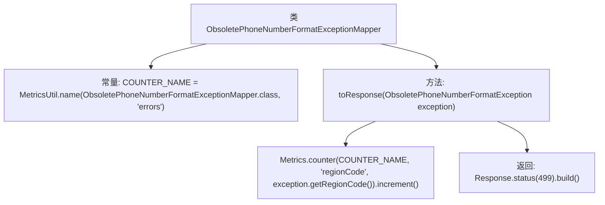

# 基础信息

|      |      |
|------|------|
| 名称 | ObsoletePhoneNumberFormatExceptionMapper |
| 编码语言 | .java |
| 代码路径 | Signal-Server/service/src/main/java/org/whispersystems/textsecuregcm/mappers/ObsoletePhoneNumberFormatExceptionMapper.java |
| 包名 | org.whispersystems.textsecuregcm.mappers |
| 依赖项 | ['io.micrometer.core.instrument.Metrics', 'jakarta.ws.rs.core.Response', 'jakarta.ws.rs.ext.ExceptionMapper', 'org.whispersystems.textsecuregcm.metrics.MetricsUtil', 'org.whispersystems.textsecuregcm.util.ObsoletePhoneNumberFormatException'] |
| 概述说明 | ObsoletePhoneNumberFormatExceptionMapper类处理异常，记录错误并返回499状态码。 |

# 说明

ObsoletePhoneNumberFormatExceptionMapper类负责处理过时电话号码格式的异常映射。当检测到此类异常时，该类会记录错误信息，并返回HTTP状态码499，表示客户端请求因格式问题被服务器拒绝。这一机制确保了异常处理的规范性和可追溯性，便于开发者快速定位和解决问题。

# 类列表 Class Summary

| 名称   | 类型  | 说明 |
|-------|------|-------------|
| ObsoletePhoneNumberFormatExceptionMapper | class | ObsoletePhoneNumberFormatExceptionMapper类实现异常映射，记录错误并返回状态码499。 |


## 类 ObsoletePhoneNumberFormatExceptionMapper

|      |      |
|------|------|
| 访问范围 | public |
| 类型 | class |
| 名称 | ObsoletePhoneNumberFormatExceptionMapper |
| 说明 | ObsoletePhoneNumberFormatExceptionMapper类实现异常映射，记录错误并返回状态码499。 |


### UML类图

```mermaid
classDiagram
    class ObsoletePhoneNumberFormatExceptionMapper {
        -String COUNTER_NAME
        +Response toResponse(ObsoletePhoneNumberFormatException exception)
    }
    class Metrics {
        +Counter counter(String name, String... tags)
    }
    class MetricsUtil {
        +String name(Class<?> clazz, String... names)
    }
    class ObsoletePhoneNumberFormatException {
        +String getRegionCode()
    }
    class Response {
        +static Response status(int status)
        +Response build()
    }
    interface ExceptionMapper~T~ {
        <<Interface>>
        +Response toResponse(T exception)
    }

    ObsoletePhoneNumberFormatExceptionMapper --> ExceptionMapper~ObsoletePhoneNumberFormatException~ : 实现
    ObsoletePhoneNumberFormatExceptionMapper --> Metrics : 依赖
    ObsoletePhoneNumberFormatExceptionMapper --> MetricsUtil : 依赖
    ObsoletePhoneNumberFormatExceptionMapper --> ObsoletePhoneNumberFormatException : 依赖
    ObsoletePhoneNumberFormatExceptionMapper --> Response : 依赖
```

这段代码定义了一个 `ObsoletePhoneNumberFormatExceptionMapper` 类，该类实现了 `ExceptionMapper` 接口，用于处理 `ObsoletePhoneNumberFormatException` 异常。在 `toResponse` 方法中，它通过 `Metrics` 类记录错误计数，并返回一个状态码为 499 的 `Response` 对象。`MetricsUtil` 类用于生成计数器名称。该类的核心功能是捕获特定异常并生成相应的响应，同时记录错误信息。


### 内部方法调用关系图



这段代码定义了一个名为`ObsoletePhoneNumberFormatExceptionMapper`的类，该类实现了`ExceptionMapper<ObsoletePhoneNumberFormatException>`接口。类中包含一个常量`COUNTER_NAME`，用于记录错误计数器的名称。`toResponse`方法用于处理`ObsoletePhoneNumberFormatException`异常，首先通过`Metrics.counter`方法增加与异常相关的计数器，然后返回一个状态码为499的HTTP响应。该类的核心功能是捕获特定异常并记录错误信息，同时返回自定义的HTTP响应。

### 字段列表 Field List

| 名称  | 类型  | 说明 |
|-------|-------|------|
| COUNTER_NAME = MetricsUtil.name(ObsoletePhoneNumberFormatExceptionMapper.class, "errors") | String | 定义私有静态常量COUNTER_NAME，用于记录ObsoletePhoneNumberFormatExceptionMapper类的错误指标。 |

### 方法列表 Method List

| 名称  | 类型  | 说明 |
|-------|-------|------|
| toResponse | Response | 处理过时电话号码格式异常，记录区域代码并返回499状态码。 |


