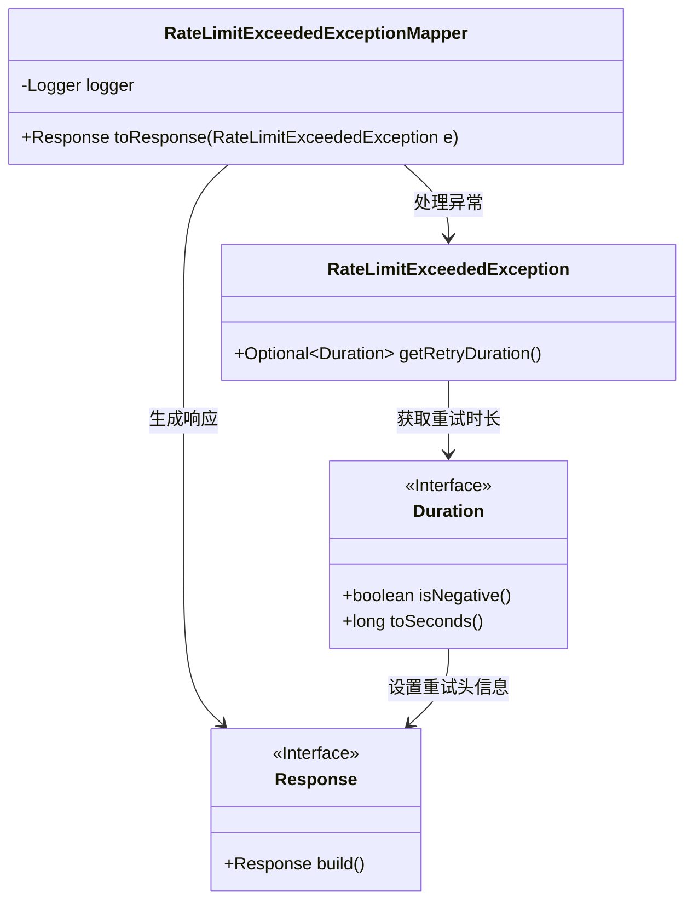
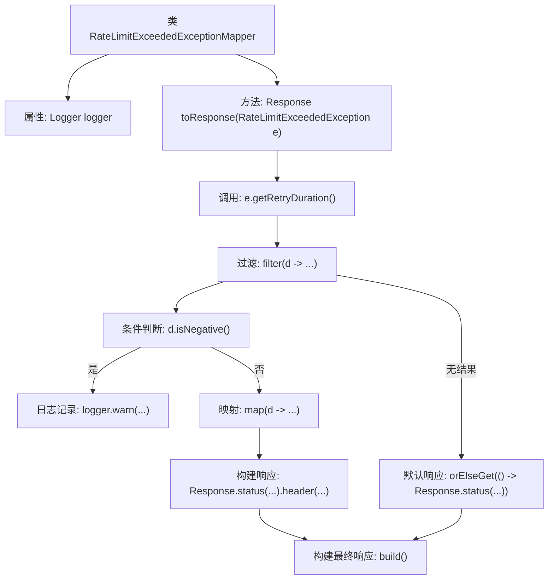

# 基础信息

|      |      |
|------|------|
| 名称 | RateLimitExceededExceptionMapper |
| 编码语言 | .java |
| 代码路径 | Signal-Server/service/src/main/java/org/whispersystems/textsecuregcm/mappers/RateLimitExceededExceptionMapper.java |
| 包名 | org.whispersystems.textsecuregcm.mappers |
| 依赖项 | ['jakarta.ws.rs.core.Response', 'jakarta.ws.rs.ext.ExceptionMapper', 'jakarta.ws.rs.ext.Provider', 'org.slf4j.Logger', 'org.slf4j.LoggerFactory', 'org.whispersystems.textsecuregcm.controllers.RateLimitExceededException'] |
| 概述说明 | 将RateLimitExceededException转为429响应，含Retry-After头。 |

# 说明

将RateLimitExceededException异常转换为HTTP 429响应，表示请求速率超过限制。响应中包含Retry-After头，指示客户端在指定时间后重试。这一处理确保客户端了解速率限制，并遵循建议的重试时间，避免进一步触发限制。

# 类列表 Class Summary

| 名称   | 类型  | 说明 |
|-------|------|-------------|
| RateLimitExceededExceptionMapper | class | 将RateLimitExceededException转换为429响应，包含Retry-After头。 |

## 类 RateLimitExceededExceptionMapper

|      |      |
|------|------|
| 访问范围 | @Provider;public |
| 类型 | class |
| 名称 | RateLimitExceededExceptionMapper |
| 说明 | 将RateLimitExceededException转换为429响应，包含Retry-After头。 |

### UML类图

### 描述
`RateLimitExceededExceptionMapper` 类用于将 `RateLimitExceededException` 异常转换为 HTTP 429 响应，并在响应头中包含 `Retry-After` 信息。该类通过 `toResponse` 方法处理异常，检查重试时长是否为负数，并根据情况生成相应的响应。`RateLimitExceededException` 类提供了获取重试时长的方法，而 `Duration` 类用于处理时间相关的操作。最终，`Response` 接口用于构建并返回 HTTP 响应。

### 内部方法调用关系图

这段代码定义了一个`RateLimitExceededExceptionMapper`类，用于将`RateLimitExceededException`异常转换为HTTP 429响应，并在响应头中添加`Retry-After`字段。代码首先获取异常中的重试时长，过滤掉负值并记录警告日志，然后将非负值映射为响应头中的`Retry-After`字段，最终构建并返回响应。流程图展示了从异常处理到响应构建的完整流程。

### 字段列表 Field List

| 名称  | 类型  | 说明 |
|-------|-------|------|
| logger = LoggerFactory.getLogger(RateLimitExceededExceptionMapper.class) | Logger | 日志记录器初始化为RateLimitExceededExceptionMapper类。 |

### 方法列表 Method List

| 名称  | 类型  | 说明 |
|-------|-------|------|
| toResponse | Response | 处理限流异常，返回响应并包含重试时间。 |

