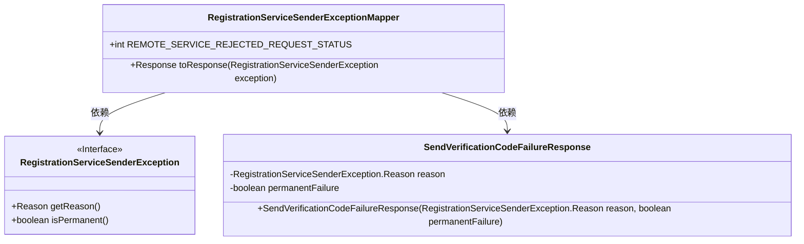
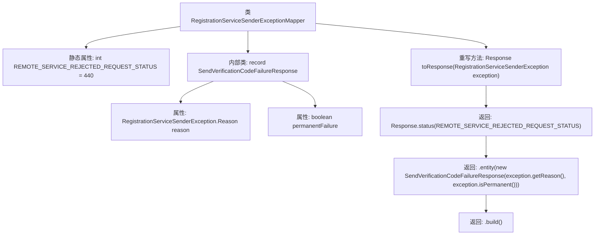

# 基础信息

|      |      |
|------|------|
| 名称 | RegistrationServiceSenderExceptionMapper |
| 编码语言 | .java |
| 代码路径 | Signal-Server/service/src/main/java/org/whispersystems/textsecuregcm/mappers/RegistrationServiceSenderExceptionMapper.java |
| 包名 | org.whispersystems.textsecuregcm.mappers |
| 依赖项 | ['com.google.common.annotations.VisibleForTesting', 'jakarta.ws.rs.core.Response', 'jakarta.ws.rs.ext.ExceptionMapper', 'org.whispersystems.textsecuregcm.registration.RegistrationServiceSenderException'] |
| 概述说明 | 注册服务异常类处理远程请求失败，返回状态码440及原因。 |

# 说明

注册服务异常映射类用于处理远程服务拒绝请求的情况。当远程服务返回状态码440时，该类会捕获并映射该异常，同时提供具体的失败原因。通过这种方式，系统能够有效地识别和处理远程服务请求被拒绝的场景，确保错误信息能够被准确传递和处理，从而提高系统的稳定性和可靠性。

# 类列表 Class Summary

| 名称   | 类型  | 说明 |
|-------|------|-------------|
| RegistrationServiceSenderExceptionMapper | class | 注册服务异常映射类，处理远程服务拒绝请求，返回状态码440及失败原因。 |

## 类 RegistrationServiceSenderExceptionMapper

|      |      |
|------|------|
| 访问范围 | public |
| 类型 | class |
| 名称 | RegistrationServiceSenderExceptionMapper |
| 说明 | 注册服务异常映射类，处理远程服务拒绝请求，返回状态码440及失败原因。 |

### UML类图

这段代码定义了一个 `RegistrationServiceSenderExceptionMapper` 类，它实现了 `ExceptionMapper` 接口，用于处理 `RegistrationServiceSenderException` 异常。`toResponse` 方法根据异常生成一个 HTTP 响应，状态码为 440，并包含一个 `SendVerificationCodeFailureResponse` 对象作为响应实体。`SendVerificationCodeFailureResponse` 是一个记录类，用于封装异常的原因和是否为永久性失败的信息。

### 内部方法调用关系图

**描述：**  
`RegistrationServiceSenderExceptionMapper` 类实现了 `ExceptionMapper` 接口，用于处理 `RegistrationServiceSenderException` 异常。类中包含一个静态属性 `REMOTE_SERVICE_REJECTED_REQUEST_STATUS`，表示远程服务拒绝请求的状态码。`toResponse` 方法重写了 `ExceptionMapper` 接口的方法，返回一个包含 `SendVerificationCodeFailureResponse` 实体的 `Response` 对象。`SendVerificationCodeFailureResponse` 是一个内部记录类，包含 `reason` 和 `permanentFailure` 两个属性，用于封装异常的原因和是否为永久性失败的信息。

### 字段列表 Field List

| 名称  | 类型  | 说明 |
|-------|-------|------|
| REMOTE_SERVICE_REJECTED_REQUEST_STATUS = 440 | int | 远程服务拒绝请求状态码为440。 |

### 方法列表 Method List

| 名称  | 类型  | 说明 |
|-------|-------|------|
| toResponse | Response | 处理注册服务发送异常，返回拒绝请求状态及失败响应。 |

