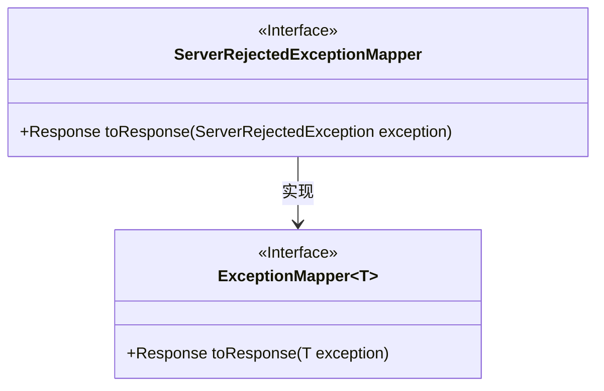
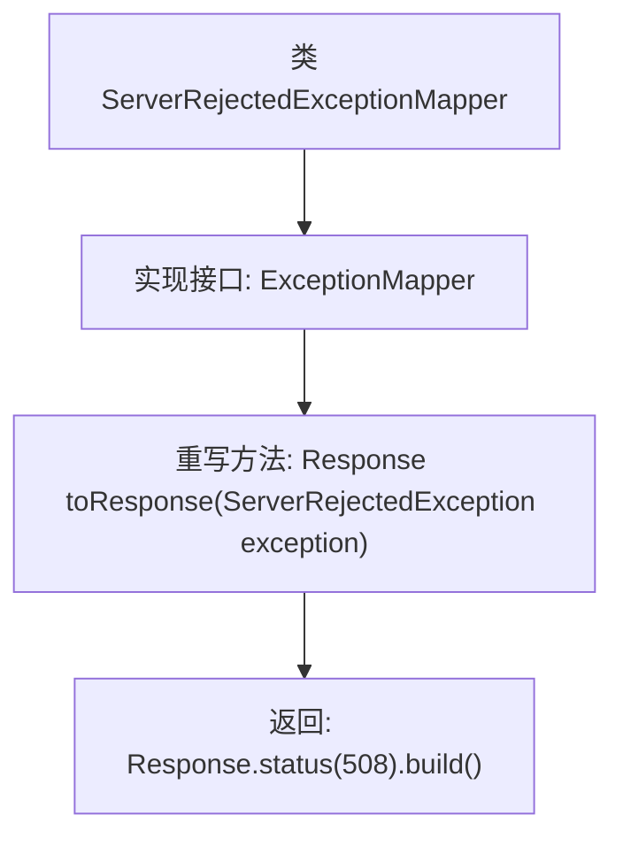

# 基础信息

|      |      |
|------|------|
| 名称 | ServerRejectedExceptionMapper |
| 编码语言 | .java |
| 代码路径 | Signal-Server/service/src/main/java/org/whispersystems/textsecuregcm/mappers/ServerRejectedExceptionMapper.java |
| 包名 | org.whispersystems.textsecuregcm.mappers |
| 依赖项 | ['jakarta.ws.rs.core.Response', 'jakarta.ws.rs.ext.ExceptionMapper', 'org.whispersystems.textsecuregcm.controllers.ServerRejectedException'] |
| 概述说明 | ServerRejectedExceptionMapper类将异常映射为508状态码。 |

# 说明

ServerRejectedExceptionMapper类用于处理异常映射，当捕获到特定异常时，它会返回HTTP状态码508。这个类的主要功能是将异常转换为标准的HTTP响应，确保客户端能够接收到明确的错误信息。通过这种方式，系统能够更有效地处理服务器拒绝请求的情况，提升错误处理的规范性和可维护性。

# 类列表 Class Summary

| 名称   | 类型  | 说明 |
|-------|------|-------------|
| ServerRejectedExceptionMapper | class | ServerRejectedExceptionMapper类实现异常映射，返回508状态码。 |

## 类 ServerRejectedExceptionMapper

|      |      |
|------|------|
| 访问范围 | public |
| 类型 | class |
| 名称 | ServerRejectedExceptionMapper |
| 说明 | ServerRejectedExceptionMapper类实现异常映射，返回508状态码。 |

### UML类图

这段代码定义了一个 `ServerRejectedExceptionMapper` 类，它实现了 `ExceptionMapper<ServerRejectedException>` 接口。该类的 `toResponse` 方法接收一个 `ServerRejectedException` 类型的异常对象，并返回一个 HTTP 状态码为 508 的 `Response` 对象。这个类主要用于处理 `ServerRejectedException` 异常，并将其映射为特定的 HTTP 响应。

### 内部方法调用关系图

这段代码定义了一个名为 `ServerRejectedExceptionMapper` 的类，该类实现了 `ExceptionMapper<ServerRejectedException>` 接口。类中重写了 `toResponse` 方法，当 `ServerRejectedException` 异常发生时，该方法会返回一个状态码为 508 的 `Response` 对象。这个类主要用于处理服务器拒绝的异常，并将其映射为特定的 HTTP 响应。

### 字段列表 Field List

| 名称  | 类型  | 说明 |
|-------|-------|------|

### 方法列表 Method List

| 名称  | 类型  | 说明 |
|-------|-------|------|
| toResponse | Response | 重写toResponse方法，返回状态码508的响应。 |

