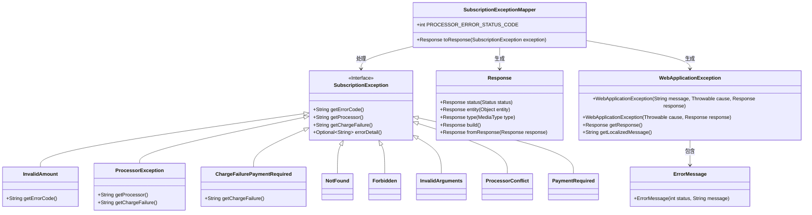

# 基础信息

|      |      |
|------|------|
| 名称 | SubscriptionExceptionMapper |
| 编码语言 | .java |
| 代码路径 | Signal-Server/service/src/main/java/org/whispersystems/textsecuregcm/mappers/SubscriptionExceptionMapper.java |
| 包名 | org.whispersystems.textsecuregcm.mappers |
| 依赖项 | ['com.google.common.annotations.VisibleForTesting', 'io.dropwizard.jersey.errors.ErrorMessage', 'jakarta.ws.rs.WebApplicationException', 'jakarta.ws.rs.core.MediaType', 'jakarta.ws.rs.core.Response', 'jakarta.ws.rs.ext.ExceptionMapper', 'java.util.Map', 'org.whispersystems.textsecuregcm.storage.SubscriptionException'] |
| 概述说明 | SubscriptionExceptionMapper处理订阅异常，返回状态码和JSON错误信息。 |

# 说明

SubscriptionExceptionMapper用于处理订阅过程中出现的异常情况。它能够捕捉不同类型的异常，并根据异常的具体类型返回相应的HTTP状态码和JSON格式的错误信息。这种机制使得系统能够在遇到问题时，向客户端提供清晰且结构化的错误反馈，便于问题的诊断和解决。通过这种方式，系统能够更好地管理订阅流程中的异常情况，确保用户体验的流畅性和系统的稳定性。

# 类列表 Class Summary

| 名称   | 类型  | 说明 |
|-------|------|-------------|
| SubscriptionExceptionMapper | class | SubscriptionExceptionMapper处理订阅异常，返回不同状态码和JSON格式的错误信息。 |

## 类 SubscriptionExceptionMapper

|      |      |
|------|------|
| 访问范围 | public |
| 类型 | class |
| 名称 | SubscriptionExceptionMapper |
| 说明 | SubscriptionExceptionMapper处理订阅异常，返回不同状态码和JSON格式的错误信息。 |

### UML类图

这段代码定义了一个`SubscriptionExceptionMapper`类，用于将不同类型的`SubscriptionException`映射为HTTP响应。`SubscriptionException`是一个接口，包含多个子类，每个子类代表不同的异常类型。`SubscriptionExceptionMapper`根据异常类型生成不同的`Response`对象，并可能生成`WebApplicationException`，最终返回包含错误信息的`Response`。该类的核心功能是处理异常并生成适当的HTTP响应。

### 内部方法调用关系图

```mermaid
graph TD
    A["类SubscriptionExceptionMapper"]
    B["常量: PROCESSOR_ERROR_STATUS_CODE = 440"]
    C["方法: toResponse(SubscriptionException exception)"]
    D["判断: exception instanceof SubscriptionException.InvalidAmount"]
    E["返回: Response.status(BAD_REQUEST).entity(Map.of('error', e.getErrorCode())).type(APPLICATION_JSON_TYPE).build()"]
    F["判断: exception instanceof SubscriptionException.ProcessorException"]
    G["返回: Response.status(PROCESSOR_ERROR_STATUS_CODE).entity(Map.of('processor', e.getProcessor().name(), 'chargeFailure', e.getChargeFailure())).type(APPLICATION_JSON_TYPE).build()"]
    H["判断: exception instanceof SubscriptionException.ChargeFailurePaymentRequired"]
    I["返回: Response.status(PAYMENT_REQUIRED).entity(Map.of('chargeFailure', e.getChargeFailure())).type(APPLICATION_JSON_TYPE).build()"]
    J["默认处理: switch(exception)"]
    K["状态: Response.Status.NOT_FOUND"]
    L["状态: Response.Status.FORBIDDEN"]
    M["状态: Response.Status.BAD_REQUEST"]
    N["状态: Response.Status.CONFLICT"]
    O["状态: Response.Status.PAYMENT_REQUIRED"]
    P["状态: Response.Status.INTERNAL_SERVER_ERROR"]
    Q["创建: WebApplicationException wae"]
    R["返回: Response.fromResponse(wae.getResponse()).type(APPLICATION_JSON_TYPE).entity(new ErrorMessage(wae.getResponse().getStatus(), wae.getLocalizedMessage())).build()"]

    A --> B
    A --> C
    C --> D
    D --> E
    C --> F
    F --> G
    C --> H
    H --> I
    C --> J
    J --> K
    J --> L
    J --> M
    J --> N
    J --> O
    J --> P
    C --> Q
    Q --> R
```

这段代码是一个异常映射器，用于处理不同类型的`SubscriptionException`并生成相应的HTTP响应。代码首先检查异常的具体类型，并根据类型返回不同的响应状态和实体。如果异常类型不匹配任何特定类型，则使用默认处理逻辑，根据异常类型选择适当的HTTP状态码，并生成包含错误信息的响应。流程图展示了从异常判断到响应生成的完整流程。

### 字段列表 Field List

| 名称  | 类型  | 说明 |
|-------|-------|------|
| PROCESSOR_ERROR_STATUS_CODE = 440 | int | 测试可见的处理器错误状态码常量设为440。 |

### 方法列表 Method List

| 名称  | 类型  | 说明 |
|-------|-------|------|
| toResponse | Response | 处理订阅异常，返回不同错误状态和JSON格式的错误信息。 |

