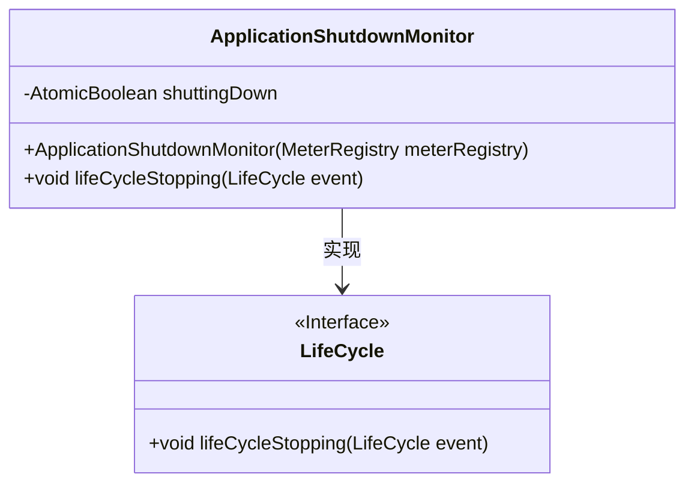
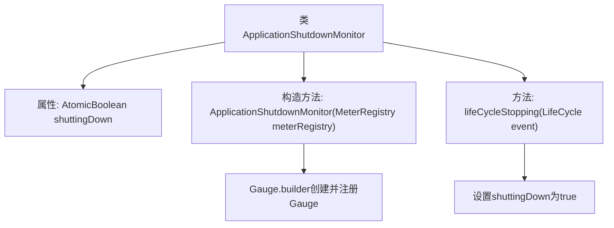

# 基础信息

|      |      |
|------|------|
| 名称 | ApplicationShutdownMonitor |
| 编码语言 | .java |
| 代码路径 | Signal-Server/service/src/main/java/org/whispersystems/textsecuregcm/metrics/ApplicationShutdownMonitor.java |
| 包名 | org.whispersystems.textsecuregcm.metrics |
| 依赖项 | ['com.codahale.metrics.MetricRegistry.name', 'io.micrometer.core.instrument.Gauge', 'io.micrometer.core.instrument.MeterRegistry', 'java.util.concurrent.atomic.AtomicBoolean', 'org.eclipse.jetty.util.component.LifeCycle'] |
| 概述说明 | ApplicationShutdownMonitor类监控应用关闭状态，用AtomicBoolean记录并通过Gauge注册到MeterRegistry。 |

# 说明

ApplicationShutdownMonitor类负责监控应用程序的关闭状态。它使用AtomicBoolean类型变量来记录当前的关闭状态，确保在多线程环境下的线程安全性。此外，该类通过Gauge机制将关闭状态注册到MeterRegistry中，以便在监控系统中实时查看和跟踪应用关闭状态的变化。

# 类列表 Class Summary

| 名称   | 类型  | 说明 |
|-------|------|-------------|
| ApplicationShutdownMonitor | class | ApplicationShutdownMonitor类监控应用关闭状态，使用AtomicBoolean记录关闭状态，并通过Gauge注册到MeterRegistry。 |

## 类 ApplicationShutdownMonitor

|      |      |
|------|------|
| 访问范围 | public |
| 类型 | class |
| 名称 | ApplicationShutdownMonitor |
| 说明 | ApplicationShutdownMonitor类监控应用关闭状态，使用AtomicBoolean记录关闭状态，并通过Gauge注册到MeterRegistry。 |

### UML类图

**描述：**  
`ApplicationShutdownMonitor` 类实现了 `LifeCycle` 接口，用于监控应用程序的关闭状态。它包含一个 `AtomicBoolean` 类型的私有成员 `shuttingDown`，用于标记应用程序是否正在关闭。构造函数中通过 `Gauge.builder` 创建了一个指标，用于在应用程序关闭时报告状态。`lifeCycleStopping` 方法在应用程序停止时被调用，将 `shuttingDown` 设置为 `true`。

### 内部方法调用关系图

这段代码定义了一个`ApplicationShutdownMonitor`类，用于监控应用程序的关闭状态。类中包含一个`AtomicBoolean`类型的属性`shuttingDown`，用于标识应用程序是否正在关闭。构造方法中通过`Gauge.builder`创建并注册了一个Gauge，用于监控`shuttingDown`的状态。`lifeCycleStopping`方法在应用程序停止时被调用，将`shuttingDown`设置为`true`，表示应用程序正在关闭。

### 字段列表 Field List

| 名称  | 类型  | 说明 |
|-------|-------|------|
| shuttingDown = new AtomicBoolean(false) | AtomicBoolean | 使用AtomicBoolean确保线程安全的关闭状态管理。 |

### 方法列表 Method List

| 名称  | 类型  | 说明 |
|-------|-------|------|
| lifeCycleStopping | void | 生命周期停止时设置关闭标志为真。 |

