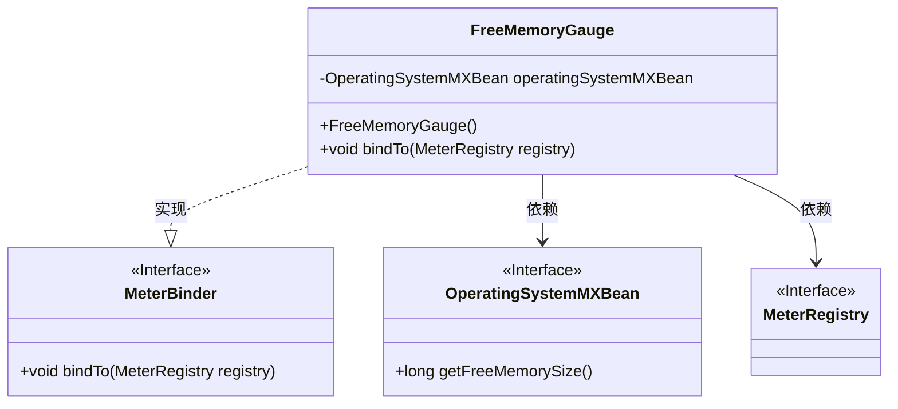
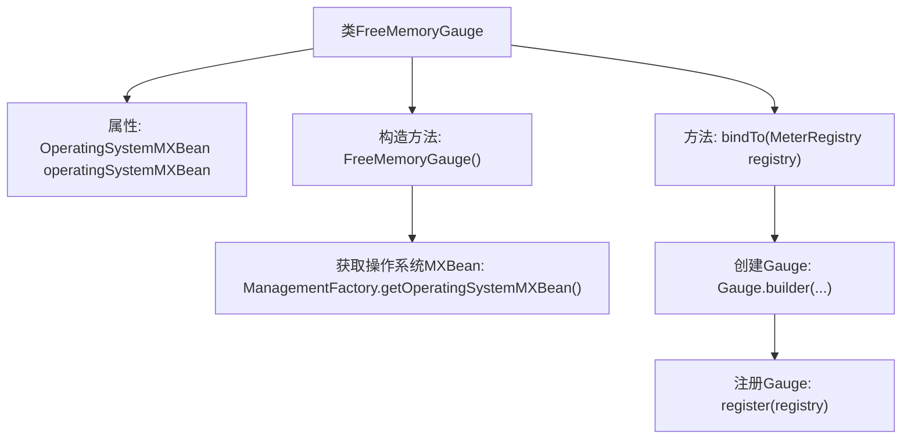

# 基础信息

|      |      |
|------|------|
| 名称 | FreeMemoryGauge |
| 编码语言 | .java |
| 代码路径 | Signal-Server/service/src/main/java/org/whispersystems/textsecuregcm/metrics/FreeMemoryGauge.java |
| 包名 | org.whispersystems.textsecuregcm.metrics |
| 依赖项 | ['org.whispersystems.textsecuregcm.metrics.MetricsUtil.name', 'com.sun.management.OperatingSystemMXBean', 'io.micrometer.core.instrument.Gauge', 'io.micrometer.core.instrument.MeterRegistry', 'io.micrometer.core.instrument.binder.MeterBinder', 'java.lang.management.ManagementFactory'] |
| 概述说明 | FreeMemoryGauge类实现MeterBinder接口，监控系统空闲内存。 |

# 说明

FreeMemoryGauge类实现了MeterBinder接口，主要用于监控系统的空闲内存。通过该类的实现，可以实时获取和绑定系统当前可用的内存资源，便于进行内存使用情况的监控和管理。这一功能对于系统性能优化和资源调度具有重要意义，能够帮助开发者及时了解系统内存状态，从而采取相应的措施来提升系统效率和稳定性。

# 类列表 Class Summary

| 名称   | 类型  | 说明 |
|-------|------|-------------|
| FreeMemoryGauge | class | FreeMemoryGauge类实现MeterBinder接口，用于监控系统空闲内存。 |

## 类 FreeMemoryGauge

|      |      |
|------|------|
| 访问范围 | public |
| 类型 | class |
| 名称 | FreeMemoryGauge |
| 说明 | FreeMemoryGauge类实现MeterBinder接口，用于监控系统空闲内存。 |

### UML类图

这段代码定义了一个名为 `FreeMemoryGauge` 的类，它实现了 `MeterBinder` 接口。`FreeMemoryGauge` 类通过 `OperatingSystemMXBean` 获取系统的空闲内存大小，并将其绑定到 `MeterRegistry` 中。`OperatingSystemMXBean` 是一个接口，提供了获取系统信息的方法。`MeterRegistry` 是用于注册和管理度量指标的接口。`FreeMemoryGauge` 类通过 `bindTo` 方法将空闲内存的度量指标注册到 `MeterRegistry` 中。

### 内部方法调用关系图

这段代码定义了一个名为 `FreeMemoryGauge` 的类，用于监控系统的空闲内存。类中包含一个 `OperatingSystemMXBean` 属性，通过构造函数初始化该属性，并在 `bindTo` 方法中创建一个 `Gauge` 并将其注册到 `MeterRegistry` 中。`Gauge` 用于实时获取系统的空闲内存大小。

### 字段列表 Field List

| 名称  | 类型  | 说明 |
|-------|-------|------|
| operatingSystemMXBean | OperatingSystemMXBean | 私有操作系统MXBean实例声明。 |

### 方法列表 Method List

| 名称  | 类型  | 说明 |
|-------|-------|------|
| bindTo | void | 绑定操作系统空闲内存大小到MeterRegistry。 |

