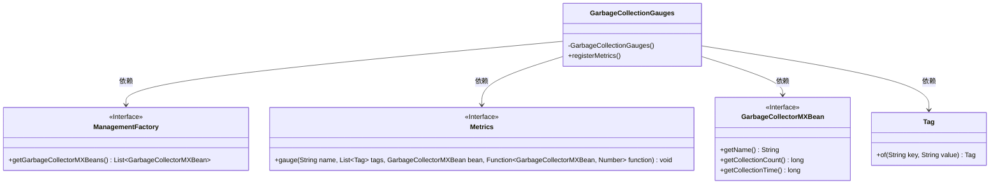
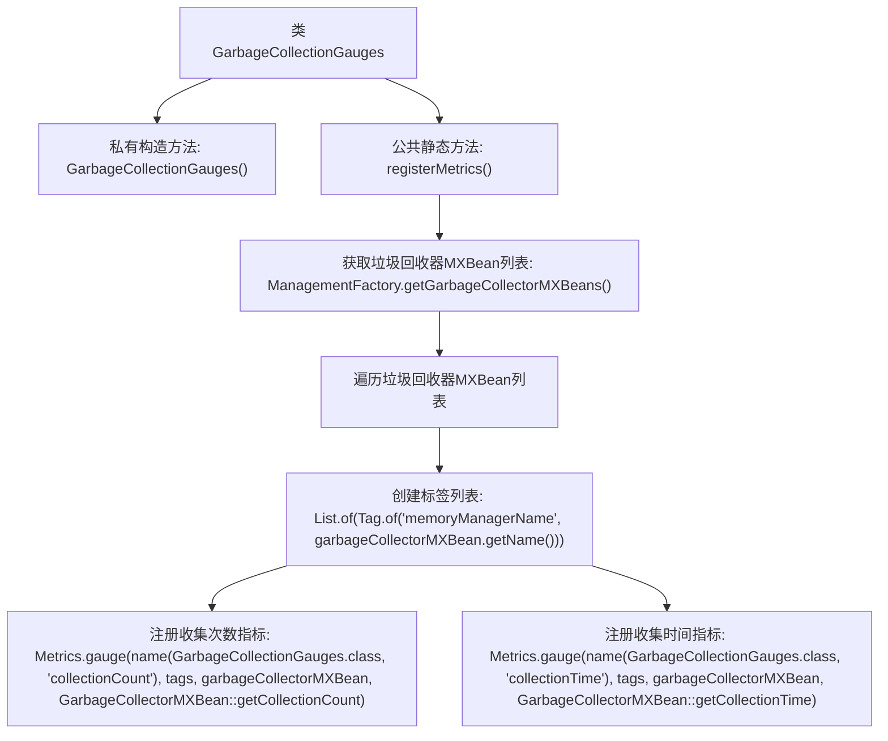

# 基础信息

|      |      |
|------|------|
| 名称 | GarbageCollectionGauges |
| 编码语言 | .java |
| 代码路径 | Signal-Server/service/src/main/java/org/whispersystems/textsecuregcm/metrics/GarbageCollectionGauges.java |
| 包名 | org.whispersystems.textsecuregcm.metrics |
| 依赖项 | ['org.whispersystems.textsecuregcm.metrics.MetricsUtil.name', 'io.micrometer.core.instrument.Metrics', 'io.micrometer.core.instrument.Tag', 'java.lang.management.GarbageCollectorMXBean', 'java.lang.management.ManagementFactory', 'java.util.List'] |
| 概述说明 | 注册垃圾收集器指标，记录收集次数与时间。 |

# 说明

注册垃圾收集器指标涉及记录垃圾收集的次数和收集所花费的时间。这些指标帮助监控和优化内存管理，确保系统性能高效稳定。通过收集这些数据，可以分析垃圾收集的频率和耗时，识别潜在的性能瓶颈，从而进行针对性的优化和调整。

# 类列表 Class Summary

| 名称   | 类型  | 说明 |
|-------|------|-------------|
| GarbageCollectionGauges | class | 注册垃圾收集器指标，包括收集次数和收集时间。 |

## 类 GarbageCollectionGauges

|      |      |
|------|------|
| 访问范围 | public |
| 类型 | class |
| 名称 | GarbageCollectionGauges |
| 说明 | 注册垃圾收集器指标，包括收集次数和收集时间。 |

### UML类图

这段代码定义了一个名为 `GarbageCollectionGauges` 的类，用于注册与垃圾回收相关的监控指标。`GarbageCollectionGauges` 类通过 `ManagementFactory` 获取所有的 `GarbageCollectorMXBean` 实例，并为每个实例注册两个指标：`collectionCount` 和 `collectionTime`。这些指标通过 `Metrics` 类的 `gauge` 方法进行注册，并使用 `Tag` 类来为每个指标添加标签。整个流程展示了如何通过依赖注入和接口调用来实现垃圾回收监控的功能。

### 内部方法调用关系图

这段代码定义了一个名为`GarbageCollectionGauges`的类，该类包含一个私有构造方法和一个公共静态方法`registerMetrics`。`registerMetrics`方法通过`ManagementFactory.getGarbageCollectorMXBeans()`获取系统中所有垃圾回收器的`MXBean`，并为每个`MXBean`创建标签列表，然后使用`Metrics.gauge`方法注册两个指标：垃圾回收次数和垃圾回收时间。这些指标通过`GarbageCollectorMXBean`的`getCollectionCount`和`getCollectionTime`方法获取。

### 字段列表 Field List

| 名称  | 类型  | 说明 |
|-------|-------|------|

### 方法列表 Method List

| 名称  | 类型  | 说明 |
|-------|-------|------|
| registerMetrics | void | 注册垃圾收集器指标，包括收集次数和收集时间。 |

