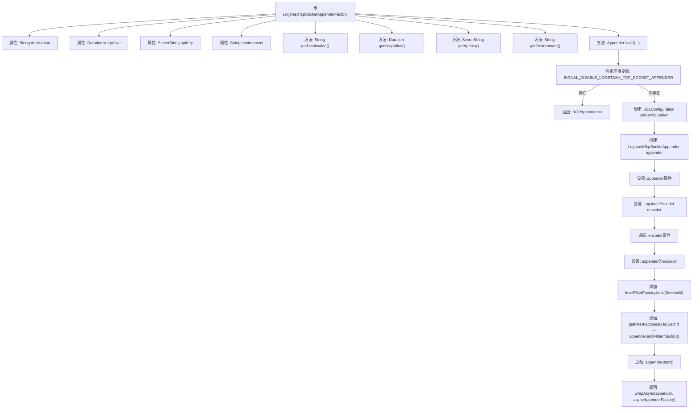

# 基础信息

|      |      |
|------|------|
| 名称 | LogstashTcpSocketAppenderFactory |
| 编码语言 | .java |
| 代码路径 | Signal-Server/service/src/main/java/org/whispersystems/textsecuregcm/metrics/LogstashTcpSocketAppenderFactory.java |
| 包名 | org.whispersystems.textsecuregcm.metrics |
| 依赖项 | ['ch.qos.logback.classic.LoggerContext', 'ch.qos.logback.classic.PatternLayout', 'ch.qos.logback.classic.spi.ILoggingEvent', 'ch.qos.logback.core.Appender', 'ch.qos.logback.core.encoder.LayoutWrappingEncoder', 'ch.qos.logback.core.helpers.NOPAppender', 'ch.qos.logback.core.net.ssl.SSLConfiguration', 'com.fasterxml.jackson.annotation.JsonProperty', 'com.fasterxml.jackson.annotation.JsonTypeName', 'com.fasterxml.jackson.databind.node.JsonNodeFactory', 'com.fasterxml.jackson.databind.node.ObjectNode', 'com.fasterxml.jackson.databind.node.TextNode', 'io.dropwizard.logging.common.AbstractAppenderFactory', 'io.dropwizard.logging.common.async.AsyncAppenderFactory', 'io.dropwizard.logging.common.filter.LevelFilterFactory', 'io.dropwizard.logging.common.layout.LayoutFactory', 'jakarta.validation.constraints.NotEmpty', 'jakarta.validation.constraints.NotNull', 'java.time.Duration', 'java.util.Optional', 'net.logstash.logback.appender.LogstashTcpSocketAppender', 'net.logstash.logback.encoder.LogstashEncoder', 'org.whispersystems.textsecuregcm.WhisperServerVersion', 'org.whispersystems.textsecuregcm.configuration.secrets.SecretString', 'org.whispersystems.textsecuregcm.util.HostnameUtil'] |
| 概述说明 | LogstashTcpSocketAppenderFactory创建支持SSL、自定义字段和异步日志的TCP套接字日志追加器。 |

# 说明

LogstashTcpSocketAppenderFactory类用于创建Logstash TCP套接字日志追加器，支持SSL加密、自定义字段配置以及异步日志记录功能，确保日志传输的安全性和灵活性。

# 类列表 Class Summary

| 名称   | 类型  | 说明 |
|-------|------|-------------|
| LogstashTcpSocketAppenderFactory | class | LogstashTcpSocketAppenderFactory类用于创建Logstash TCP套接字日志追加器，支持SSL、自定义字段和异步日志记录。 |

## 类 LogstashTcpSocketAppenderFactory

|      |      |
|------|------|
| 访问范围 | @JsonTypeName("logstashtcpsocket");public |
| 类型 | class |
| 名称 | LogstashTcpSocketAppenderFactory |
| 说明 | LogstashTcpSocketAppenderFactory类用于创建Logstash TCP套接字日志追加器，支持SSL、自定义字段和异步日志记录。 |

### UML类图

```mermaid
classDiagram
    class LogstashTcpSocketAppenderFactory {
        -String destination
        -Duration keepAlive
        -SecretString apiKey
        -String environment
        +String getDestination()
        +Duration getKeepAlive()
        +SecretString getApiKey()
        +String getEnvironment()
        +Appender~ILoggingEvent~ build(LoggerContext context, String applicationName, LayoutFactory~ILoggingEvent~ layoutFactory, LevelFilterFactory~ILoggingEvent~ levelFilterFactory, AsyncAppenderFactory~ILoggingEvent~ asyncAppenderFactory)
    }

    class AbstractAppenderFactory~T~ {
        <<Abstract>>
    }

    class ILoggingEvent {
        <<Interface>>
    }

    class Appender~T~ {
        <<Interface>>
    }

    class LoggerContext {
    }

    class LayoutFactory~T~ {
        <<Interface>>
    }

    class LevelFilterFactory~T~ {
        <<Interface>>
    }

    class AsyncAppenderFactory~T~ {
        <<Interface>>
    }

    class NOPAppender~T~ {
    }

    class SSLConfiguration {
    }

    class LogstashTcpSocketAppender {
    }

    class LogstashEncoder {
    }

    class ObjectNode {
    }

    class JsonNodeFactory {
    }

    class TextNode {
    }

    class HostnameUtil {
    }

    class LayoutWrappingEncoder~T~ {
    }

    class PatternLayout {
    }

    class SecretString {
        +String value()
    }

    AbstractAppenderFactory~ILoggingEvent~ <|-- LogstashTcpSocketAppenderFactory
    LogstashTcpSocketAppenderFactory --> ILoggingEvent : 使用
    LogstashTcpSocketAppenderFactory --> LoggerContext : 依赖
    LogstashTcpSocketAppenderFactory --> LayoutFactory~ILoggingEvent~ : 依赖
    LogstashTcpSocketAppenderFactory --> LevelFilterFactory~ILoggingEvent~ : 依赖
    LogstashTcpSocketAppenderFactory --> AsyncAppenderFactory~ILoggingEvent~ : 依赖
    LogstashTcpSocketAppenderFactory --> NOPAppender~ILoggingEvent~ : 依赖
    LogstashTcpSocketAppenderFactory --> SSLConfiguration : 依赖
    LogstashTcpSocketAppenderFactory --> LogstashTcpSocketAppender : 依赖
    LogstashTcpSocketAppenderFactory --> LogstashEncoder : 依赖
    LogstashTcpSocketAppenderFactory --> ObjectNode : 依赖
    LogstashTcpSocketAppenderFactory --> JsonNodeFactory : 依赖
    LogstashTcpSocketAppenderFactory --> TextNode : 依赖
    LogstashTcpSocketAppenderFactory --> HostnameUtil : 依赖
    LogstashTcpSocketAppenderFactory --> LayoutWrappingEncoder~ILoggingEvent~ : 依赖
    LogstashTcpSocketAppenderFactory --> PatternLayout : 依赖
    LogstashTcpSocketAppenderFactory --> SecretString : 依赖
```

这段代码定义了一个 `LogstashTcpSocketAppenderFactory` 类，它继承自 `AbstractAppenderFactory`，用于构建 `LogstashTcpSocketAppender` 实例。该类通过配置 `destination`、`keepAlive`、`apiKey` 和 `environment` 等属性，生成一个用于日志输出的 `Appender` 实例。代码中还涉及了多种依赖类，如 `SSLConfiguration`、`LogstashEncoder` 等，用于处理日志的格式化和传输。

### 内部方法调用关系图

这段代码定义了一个`LogstashTcpSocketAppenderFactory`类，用于构建日志追加器。代码首先检查环境变量`SIGNAL_DISABLE_LOGSTASH_TCP_SOCKET_APPENDER`，如果存在则返回一个`NOPAppender`。否则，创建并配置`LogstashTcpSocketAppender`，设置SSL配置、目的地、保持连接时间等属性，并通过`LogstashEncoder`设置日志格式。最后，添加过滤器并启动追加器，返回异步包装后的追加器。

### 字段列表 Field List

| 名称  | 类型  | 说明 |
|-------|-------|------|
| keepAlive = Duration.ofSeconds(20) | Duration | 属性keepAlive设置为20秒的持续时间。 |
| apiKey | SecretString | API密钥为不可空的私有字符串类型。 |
| destination | String | 使用JsonProperty注解标记私有字段destination。 |
| environment | String | 该代码片段定义了一个私有字符串变量`environment`，并使用`@JsonProperty`注解进行序列化处理。 |

### 方法列表 Method List

| 名称  | 类型  | 说明 |
|-------|-------|------|
| getKeepAlive | Duration | 获取保持连接时长的Duration对象。 |
| getApiKey | SecretString | 使用JsonProperty注解获取apiKey的SecretString类型值。 |
| getDestination | String | 方法getDestination返回非空字符串destination。 |
| getEnvironment | String | 该方法使用注解标记，确保返回的非空字符串为环境变量值。 |
| build | Appender<ILoggingEvent> | 根据环境变量决定是否禁用Logstash TCP套接字追加器，若禁用则返回无操作追加器，否则配置并启动Logstash TCP套接字追加器。 |

