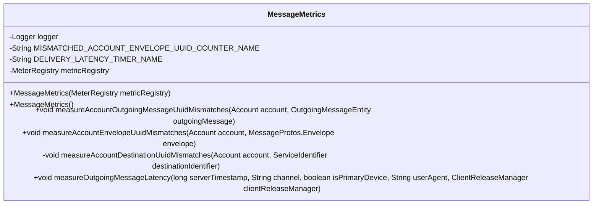

# 基础信息

|      |      |
|------|------|
| 名称 | MessageMetrics |
| 编码语言 | .java |
| 代码路径 | Signal-Server/service/src/main/java/org/whispersystems/textsecuregcm/metrics/MessageMetrics.java |
| 包名 | org.whispersystems.textsecuregcm.metrics |
| 依赖项 | ['org.whispersystems.textsecuregcm.metrics.MetricsUtil.name', 'com.google.common.annotations.VisibleForTesting', 'io.micrometer.core.instrument.MeterRegistry', 'io.micrometer.core.instrument.Metrics', 'io.micrometer.core.instrument.Tag', 'io.micrometer.core.instrument.Timer', 'java.time.Duration', 'java.time.Instant', 'java.util.ArrayList', 'java.util.List', 'org.slf4j.Logger', 'org.slf4j.LoggerFactory', 'org.whispersystems.textsecuregcm.entities.MessageProtos', 'org.whispersystems.textsecuregcm.entities.OutgoingMessageEntity', 'org.whispersystems.textsecuregcm.identity.ServiceIdentifier', 'org.whispersystems.textsecuregcm.storage.Account', 'org.whispersystems.textsecuregcm.storage.ClientReleaseManager'] |
| 概述说明 | MessageMetrics类用于度量消息延迟和账户UUID匹配情况。 |

# 说明

MessageMetrics类用于度量与消息相关的关键指标，主要关注两个方面：账户UUID不匹配和消息延迟。账户UUID不匹配指标用于检测消息发送或接收过程中账户标识符不一致的情况，确保消息的准确性和安全性。消息延迟指标则用于衡量消息从发送到接收的时间差，帮助识别和优化系统中的延迟问题，提升整体性能。通过这些指标，MessageMetrics类为系统提供了重要的监控和优化依据。

# 类列表 Class Summary

| 名称   | 类型  | 说明 |
|-------|------|-------------|
| MessageMetrics | class | MessageMetrics类用于度量消息相关指标，包括账户UUID不匹配和消息延迟。 |

## 类 MessageMetrics

|      |      |
|------|------|
| 访问范围 | public final |
| 类型 | class |
| 名称 | MessageMetrics |
| 说明 | MessageMetrics类用于度量消息相关指标，包括账户UUID不匹配和消息延迟。 |

### UML类图

**描述：**  
`MessageMetrics` 类用于管理和记录消息相关的度量指标。它包含多个公有方法，用于测量账户与消息UUID不匹配的情况以及消息的传输延迟。类中使用了 `MeterRegistry` 来注册和记录这些度量指标。`measureAccountDestinationUuidMismatches` 是一个私有方法，用于处理账户与目标UUID不匹配的逻辑。`measureOutgoingMessageLatency` 方法则通过 `Timer` 来记录消息的传输延迟，并根据用户代理、通道等信息添加标签。

### 内部方法调用关系图

```mermaid
graph TD
    A["类MessageMetrics"]
    B["属性: Logger logger"]
    C["属性: String MISMATCHED_ACCOUNT_ENVELOPE_UUID_COUNTER_NAME"]
    D["属性: String DELIVERY_LATENCY_TIMER_NAME"]
    E["属性: MeterRegistry metricRegistry"]
    F["构造方法: MessageMetrics(MeterRegistry metricRegistry)"]
    G["构造方法: MessageMetrics()"]
    H["方法: measureAccountOutgoingMessageUuidMismatches(Account account, OutgoingMessageEntity outgoingMessage)"]
    I["方法: measureAccountEnvelopeUuidMismatches(Account account, MessageProtos.Envelope envelope)"]
    J["方法: measureAccountDestinationUuidMismatches(Account account, ServiceIdentifier destinationIdentifier)"]
    K["方法: measureOutgoingMessageLatency(long serverTimestamp, String channel, boolean isPrimaryDevice, String userAgent, ClientReleaseManager clientReleaseManager)"]
    L["方法: UserAgentTagUtil.getPlatformTag(String userAgent)"]
    M["方法: UserAgentTagUtil.getClientVersionTag(String userAgent, ClientReleaseManager clientReleaseManager)"]
    N["方法: Timer.builder(String name)"]
    O["方法: Timer.register(MeterRegistry metricRegistry)"]
    P["方法: Timer.record(Duration duration)"]
    Q["方法: metricRegistry.counter(String name).increment()"]
    R["方法: Instant.ofEpochMilli(long epochMilli)"]
    S["方法: Instant.now()"]
    T["方法: Duration.between(Instant start, Instant end)"]
    U["方法: logger.warn(String message, Object... args)"]

    A --> B
    A --> C
    A --> D
    A --> E
    A --> F
    A --> G
    A --> H
    A --> I
    A --> J
    A --> K
    K --> L
    K --> M
    K --> N
    N --> O
    O --> P
    J --> Q
    K --> R
    K --> S
    K --> T
    I --> U
```

这段代码描述了一个名为 `MessageMetrics` 的类，主要用于测量和记录消息相关的指标。类中包含多个方法，用于处理账户与消息UUID不匹配的情况、测量消息的延迟等。代码通过 `MeterRegistry` 来注册和记录指标，并使用 `Logger` 记录警告信息。流程图展示了类中各方法的调用关系，以及它们如何协同工作来完成消息指标的测量和记录。

### 字段列表 Field List

| 名称  | 类型  | 说明 |
|-------|-------|------|
| metricRegistry | MeterRegistry | 私有且不可变的度量注册表实例。 |
| logger = LoggerFactory.getLogger(MessageMetrics.class) | Logger | MessageMetrics类中定义了一个私有的静态日志记录器。 |
| DELIVERY_LATENCY_TIMER_NAME = name(MessageMetrics.class, "deliveryLatency") | String | 定义静态常量DELIVERY_LATENCY_TIMER_NAME，用于记录消息传递延迟。 |
| MISMATCHED_ACCOUNT_ENVELOPE_UUID_COUNTER_NAME = name(MessageMetrics.class,      "mismatchedAccountEnvelopeUuid") | String | 定义了静态常量MISMATCHED_ACCOUNT_ENVELOPE_UUID_COUNTER_NAME，用于记录不匹配账户信封UUID的计数器名称。 |

### 方法列表 Method List

| 名称  | 类型  | 说明 |
|-------|-------|------|
| measureAccountEnvelopeUuidMismatches | void | 测量账户与信封目标服务ID不匹配，处理无效UUID并记录警告。 |
| measureAccountDestinationUuidMismatches | void | 方法检测账户UUID与目标标识符是否匹配，不匹配则增加计数器。 |
| measureAccountOutgoingMessageUuidMismatches | void | 测量账户与发送消息目标UUID不匹配情况。 |
| measureOutgoingMessageLatency | void | 测量消息延迟，记录平台、通道、主设备状态及客户端版本。 |

