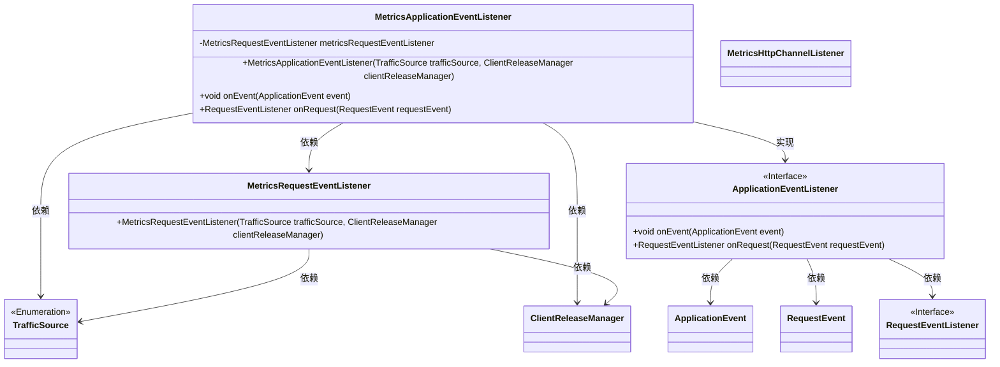
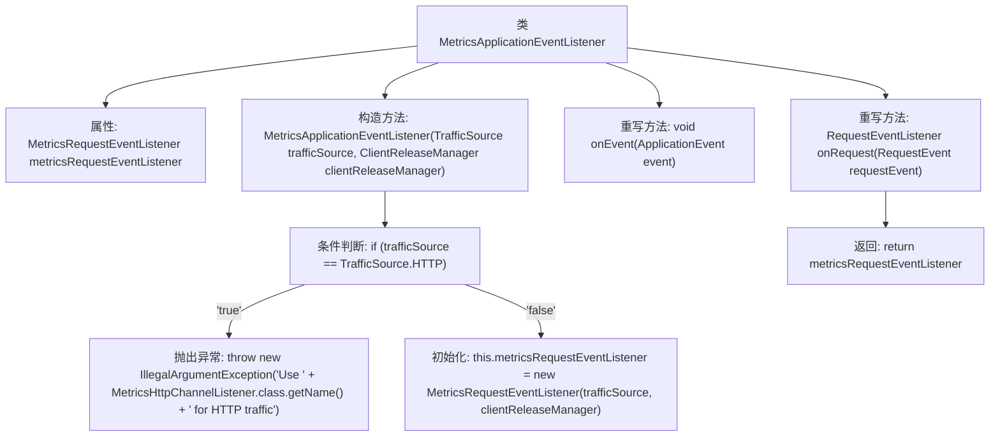

# 基础信息

|      |      |
|------|------|
| 名称 | MetricsApplicationEventListener |
| 编码语言 | .java |
| 代码路径 | Signal-Server/service/src/main/java/org/whispersystems/textsecuregcm/metrics/MetricsApplicationEventListener.java |
| 包名 | org.whispersystems.textsecuregcm.metrics |
| 依赖项 | ['org.glassfish.jersey.server.monitoring.ApplicationEvent', 'org.glassfish.jersey.server.monitoring.ApplicationEventListener', 'org.glassfish.jersey.server.monitoring.RequestEvent', 'org.glassfish.jersey.server.monitoring.RequestEventListener', 'org.whispersystems.textsecuregcm.storage.ClientReleaseManager'] |
| 概述说明 | MetricsApplicationEventListener监听应用事件，处理非HTTP流量，返回MetricsRequestEventListener。 |

# 说明

MetricsApplicationEventListener是一个用于监听应用事件的组件，主要负责处理非HTTP流量。它通过监听应用中的各种事件，能够捕获与性能、错误率等相关的指标数据。在处理完这些事件后，该监听器会返回一个MetricsRequestEventListener，用于进一步处理与请求相关的指标数据。这种设计有助于在非HTTP场景下，依然能够有效地监控和收集应用的性能指标，确保系统的稳定性和可观测性。

# 类列表 Class Summary

| 名称   | 类型  | 说明 |
|-------|------|-------------|
| MetricsApplicationEventListener | class | MetricsApplicationEventListener监听应用事件，处理非HTTP流量，返回MetricsRequestEventListener。 |

## 类 MetricsApplicationEventListener

|      |      |
|------|------|
| 访问范围 | public |
| 类型 | class |
| 名称 | MetricsApplicationEventListener |
| 说明 | MetricsApplicationEventListener监听应用事件，处理非HTTP流量，返回MetricsRequestEventListener。 |

### UML类图

这段代码描述了一个`MetricsApplicationEventListener`类，它实现了`ApplicationEventListener`接口。该类通过构造函数接收`TrafficSource`和`ClientReleaseManager`参数，并根据`TrafficSource`的类型决定是否抛出异常。它还包含一个`MetricsRequestEventListener`实例，用于处理请求事件。类图展示了各个类之间的依赖关系和接口实现关系，清晰地反映了代码的结构和功能。

### 内部方法调用关系图

这段代码定义了一个`MetricsApplicationEventListener`类，实现了`ApplicationEventListener`接口。类中包含一个`MetricsRequestEventListener`属性，构造方法根据传入的`trafficSource`参数进行判断，如果为`HTTP`则抛出异常，否则初始化`metricsRequestEventListener`。类中还重写了`onEvent`和`onRequest`方法，`onRequest`方法返回`metricsRequestEventListener`。流程图展示了类的结构和方法调用关系。

### 字段列表 Field List

| 名称  | 类型  | 说明 |
|-------|-------|------|
| metricsRequestEventListener | MetricsRequestEventListener | 私有且不可变的MetricsRequestEventListener实例。 |

### 方法列表 Method List

| 名称  | 类型  | 说明 |
|-------|-------|------|
| onEvent | void | 重写事件处理方法，接收应用程序事件。 |
| onRequest | RequestEventListener | 重写方法，返回请求事件监听器。 |

