# 基础信息

|      |      |
|------|------|
| 名称 | MetricsHttpChannelListener |
| 编码语言 | .java |
| 代码路径 | Signal-Server/service/src/main/java/org/whispersystems/textsecuregcm/metrics/MetricsHttpChannelListener.java |
| 包名 | org.whispersystems.textsecuregcm.metrics |
| 依赖项 | ['com.google.common.annotations.VisibleForTesting', 'com.google.common.net.HttpHeaders', 'io.dropwizard.core.setup.Environment', 'io.micrometer.core.instrument.MeterRegistry', 'io.micrometer.core.instrument.Metrics', 'io.micrometer.core.instrument.Tag', 'io.micrometer.core.instrument.Tags', 'jakarta.ws.rs.container.ContainerRequestContext', 'jakarta.ws.rs.container.ContainerResponseContext', 'jakarta.ws.rs.container.ContainerResponseFilter', 'java.io.IOException', 'java.util.ArrayList', 'java.util.List', 'java.util.Optional', 'java.util.Set', 'javax.annotation.Nullable', 'org.eclipse.jetty.server.Connector', 'org.eclipse.jetty.server.HttpChannel', 'org.eclipse.jetty.server.Request', 'org.eclipse.jetty.util.component.Container', 'org.eclipse.jetty.util.component.LifeCycle', 'org.glassfish.jersey.server.ExtendedUriInfo', 'org.slf4j.Logger', 'org.slf4j.LoggerFactory', 'org.whispersystems.textsecuregcm.storage.ClientReleaseManager', 'org.whispersystems.textsecuregcm.util.logging.UriInfoUtil'] |
| 概述说明 | MetricsHttpChannelListener类监控HTTP请求，记录路径、方法、状态码和用户代理，通过MeterRegistry统计。 |

# 说明

MetricsHttpChannelListener类主要用于监控HTTP请求，它能够记录请求的路径、方法、状态码以及用户代理等关键信息。这些信息通过MeterRegistry进行统计和分析，帮助开发者和运维人员更好地了解系统的请求情况，优化性能并排查问题。该类在监控和统计HTTP请求方面提供了全面的支持，确保系统运行的可观测性和可维护性。

# 类列表 Class Summary

| 名称   | 类型  | 说明 |
|-------|------|-------------|
| MetricsHttpChannelListener | class | MetricsHttpChannelListener类用于监控HTTP请求，记录路径、方法、状态码和用户代理等信息，并通过MeterRegistry进行统计。 |


## 类 MetricsHttpChannelListener

|      |      |
|------|------|
| 访问范围 | public |
| 类型 | class |
| 名称 | MetricsHttpChannelListener |
| 说明 | MetricsHttpChannelListener类用于监控HTTP请求，记录路径、方法、状态码和用户代理等信息，并通过MeterRegistry进行统计。 |


### UML类图

```mermaid
classDiagram
    class MetricsHttpChannelListener {
        -Logger logger
        -ClientReleaseManager clientReleaseManager
        -Set~String~ servletPaths
        -MeterRegistry meterRegistry
        +String REQUEST_COUNTER_NAME
        +String REQUESTS_BY_VERSION_COUNTER_NAME
        +String URI_INFO_PROPERTY_NAME
        +String PATH_TAG
        +String METHOD_TAG
        +String STATUS_CODE_TAG
        +String TRAFFIC_SOURCE_TAG
        +MetricsHttpChannelListener(ClientReleaseManager clientReleaseManager, Set~String~ servletPaths)
        +MetricsHttpChannelListener(MeterRegistry meterRegistry, ClientReleaseManager clientReleaseManager, Set~String~ servletPaths)
        +void configure(Environment environment)
        +void onRequestFailure(Request request, Throwable failure)
        +void onResponseFailure(Request request, Throwable failure)
        +void onComplete(Request request)
        +void beanAdded(Container parent, Object child)
        +void beanRemoved(Container parent, Object child)
        +void filter(ContainerRequestContext requestContext, ContainerResponseContext responseContext) throws IOException
        -RequestInfo getRequestInfo(Request request)
    }
    class RequestInfo {
        -String path
        -String method
        -int statusCode
        -String userAgent
        +RequestInfo(String path, String method, int statusCode, String userAgent)
    }
    class <<Interface>> HttpChannel$Listener {
    }
    class <<Interface>> Container$Listener {
    }
    class <<Interface>> LifeCycle$Listener {
    }
    class <<Interface>> ContainerResponseFilter {
    }
    MetricsHttpChannelListener --> HttpChannel$Listener : 实现
    MetricsHttpChannelListener --> Container$Listener : 实现
    MetricsHttpChannelListener --> LifeCycle$Listener : 实现
    MetricsHttpChannelListener --> ContainerResponseFilter : 实现
```

**描述：**  
`MetricsHttpChannelListener` 类实现了 `HttpChannel.Listener`、`Container.Listener`、`LifeCycle.Listener` 和 `ContainerResponseFilter` 接口，用于监听 HTTP 请求和响应的生命周期事件，并记录相关指标。该类通过 `MeterRegistry` 记录请求的路径、方法、状态码和用户代理等信息，并在请求失败、响应失败或请求完成时触发相应的事件处理逻辑。`RequestInfo` 是一个内部记录类，用于存储请求的相关信息。


### 内部方法调用关系图

```mermaid
graph TD
    A["类MetricsHttpChannelListener"]
    B["属性: Logger logger"]
    C["属性: ClientReleaseManager clientReleaseManager"]
    D["属性: Set<String> servletPaths"]
    E["属性: MeterRegistry meterRegistry"]
    F["构造方法: MetricsHttpChannelListener(ClientReleaseManager, Set<String>)"]
    G["构造方法: MetricsHttpChannelListener(MeterRegistry, ClientReleaseManager, Set<String>)"]
    H["方法: configure(Environment)"]
    I["方法: onRequestFailure(Request, Throwable)"]
    J["方法: onResponseFailure(Request, Throwable)"]
    K["方法: onComplete(Request)"]
    L["方法: beanAdded(Container, Object)"]
    M["方法: beanRemoved(Container, Object)"]
    N["方法: filter(ContainerRequestContext, ContainerResponseContext)"]
    O["方法: getRequestInfo(Request)"]

    A --> B
    A --> C
    A --> D
    A --> E
    A --> F
    A --> G
    A --> H
    A --> I
    A --> J
    A --> K
    A --> L
    A --> M
    A --> N
    A --> O
```



这段代码定义了一个名为 `MetricsHttpChannelListener` 的类，该类实现了多个接口，包括 `HttpChannel.Listener`、`Container.Listener`、`LifeCycle.Listener` 和 `ContainerResponseFilter`。该类主要用于监控 HTTP 请求和响应的性能指标，并记录相关日志。通过 `MeterRegistry` 对象，它可以收集和报告请求的路径、方法、状态码等信息。此外，该类还处理了请求失败、响应失败以及请求完成等事件，并通过 `getRequestInfo` 方法提取请求的相关信息。

### 字段列表 Field List

| 名称  | 类型  | 说明 |
|-------|-------|------|
| servletPaths | Set<String> | 私有最终字符串集合servletPaths。 |
| meterRegistry | MeterRegistry | 私有且不可变的MeterRegistry对象。 |
| clientReleaseManager | ClientReleaseManager | 私有且不可变的客户端发布管理器实例。 |
| STATUS_CODE_TAG = "status" | String | 测试可见的静态常量字符串标签“status”。 |
| logger = LoggerFactory.getLogger(MetricsHttpChannelListener.class) | Logger | MetricsHttpChannelListener类中定义了一个私有的静态日志记录器。 |
| METHOD_TAG = "method" | String | 测试可见的静态字符串常量 METHOD_TAG 定义为 "method"。 |
| PATH_TAG = "path" | String | 用于测试的静态常量PATH_TAG，值为"path"。 |
| REQUEST_COUNTER_NAME = MetricsRequestEventListener.REQUEST_COUNTER_NAME | String | 定义了一个静态常量字符串REQUEST_COUNTER_NAME，其值为MetricsRequestEventListener.REQUEST_COUNTER_NAME。 |
| TRAFFIC_SOURCE_TAG = "trafficSource" | String | 测试可见的静态常量TRAFFIC_SOURCE_TAG定义为"trafficSource"。 |
| REQUESTS_BY_VERSION_COUNTER_NAME = MetricsRequestEventListener.REQUESTS_BY_VERSION_COUNTER_NAME | String | 定义常量REQUESTS_BY_VERSION_COUNTER_NAME，引用MetricsRequestEventListener的同名常量。 |
| URI_INFO_PROPERTY_NAME = MetricsHttpChannelListener.class.getName() + ".uriInfo" | String | 测试用静态常量URI_INFO_PROPERTY_NAME，用于MetricsHttpChannelListener类。 |

### 方法列表 Method List

| 名称  | 类型  | 说明 |
|-------|-------|------|
| beanRemoved | void | 重写beanRemoved方法，处理容器中对象移除事件。 |
| filter | void | 重写filter方法，将请求URI信息存入请求上下文属性中。 |
| configure | void | 配置环境，注册响应过滤器和生命周期事件监听器。 |
| onRequestFailure | void | 请求失败时记录调试信息，包括方法、路径、用户代理和状态码。 |
| onComplete | void | 方法onComplete处理请求，收集路径、方法、状态码等信息，记录请求计数和客户端版本计数。 |
| getRequestInfo | RequestInfo | 方法`getRequestInfo`提取请求路径、方法、状态和用户代理信息。 |
| beanAdded | void | 当容器添加子对象时，若子对象为连接器，则将其与当前对象绑定。 |
| onResponseFailure | void | 处理请求失败时，记录方法、路径、用户代理和状态码等信息。 |


