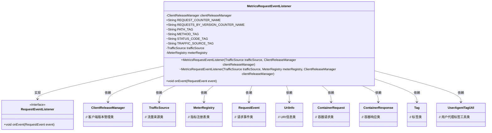
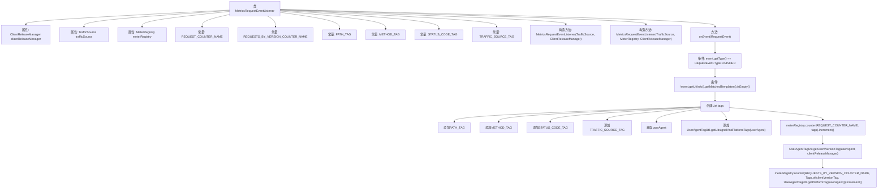

# 基础信息

|      |      |
|------|------|
| 名称 | MetricsRequestEventListener |
| 编码语言 | .java |
| 代码路径 | Signal-Server/service/src/main/java/org/whispersystems/textsecuregcm/metrics/MetricsRequestEventListener.java |
| 包名 | org.whispersystems.textsecuregcm.metrics |
| 依赖项 | ['com.codahale.metrics.MetricRegistry', 'com.google.common.annotations.VisibleForTesting', 'com.google.common.net.HttpHeaders', 'io.micrometer.core.instrument.MeterRegistry', 'io.micrometer.core.instrument.Metrics', 'io.micrometer.core.instrument.Tag', 'io.micrometer.core.instrument.Tags', 'org.glassfish.jersey.server.ContainerResponse', 'org.glassfish.jersey.server.monitoring.RequestEvent', 'org.glassfish.jersey.server.monitoring.RequestEventListener', 'org.whispersystems.textsecuregcm.storage.ClientReleaseManager', 'org.whispersystems.textsecuregcm.util.logging.UriInfoUtil', 'javax.annotation.Nullable', 'java.util.ArrayList', 'java.util.List', 'java.util.Optional'] |
| 概述说明 | MetricsRequestEventListener监听请求事件，记录路径、方法、状态码，并通过MeterRegistry统计。 |

# 说明

MetricsRequestEventListener类的主要功能是监听请求事件，用于记录和统计与请求相关的关键信息。具体而言，它会捕获请求的路径、请求方法（如GET、POST等）以及响应状态码等数据。这些信息随后通过MeterRegistry进行统计和分析，帮助监控和优化系统的请求处理性能。该类在实现请求监控和性能分析方面具有重要作用。

# 类列表 Class Summary

| 名称   | 类型  | 说明 |
|-------|------|-------------|
| MetricsRequestEventListener | class | MetricsRequestEventListener类用于监听请求事件，记录请求路径、方法、状态码等信息，并通过MeterRegistry进行统计。 |

## 类 MetricsRequestEventListener

|      |      |
|------|------|
| 访问范围 | public |
| 类型 | class |
| 名称 | MetricsRequestEventListener |
| 说明 | MetricsRequestEventListener类用于监听请求事件，记录请求路径、方法、状态码等信息，并通过MeterRegistry进行统计。 |

### UML类图

### 描述
`MetricsRequestEventListener` 类实现了 `RequestEventListener` 接口，用于监听请求事件并记录相关指标。该类依赖于 `ClientReleaseManager`、`TrafficSource` 和 `MeterRegistry` 等类来管理客户端版本、流量来源和指标注册。在 `onEvent` 方法中，它根据请求事件的类型和相关信息生成标签，并使用 `MeterRegistry` 记录请求计数和版本计数。通过这种方式，该类能够有效地监控和分析请求的处理情况。

### 内部方法调用关系图

这段代码描述了一个名为`MetricsRequestEventListener`的类，该类实现了`RequestEventListener`接口，用于监听请求事件并记录相关指标。代码通过构造方法初始化相关属性，并在`onEvent`方法中处理请求完成事件，生成并记录与请求路径、方法、状态码、流量来源等相关的标签，最后通过`meterRegistry`计数器记录请求数量。该流程图展示了类的结构、属性、常量、构造方法以及`onEvent`方法中的处理逻辑。

### 字段列表 Field List

| 名称  | 类型  | 说明 |
|-------|-------|------|
| clientReleaseManager | ClientReleaseManager | 私有且不可变的ClientReleaseManager实例。 |
| trafficSource | TrafficSource | 私有不可变的流量源对象。 |
| REQUESTS_BY_VERSION_COUNTER_NAME = MetricRegistry.name(MetricsRequestEventListener.class, "requestByVersion") | String | 定义请求版本计数器的静态常量名。 |
| STATUS_CODE_TAG = "status" | String | 测试可见的静态常量字符串用于状态码标记。 |
| REQUEST_COUNTER_NAME = MetricRegistry.name(MetricsRequestEventListener.class, "request") | String | 定义请求计数器常量名为REQUEST_COUNTER_NAME。 |
| METHOD_TAG = "method" | String | 用于测试的静态常量字符串METHOD_TAG，值为"method"。 |
| PATH_TAG = "path" | String | 测试可见的静态常量PATH_TAG定义为"path"。 |
| meterRegistry | MeterRegistry | 私有成员变量meterRegistry，类型为MeterRegistry。 |
| TRAFFIC_SOURCE_TAG = "trafficSource" | String | 测试用常量TRAFFIC_SOURCE_TAG定义为"trafficSource"。 |

### 方法列表 Method List

| 名称  | 类型  | 说明 |
|-------|-------|------|
| onEvent | void | 事件完成时记录请求路径、方法、状态码、流量来源及用户代理信息。 |

