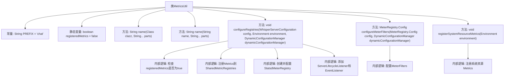

# 基础信息

|      |      |
|------|------|
| 名称 | MetricsUtil |
| 编码语言 | .java |
| 代码路径 | Signal-Server/service/src/main/java/org/whispersystems/textsecuregcm/metrics/MetricsUtil.java |
| 包名 | org.whispersystems.textsecuregcm.metrics |
| 依赖项 | ['com.codahale.metrics.SharedMetricRegistries', 'com.google.common.annotations.VisibleForTesting', 'io.dropwizard.core.setup.Environment', 'io.micrometer.core.instrument.Meter', 'io.micrometer.core.instrument.MeterRegistry', 'io.micrometer.core.instrument.Metrics', 'io.micrometer.core.instrument.Tags', 'io.micrometer.core.instrument.binder.jetty.JettySslHandshakeMetrics', 'io.micrometer.core.instrument.binder.jvm.JvmMemoryMetrics', 'io.micrometer.core.instrument.binder.jvm.JvmThreadMetrics', 'io.micrometer.core.instrument.binder.system.FileDescriptorMetrics', 'io.micrometer.core.instrument.binder.system.ProcessorMetrics', 'io.micrometer.core.instrument.config.MeterFilter', 'io.micrometer.core.instrument.distribution.DistributionStatisticConfig', 'io.micrometer.statsd.StatsdMeterRegistry', 'org.whispersystems.textsecuregcm.WhisperServerConfiguration', 'org.whispersystems.textsecuregcm.WhisperServerVersion', 'org.whispersystems.textsecuregcm.configuration.dynamic.DynamicConfiguration', 'org.whispersystems.textsecuregcm.storage.DynamicConfigurationManager', 'org.whispersystems.textsecuregcm.util.Constants'] |
| 概述说明 | MetricsUtil类用于配置管理指标注册表，支持多类型指标和过滤器。 |

# 说明

MetricsUtil类主要用于配置和管理指标注册表，提供了对多种指标类型的支持，并具备过滤器的功能，以便更灵活地处理和监控指标数据。

# 类列表 Class Summary

| 名称   | 类型  | 说明 |
|-------|------|-------------|
| MetricsUtil | class | MetricsUtil类用于配置和管理指标注册表，支持多种指标类型和过滤器。 |

## 类 MetricsUtil

|      |      |
|------|------|
| 访问范围 | public |
| 类型 | class |
| 名称 | MetricsUtil |
| 说明 | MetricsUtil类用于配置和管理指标注册表，支持多种指标类型和过滤器。 |

### UML类图

```mermaid
classDiagram
    class MetricsUtil {
        +String PREFIX
        -boolean registeredMetrics
        +String name(Class~?~ clazz, String... parts)
        -String name(String name, String... parts)
        +void configureRegistries(WhisperServerConfiguration config, Environment environment, DynamicConfigurationManager~DynamicConfiguration~ dynamicConfigurationManager)
        +MeterRegistry.Config configureMeterFilters(MeterRegistry.Config config, DynamicConfigurationManager~DynamicConfiguration~ dynamicConfigurationManager)
        +void registerSystemResourceMetrics(Environment environment)
    }

    class WhisperServerConfiguration {
        // 配置类，用于存储服务器配置
    }

    class Environment {
        // 环境类，用于管理应用环境
    }

    class DynamicConfigurationManager~T~ {
        // 动态配置管理器，泛型类
    }

    class DynamicConfiguration {
        // 动态配置类
    }

    class MeterRegistry {
        // 计量器注册表类
    }

    class StatsdMeterRegistry {
        // StatsD 计量器注册表类
    }

    class DistributionStatisticConfig {
        // 分布统计配置类
    }

    class MeterFilter {
        // 计量器过滤器类
    }

    class ProcessorMetrics {
        // 处理器计量器类
    }

    class FreeMemoryGauge {
        // 空闲内存计量器类
    }

    class FileDescriptorMetrics {
        // 文件描述符计量器类
    }

    class OperatingSystemMemoryGauge {
        // 操作系统内存计量器类
    }

    class JvmMemoryMetrics {
        // JVM 内存计量器类
    }

    class JvmThreadMetrics {
        // JVM 线程计量器类
    }

    class GarbageCollectionGauges {
        // 垃圾回收计量器类
    }

    MetricsUtil --> WhisperServerConfiguration : 依赖
    MetricsUtil --> Environment : 依赖
    MetricsUtil --> DynamicConfigurationManager~DynamicConfiguration~ : 依赖
    MetricsUtil --> MeterRegistry : 依赖
    MetricsUtil --> StatsdMeterRegistry : 依赖
    MetricsUtil --> DistributionStatisticConfig : 依赖
    MetricsUtil --> MeterFilter : 依赖
    MetricsUtil --> ProcessorMetrics : 依赖
    MetricsUtil --> FreeMemoryGauge : 依赖
    MetricsUtil --> FileDescriptorMetrics : 依赖
    MetricsUtil --> OperatingSystemMemoryGauge : 依赖
    MetricsUtil --> JvmMemoryMetrics : 依赖
    MetricsUtil --> JvmThreadMetrics : 依赖
    MetricsUtil --> GarbageCollectionGauges : 依赖
```

### 描述
`MetricsUtil` 类是一个工具类，用于管理和配置应用的度量指标。它提供了生成度量名称、配置度量注册表、注册系统资源度量等功能。该类依赖于多个配置类和度量类，如 `WhisperServerConfiguration`、`Environment`、`DynamicConfigurationManager`、`MeterRegistry` 等，以实现全面的度量管理。通过 `configureRegistries` 方法，它初始化并配置了多个度量注册表，确保度量数据的收集和上报。

### 内部方法调用关系图

**描述：**
`MetricsUtil`类用于管理和配置应用程序的度量指标。它包含多个方法，如`name`用于生成度量名称，`configureRegistries`用于配置度量注册表，`configureMeterFilters`用于配置度量过滤器，`registerSystemResourceMetrics`用于注册系统资源度量。类中还包含常量和静态变量，用于辅助度量的管理和配置。流程图中展示了各个方法的调用关系和内部逻辑。

### 字段列表 Field List

| 名称  | 类型  | 说明 |
|-------|-------|------|
| PREFIX = "chat" | String | 定义了一个名为PREFIX的静态常量字符串，值为"chat"。 |
| registeredMetrics = false | boolean | 私有静态易变布尔变量registeredMetrics初始为false。 |

### 方法列表 Method List

| 名称  | 类型  | 说明 |
|-------|-------|------|
| name | String | 静态方法根据类名和部分字符串生成名称。 |
| name | String | 静态方法拼接字符串，使用StringBuilder添加前缀和部分。 |
| registerSystemResourceMetrics | void | 注册系统资源指标，包括处理器、内存、文件描述符、操作系统内存、JVM内存和线程、垃圾回收等。 |
| configureRegistries | void | 配置注册表，防止重复注册，添加共享度量注册表，设置Dogstatsd注册表，配置过滤器，添加生命周期监听器。 |
| configureMeterFilters | MeterRegistry.Config | 配置MeterRegistry过滤器，设置默认统计配置，处理Lettuce和AWS SDK指标，移除高基数标签。 |

