# 基础信息

|      |      |
|------|------|
| 名称 | MicrometerAwsSdkMetricPublisher |
| 编码语言 | .java |
| 代码路径 | Signal-Server/service/src/main/java/org/whispersystems/textsecuregcm/metrics/MicrometerAwsSdkMetricPublisher.java |
| 包名 | org.whispersystems.textsecuregcm.metrics |
| 依赖项 | ['io.micrometer.core.instrument.DistributionSummary', 'io.micrometer.core.instrument.Metrics', 'io.micrometer.core.instrument.Tags', 'io.micrometer.core.instrument.Timer', 'java.time.Duration', 'java.util.Map', 'java.util.Optional', 'java.util.concurrent.ExecutorService', 'java.util.concurrent.RejectedExecutionException', 'java.util.concurrent.atomic.AtomicInteger', 'java.util.stream.Collectors', 'software.amazon.awssdk.metrics.MetricCollection', 'software.amazon.awssdk.metrics.MetricPublisher', 'software.amazon.awssdk.metrics.MetricRecord'] |
| 概述说明 | MicrometerAwsSdkMetricPublisher类发布AWS SDK指标，记录API调用及子指标。 |

# 说明

MicrometerAwsSdkMetricPublisher类的主要功能是发布与AWS SDK相关的指标，具体包括记录API调用及其相关的子指标。通过该类，开发者可以监控和分析AWS SDK的操作性能，确保系统的高效运行和及时发现问题。

# 类列表 Class Summary

| 名称   | 类型  | 说明 |
|-------|------|-------------|
| MicrometerAwsSdkMetricPublisher | class | MicrometerAwsSdkMetricPublisher类用于发布AWS SDK的指标，记录API调用及其子指标。 |


## 类 MicrometerAwsSdkMetricPublisher

|      |      |
|------|------|
| 访问范围 | public |
| 类型 | class |
| 名称 | MicrometerAwsSdkMetricPublisher |
| 说明 | MicrometerAwsSdkMetricPublisher类用于发布AWS SDK的指标，记录API调用及其子指标。 |


### UML类图

```mermaid
classDiagram
    class MicrometerAwsSdkMetricPublisher {
        -ExecutorService recordMetricsExecutorService
        -String awsClientName
        -AtomicInteger mostRecentMaxConcurrency
        -static final String METRIC_COLLECTION_TYPE_API_CALL
        -static final String METRIC_COLLECTION_TYPE_API_CALL_ATTEMPT
        -static final String METRIC_COLLECTION_TYPE_HTTP_METRICS
        -static final String API_CALL_COUNTER_NAME
        -static final String API_CALL_RETRY_COUNT_DISTRIBUTION_NAME
        -static final String CHANNEL_ACQUISITION_TIMER_NAME
        -static final String PENDING_CHANNEL_ACQUISITIONS_DISTRIBUTION_NAME
        -static final String CONCURRENT_REQUESTS_DISTRIBUTION_NAME
        -static final String MAX_CONCURRENCY_GAUGE_NAME
        -static final String CLIENT_NAME_TAG
        +MicrometerAwsSdkMetricPublisher(ExecutorService recordMetricsExecutorService, String awsClientName)
        +void publish(MetricCollection metricCollection)
        -void recordApiCallMetrics(MetricCollection apiCallMetricCollection)
        -void recordAttemptMetrics(MetricCollection apiCallAttemptMetricCollection, Tags callTags)
        -static Map~String, MetricRecord~?~~ toMetricMap(MetricCollection metricCollection)
        +void close()
    }

    interface MetricPublisher {
        <<Interface>>
        +void publish(MetricCollection metricCollection)
        +void close()
    }

    MicrometerAwsSdkMetricPublisher --> MetricPublisher : 实现
```

**描述：**  
`MicrometerAwsSdkMetricPublisher` 类实现了 `MetricPublisher` 接口，用于发布 AWS SDK 的监控指标。它通过 `ExecutorService` 异步记录指标，并使用 `AtomicInteger` 跟踪最大并发数。类中包含多个静态常量，用于定义指标类型和名称。`publish` 方法根据传入的 `MetricCollection` 类型记录不同的指标，`recordApiCallMetrics` 和 `recordAttemptMetrics` 方法分别处理 API 调用和尝试的指标记录。`toMetricMap` 方法将 `MetricCollection` 转换为 `Map` 以便于处理。


### 内部方法调用关系图

```mermaid
graph TD
    A["类MicrometerAwsSdkMetricPublisher"]
    B["属性: ExecutorService recordMetricsExecutorService"]
    C["属性: String awsClientName"]
    D["属性: AtomicInteger mostRecentMaxConcurrency"]
    E["常量: METRIC_COLLECTION_TYPE_API_CALL"]
    F["常量: METRIC_COLLECTION_TYPE_API_CALL_ATTEMPT"]
    G["常量: METRIC_COLLECTION_TYPE_HTTP_METRICS"]
    H["常量: API_CALL_COUNTER_NAME"]
    I["常量: API_CALL_RETRY_COUNT_DISTRIBUTION_NAME"]
    J["常量: CHANNEL_ACQUISITION_TIMER_NAME"]
    K["常量: PENDING_CHANNEL_ACQUISITIONS_DISTRIBUTION_NAME"]
    L["常量: CONCURRENT_REQUESTS_DISTRIBUTION_NAME"]
    M["常量: MAX_CONCURRENCY_GAUGE_NAME"]
    N["常量: CLIENT_NAME_TAG"]
    O["构造方法: MicrometerAwsSdkMetricPublisher(ExecutorService recordMetricsExecutorService, String awsClientName)"]
    P["方法: publish(MetricCollection metricCollection)"]
    Q["方法: recordApiCallMetrics(MetricCollection apiCallMetricCollection)"]
    R["方法: recordAttemptMetrics(MetricCollection apiCallAttemptMetricCollection, Tags callTags)"]
    S["方法: toMetricMap(MetricCollection metricCollection)"]
    T["方法: close()"]

    A --> B
    A --> C
    A --> D
    A --> E
    A --> F
    A --> G
    A --> H
    A --> I
    A --> J
    A --> K
    A --> L
    A --> M
    A --> N
    A --> O
    A --> P
    A --> Q
    A --> R
    A --> S
    A --> T
    P --> Q
    Q --> R
    R --> S
```



该流程图展示了`MicrometerAwsSdkMetricPublisher`类的结构及其内部方法调用关系。类中包含多个属性和常量，用于记录和发布AWS SDK的度量数据。`publish`方法接收`MetricCollection`对象，并根据其类型调用`recordApiCallMetrics`方法。`recordApiCallMetrics`方法进一步处理API调用的度量数据，并调用`recordAttemptMetrics`方法记录每个API调用尝试的度量数据。`recordAttemptMetrics`方法处理HTTP相关的度量数据，并使用`toMetricMap`方法将度量记录转换为映射。`close`方法用于关闭资源。

### 字段列表 Field List

| 名称  | 类型  | 说明 |
|-------|-------|------|
| METRIC_COLLECTION_TYPE_HTTP_METRICS = "HttpClient" | String | 定义常量表示HTTP客户端指标收集类型。 |
| MAX_CONCURRENCY_GAUGE_NAME =          MetricsUtil.name(MicrometerAwsSdkMetricPublisher.class, "maxConcurrency") | String | 定义了最大并发量指标的静态常量名称。 |
| awsClientName | String | 私有字符串变量awsClientName。 |
| CONCURRENT_REQUESTS_DISTRIBUTION_NAME =      MetricsUtil.name(MicrometerAwsSdkMetricPublisher.class, "concurrentRequests") | String | 定义了并发请求指标的静态常量名称。 |
| recordMetricsExecutorService | ExecutorService | 私有且不可变的记录指标线程池服务。 |
| mostRecentMaxConcurrency | AtomicInteger | 私有且不可变的原子整数，存储最新最大并发数。 |
| API_CALL_COUNTER_NAME =      MetricsUtil.name(MicrometerAwsSdkMetricPublisher.class, "apiCall") | String | API调用计数器命名为MicrometerAwsSdkMetricPublisher类的apiCall。 |
| API_CALL_RETRY_COUNT_DISTRIBUTION_NAME =      MetricsUtil.name(MicrometerAwsSdkMetricPublisher.class, "apiCallRetries") | String | API调用重试次数分布指标名称定义。 |
| CLIENT_NAME_TAG = "clientName" | String | 定义常量字符串CLIENT_NAME_TAG，值为"clientName"。 |
| PENDING_CHANNEL_ACQUISITIONS_DISTRIBUTION_NAME =      MetricsUtil.name(MicrometerAwsSdkMetricPublisher.class, "pendingChannelAcquisitions") | String | MicrometerAwsSdkMetricPublisher类中定义了一个静态常量，用于度量待处理通道获取的分布名称。 |
| CHANNEL_ACQUISITION_TIMER_NAME =      MetricsUtil.name(MicrometerAwsSdkMetricPublisher.class, "acquireChannelDuration") | String | 定义用于测量获取通道耗时的私有静态常量计时器名称。 |
| METRIC_COLLECTION_TYPE_API_CALL_ATTEMPT = "ApiCallAttempt" | String | 定义常量字符串METRIC_COLLECTION_TYPE_API_CALL_ATTEMPT为"ApiCallAttempt"。 |
| METRIC_COLLECTION_TYPE_API_CALL = "ApiCall" | String | 定义常量METRIC_COLLECTION_TYPE_API_CALL为"ApiCall"。 |

### 方法列表 Method List

| 名称  | 类型  | 说明 |
|-------|-------|------|
| toMetricMap | Map<String, MetricRecord<?>> | 将MetricCollection转换为以指标名为键的Map。 |
| publish | void | 重写publish方法，处理API调用指标记录，异步执行，忽略拒绝异常。 |
| recordAttemptMetrics | void | 记录API调用尝试的指标，验证HTTP指标，并更新相关并发和持续时间指标。 |
| close | void | 该方法重写了close()，但未实现具体功能。 |
| recordApiCallMetrics | void | 记录API调用指标，验证指标集合名称，提取服务ID和操作名称，统计成功率和重试次数，生成标签并更新计数器。 |


