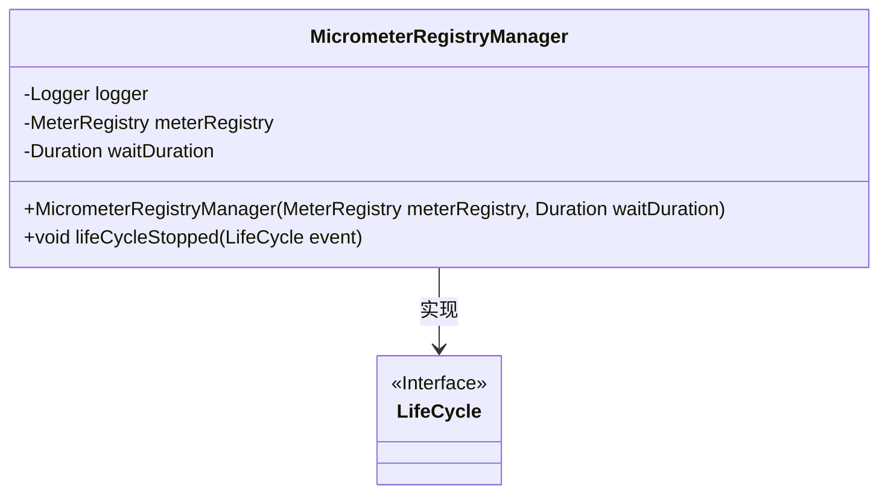
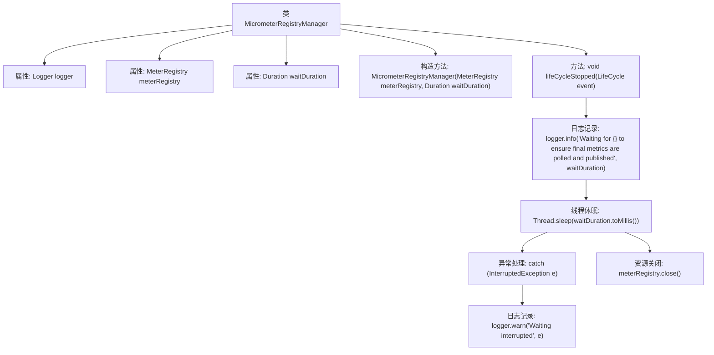
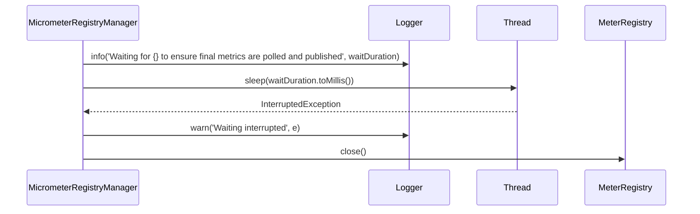

# 基础信息

|      |      |
|------|------|
| 名称 | MicrometerRegistryManager |
| 编码语言 | .java |
| 代码路径 | Signal-Server/service/src/main/java/org/whispersystems/textsecuregcm/metrics/MicrometerRegistryManager.java |
| 包名 | org.whispersystems.textsecuregcm.metrics |
| 依赖项 | ['io.micrometer.core.instrument.MeterRegistry', 'java.time.Duration', 'org.eclipse.jetty.util.component.LifeCycle', 'org.slf4j.Logger', 'org.slf4j.LoggerFactory'] |
| 概述说明 | MicrometerRegistryManager负责管理MeterRegistry生命周期，确保停止时关闭注册表。 |

# 说明

MicrometerRegistryManager负责管理MeterRegistry的生命周期，确保在停止时能够等待并正确关闭注册表，以避免资源泄漏和确保系统稳定性。

# 类列表 Class Summary

| 名称   | 类型  | 说明 |
|-------|------|-------------|
| MicrometerRegistryManager | class | MicrometerRegistryManager管理MeterRegistry生命周期，停止时等待并关闭注册表。 |

## 类 MicrometerRegistryManager

|      |      |
|------|------|
| 访问范围 | public |
| 类型 | class |
| 名称 | MicrometerRegistryManager |
| 说明 | MicrometerRegistryManager管理MeterRegistry生命周期，停止时等待并关闭注册表。 |

### UML类图

这段代码定义了一个 `MicrometerRegistryManager` 类，该类实现了 `LifeCycle.Listener` 接口。`MicrometerRegistryManager` 类负责在生命周期停止时，等待一段时间以确保最终的指标被收集和发布，然后关闭 `MeterRegistry`。类中包含一个构造函数和 `lifeCycleStopped` 方法，后者处理生命周期停止事件并执行相应的操作。

### 内部方法调用关系图

**描述：**  
该代码定义了一个名为`MicrometerRegistryManager`的类，实现了`LifeCycle.Listener`接口。类中包含两个主要属性：`MeterRegistry`和`Duration`，分别用于管理度量注册表和等待时间。在`lifeCycleStopped`方法中，首先记录日志表示等待时间，随后线程休眠指定时间以确保最终度量数据被拉取和发布。如果休眠被中断，则记录警告日志。最后，无论是否发生异常，都会关闭度量注册表资源。

### 字段列表 Field List

| 名称  | 类型  | 说明 |
|-------|-------|------|
| meterRegistry | MeterRegistry | 私有且不可变的MeterRegistry实例变量。 |
| waitDuration | Duration | 定义了一个私有不可变的等待时长变量。 |
| logger = LoggerFactory.getLogger(MicrometerRegistryManager.class) | Logger | MicrometerRegistryManager类中定义了私有的静态日志记录器logger。 |

### 方法列表 Method List

| 名称  | 类型  | 说明 |
|-------|-------|------|
| lifeCycleStopped | void | 生命周期停止时等待并发布最终指标后关闭注册表。 |

