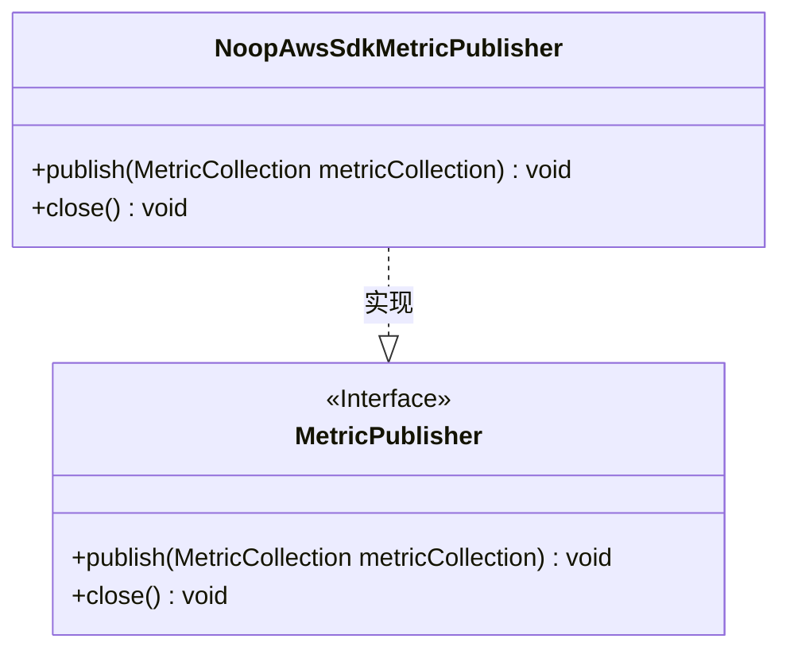
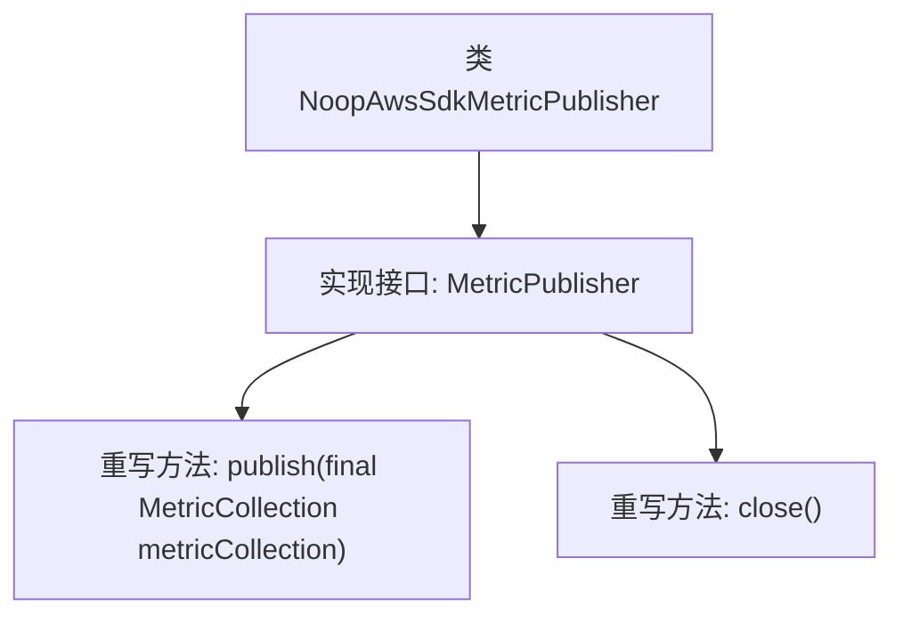

# 基础信息

|      |      |
|------|------|
| 名称 | NoopAwsSdkMetricPublisher |
| 编码语言 | .java |
| 代码路径 | Signal-Server/service/src/main/java/org/whispersystems/textsecuregcm/metrics/NoopAwsSdkMetricPublisher.java |
| 包名 | org.whispersystems.textsecuregcm.metrics |
| 依赖项 | ['software.amazon.awssdk.metrics.MetricCollection', 'software.amazon.awssdk.metrics.MetricPublisher'] |
| 概述说明 | NoopAwsSdkMetricPublisher实现MetricPublisher接口，包含空publish和close方法。 |

# 说明

NoopAwsSdkMetricPublisher类实现了MetricPublisher接口，该类包含两个空方法：publish和close。publish方法用于发布指标数据，而close方法用于关闭资源。由于这两个方法都是空的，意味着该类在实际使用中不会执行任何发布或关闭操作，仅作为占位符或默认实现存在。

# 类列表 Class Summary

| 名称   | 类型  | 说明 |
|-------|------|-------------|
| NoopAwsSdkMetricPublisher | class | NoopAwsSdkMetricPublisher类实现MetricPublisher接口，包含空的publish和close方法。 |

## 类 NoopAwsSdkMetricPublisher

|      |      |
|------|------|
| 访问范围 | public |
| 类型 | class |
| 名称 | NoopAwsSdkMetricPublisher |
| 说明 | NoopAwsSdkMetricPublisher类实现MetricPublisher接口，包含空的publish和close方法。 |

### UML类图

这段代码定义了一个名为 `NoopAwsSdkMetricPublisher` 的类，它实现了 `MetricPublisher` 接口。`NoopAwsSdkMetricPublisher` 类提供了两个方法：`publish` 和 `close`，但它们都是空实现，即不执行任何操作。`MetricPublisher` 接口定义了这两个方法，要求实现类必须提供它们的具体实现。这种设计通常用于提供一个默认的、不执行任何操作的实现，以便在不需要实际发布或关闭度量数据时使用。

### 内部方法调用关系图

该流程图描述了`NoopAwsSdkMetricPublisher`类的结构及其与`MetricPublisher`接口的关系。`NoopAwsSdkMetricPublisher`类实现了`MetricPublisher`接口，并重写了其中的两个方法：`publish`和`close`。`publish`方法接收一个`MetricCollection`类型的参数，但方法体为空；`close`方法同样没有具体实现。这个类可能用于提供一个无操作的实现，以便在不需要实际发布或关闭度量时使用。

### 字段列表 Field List

| 名称  | 类型  | 说明 |
|-------|-------|------|

### 方法列表 Method List

| 名称  | 类型  | 说明 |
|-------|-------|------|
| publish | void | 重写publish方法，接收MetricCollection参数。 |
| close | void | 重写close方法，无具体实现。 |

