# 基础信息

|      |      |
|------|------|
| 名称 | OpenWebSocketCounter |
| 编码语言 | .java |
| 代码路径 | Signal-Server/service/src/main/java/org/whispersystems/textsecuregcm/metrics/OpenWebSocketCounter.java |
| 包名 | org.whispersystems.textsecuregcm.metrics |
| 依赖项 | ['org.whispersystems.textsecuregcm.metrics.MetricsUtil.name', 'io.micrometer.core.instrument.Metrics', 'io.micrometer.core.instrument.Tag', 'io.micrometer.core.instrument.Tags', 'io.micrometer.core.instrument.Timer', 'java.util.Map', 'java.util.concurrent.atomic.AtomicInteger', 'org.whispersystems.textsecuregcm.util.EnumMapUtil', 'org.whispersystems.textsecuregcm.util.ua.ClientPlatform', 'org.whispersystems.textsecuregcm.util.ua.UnrecognizedUserAgentException', 'org.whispersystems.textsecuregcm.util.ua.UserAgentUtil', 'org.whispersystems.websocket.session.WebSocketSessionContext'] |
| 概述说明 | OpenWebSocketCounter类统计WebSocket连接，按平台分类记录连接数和时长。 |

# 说明

OpenWebSocketCounter类主要用于统计WebSocket连接情况，根据客户端平台进行分类，记录每个平台的连接数量以及连接的持续时间。该类的功能包括实时监控和汇总不同平台上的WebSocket连接状态，为系统性能分析和优化提供数据支持。

# 类列表 Class Summary

| 名称   | 类型  | 说明 |
|-------|------|-------------|
| OpenWebSocketCounter | class | OpenWebSocketCounter类用于统计WebSocket连接，按客户端平台分类，记录连接数和持续时间。 |


## 类 OpenWebSocketCounter

|      |      |
|------|------|
| 访问范围 | public |
| 类型 | class |
| 名称 | OpenWebSocketCounter |
| 说明 | OpenWebSocketCounter类用于统计WebSocket连接，按客户端平台分类，记录连接数和持续时间。 |


### UML类图

```mermaid
classDiagram
    class OpenWebSocketCounter {
        -static final String WEBSOCKET_CLOSED_COUNTER_NAME
        -Map~ClientPlatform, AtomicInteger~ openWebsocketsByClientPlatform
        -AtomicInteger openWebsocketsFromUnknownPlatforms
        -Map~ClientPlatform, Timer~ durationTimersByClientPlatform
        -Timer durationTimerForUnknownPlatforms
        +OpenWebSocketCounter(String openWebSocketGaugeName, String durationTimerName)
        +OpenWebSocketCounter(String openWebSocketGaugeName, String durationTimerName, Tags tags)
        -static AtomicInteger buildGauge(String gaugeName, String clientPlatformName, Tags tags)
        -static Timer buildTimer(String timerName, String clientPlatformName, Tags tags)
        +void countOpenWebSocket(WebSocketSessionContext context)
    }

    class ClientPlatform {
        <<Enum>>
    }

    class WebSocketSessionContext {
        +void addWebsocketClosedListener(WebSocketClosedListener listener)
    }

    interface WebSocketClosedListener {
        <<Interface>>
        +void onWebSocketClosed(WebSocketSessionContext context, int statusCode, String reason)
    }

    OpenWebSocketCounter --> ClientPlatform : 依赖
    OpenWebSocketCounter --> WebSocketSessionContext : 依赖
    WebSocketSessionContext --> WebSocketClosedListener : 依赖
```

### 描述
`OpenWebSocketCounter`类用于监控WebSocket连接的打开和关闭状态。它通过`ClientPlatform`枚举来区分不同的客户端平台，并使用`AtomicInteger`和`Timer`来统计各平台的连接数和持续时间。当WebSocket连接关闭时，会通过`WebSocketClosedListener`接口回调来更新统计信息。该类还处理了无法识别用户代理字符串的情况，确保统计的完整性。


### 内部方法调用关系图

```mermaid
graph TD
    A["类OpenWebSocketCounter"]
    B["常量: WEBSOCKET_CLOSED_COUNTER_NAME"]
    C["属性: Map<ClientPlatform, AtomicInteger> openWebsocketsByClientPlatform"]
    D["属性: AtomicInteger openWebsocketsFromUnknownPlatforms"]
    E["属性: Map<ClientPlatform, Timer> durationTimersByClientPlatform"]
    F["属性: Timer durationTimerForUnknownPlatforms"]
    G["构造方法: OpenWebSocketCounter(String openWebSocketGaugeName, String durationTimerName)"]
    H["构造方法: OpenWebSocketCounter(String openWebSocketGaugeName, String durationTimerName, Tags tags)"]
    I["方法: AtomicInteger buildGauge(String gaugeName, String clientPlatformName, Tags tags)"]
    J["方法: Timer buildTimer(String timerName, String clientPlatformName, Tags tags)"]
    K["方法: void countOpenWebSocket(WebSocketSessionContext context)"]
    L["内部操作: Timer.Sample sample = Timer.start()"]
    M["内部操作: AtomicInteger openWebSocketCounter"]
    N["内部操作: Timer durationTimer"]
    O["内部操作: ClientPlatform clientPlatform = UserAgentUtil.parseUserAgentString(context.getClient().getUserAgent()).getPlatform()"]
    P["内部操作: calculatedOpenWebSocketCounter = openWebsocketsByClientPlatform.get(clientPlatform)"]
    Q["内部操作: calculatedDurationTimer = durationTimersByClientPlatform.get(clientPlatform)"]
    R["内部操作: catch UnrecognizedUserAgentException e"]
    S["内部操作: openWebSocketCounter.incrementAndGet()"]
    T["内部操作: context.addWebsocketClosedListener((context1, statusCode, reason) -> { sample.stop(durationTimer); openWebSocketCounter.decrementAndGet(); Metrics.counter(WEBSOCKET_CLOSED_COUNTER_NAME, 'status', String.valueOf(statusCode)).increment(); })"]

    A --> B
    A --> C
    A --> D
    A --> E
    A --> F
    A --> G
    A --> H
    A --> I
    A --> J
    A --> K
    K --> L
    K --> M
    K --> N
    K --> O
    O --> P
    O --> Q
    O -.-> R
    K --> S
    K --> T
```



**描述：**
`OpenWebSocketCounter` 类用于统计和管理WebSocket连接的打开和关闭状态。它通过构造方法初始化不同类型的计数器和计时器，并通过 `countOpenWebSocket` 方法处理WebSocket会话的打开和关闭事件。在会话关闭时，它会记录关闭状态并更新计数器。该类还处理了无法识别用户代理的情况，确保所有连接都能被正确统计。

### 字段列表 Field List

| 名称  | 类型  | 说明 |
|-------|-------|------|
| durationTimersByClientPlatform | Map<ClientPlatform, Timer> | 存储各客户端平台与计时器的映射关系。 |
| openWebsocketsByClientPlatform | Map<ClientPlatform, AtomicInteger> | 私有映射表，按客户端平台统计打开的WebSocket连接数。 |
| openWebsocketsFromUnknownPlatforms | AtomicInteger | 未知平台WebSocket连接的原子计数器。 |
| WEBSOCKET_CLOSED_COUNTER_NAME = name(OpenWebSocketCounter.class, "websocketClosed") | String | 定义WebSocket关闭计数器名称。 |
| durationTimerForUnknownPlatforms | Timer | 私有计时器用于未知平台持续时间测量。 |

### 方法列表 Method List

| 名称  | 类型  | 说明 |
|-------|-------|------|
| buildGauge | AtomicInteger | 构建带平台标签的原子整数指标。 |
| buildTimer | Timer | 构建定时器方法，设置名称、平台标签并注册到全局度量注册表。 |
| countOpenWebSocket | void | 统计WebSocket连接数，根据客户端平台分类，记录连接时长和关闭状态。 |


