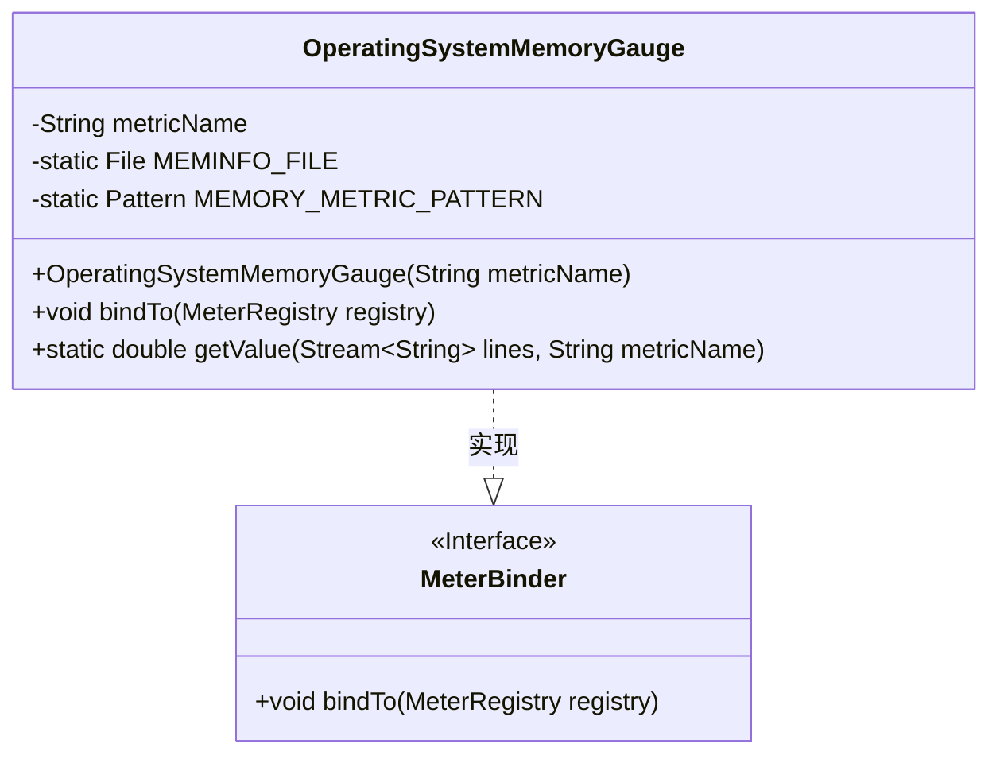
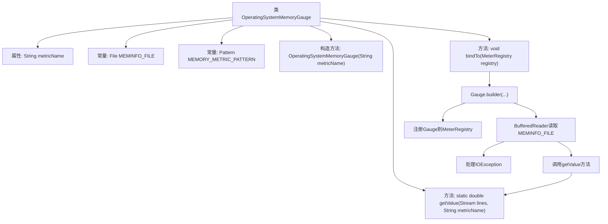

# 基础信息

|      |      |
|------|------|
| 名称 | OperatingSystemMemoryGauge |
| 编码语言 | .java |
| 代码路径 | Signal-Server/service/src/main/java/org/whispersystems/textsecuregcm/metrics/OperatingSystemMemoryGauge.java |
| 包名 | org.whispersystems.textsecuregcm.metrics |
| 依赖项 | ['org.whispersystems.textsecuregcm.metrics.MetricsUtil.name', 'com.google.common.annotations.VisibleForTesting', 'io.micrometer.core.instrument.Gauge', 'io.micrometer.core.instrument.MeterRegistry', 'io.micrometer.core.instrument.binder.MeterBinder', 'java.io.BufferedReader', 'java.io.File', 'java.io.FileReader', 'java.io.IOException', 'java.util.Locale', 'java.util.regex.Matcher', 'java.util.regex.Pattern', 'java.util.stream.Stream'] |
| 概述说明 | 类OperatingSystemMemoryGauge实现MeterBinder，读取/proc/meminfo提取内存指标。 |

# 说明

类OperatingSystemMemoryGauge实现了MeterBinder接口，其主要功能是通过读取/proc/meminfo文件来提取特定的内存指标值。该类的设计旨在监控和收集操作系统的内存使用情况，并将这些指标绑定到度量系统中，以便进行进一步的分析和展示。通过这种方式，开发者可以实时获取系统的内存状态，从而更好地进行性能监控和优化。

# 类列表 Class Summary

| 名称   | 类型  | 说明 |
|-------|------|-------------|
| OperatingSystemMemoryGauge | class | 类OperatingSystemMemoryGauge实现MeterBinder，读取/proc/meminfo文件并提取指定内存指标值。 |

## 类 OperatingSystemMemoryGauge

|      |      |
|------|------|
| 访问范围 | public |
| 类型 | class |
| 名称 | OperatingSystemMemoryGauge |
| 说明 | 类OperatingSystemMemoryGauge实现MeterBinder，读取/proc/meminfo文件并提取指定内存指标值。 |

### UML类图

**描述：**  
`OperatingSystemMemoryGauge` 类实现了 `MeterBinder` 接口，用于监控操作系统的内存使用情况。它通过读取 `/proc/meminfo` 文件并解析其中的内存信息，生成相应的指标。类中包含一个构造函数、一个 `bindTo` 方法用于绑定指标到注册表，以及一个静态 `getValue` 方法用于从文件流中提取特定内存指标的值。

### 内部方法调用关系图

这段代码定义了一个名为`OperatingSystemMemoryGauge`的类，用于监控操作系统的内存使用情况。类中包含一个构造方法和两个主要方法：`bindTo`和`getValue`。`bindTo`方法通过读取`/proc/meminfo`文件，并使用正则表达式匹配特定内存指标的值，然后将这些值注册到`MeterRegistry`中。`getValue`方法则负责从文件内容中提取并返回指定内存指标的值。整个流程展示了从文件读取到数据处理再到注册监控指标的完整过程。

### 字段列表 Field List

| 名称  | 类型  | 说明 |
|-------|-------|------|
| metricName | String | 私有不可变的字符串变量metricName。 |
| MEMORY_METRIC_PATTERN = Pattern.compile("^([^:]+):\\s+([0-9]+).*$") | Pattern | 定义私有静态正则表达式，匹配内存指标格式。 |
| MEMINFO_FILE = new File("/proc/meminfo") | File | 私有静态常量MEMINFO_FILE指向系统内存信息文件/proc/meminfo。 |

### 方法列表 Method List

| 名称  | 类型  | 说明 |
|-------|-------|------|
| getValue | double | 从流中提取匹配指标名称的数值，若无则返回0。 |
| bindTo | void | 绑定内存指标到注册表，读取文件获取值并注册。 |

