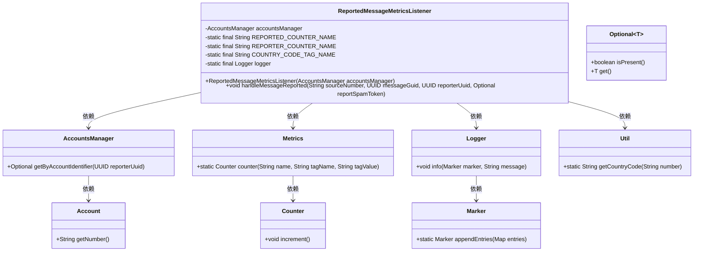
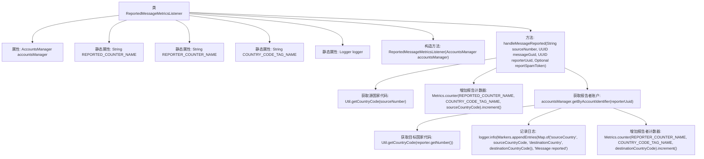

# 基础信息

|      |      |
|------|------|
| 名称 | ReportedMessageMetricsListener |
| 编码语言 | .java |
| 代码路径 | Signal-Server/service/src/main/java/org/whispersystems/textsecuregcm/metrics/ReportedMessageMetricsListener.java |
| 包名 | org.whispersystems.textsecuregcm.metrics |
| 依赖项 | ['com.codahale.metrics.MetricRegistry.name', 'io.micrometer.core.instrument.Metrics', 'java.util.Map', 'java.util.Optional', 'java.util.UUID', 'net.logstash.logback.marker.Markers', 'org.slf4j.Logger', 'org.slf4j.LoggerFactory', 'org.whispersystems.textsecuregcm.storage.AccountsManager', 'org.whispersystems.textsecuregcm.storage.ReportMessageManager', 'org.whispersystems.textsecuregcm.storage.ReportedMessageListener', 'org.whispersystems.textsecuregcm.util.Util'] |
| 概述说明 | ReportedMessageMetricsListener处理消息报告，记录号码和国家代码，更新计数器并写日志。 |

# 说明

ReportedMessageMetricsListener类负责处理消息报告的相关操作。它首先记录消息的源号码和国家代码，然后更新相应的计数器以跟踪消息处理的状态。最后，该类还会记录日志，以便后续分析和监控。通过这些步骤，ReportedMessageMetricsListener确保消息报告的完整性和可追溯性。

# 类列表 Class Summary

| 名称   | 类型  | 说明 |
|-------|------|-------------|
| ReportedMessageMetricsListener | class | ReportedMessageMetricsListener类处理消息报告，记录源号码和国家代码，更新计数器并记录日志。 |

## 类 ReportedMessageMetricsListener

|      |      |
|------|------|
| 访问范围 | public |
| 类型 | class |
| 名称 | ReportedMessageMetricsListener |
| 说明 | ReportedMessageMetricsListener类处理消息报告，记录源号码和国家代码，更新计数器并记录日志。 |

### UML类图

**描述：**  
`ReportedMessageMetricsListener`类实现了`ReportedMessageListener`接口，用于处理消息报告事件。它依赖于`AccountsManager`来获取报告者信息，`Metrics`来记录计数器，`Logger`来记录日志，以及`Util`来获取国家代码。当处理报告消息时，它会根据报告者和被报告者的国家代码分别更新两个计数器，并记录相关日志信息。

### 内部方法调用关系图

这段代码定义了一个`ReportedMessageMetricsListener`类，用于处理消息报告事件并记录相关指标。类中包含一个构造方法和一个`handleMessageReported`方法，该方法首先获取源国家代码并增加报告计数器，然后通过报告者UUID获取账户信息，进一步获取目标国家代码并记录日志，最后增加报告者计数器。整个过程通过日志和计数器来跟踪消息报告事件的发生。

### 字段列表 Field List

| 名称  | 类型  | 说明 |
|-------|-------|------|
| accountsManager | AccountsManager | 私有账户管理器实例。 |
| logger = LoggerFactory.getLogger(ReportedMessageMetricsListener.class) | Logger | 定义日志记录器，用于ReportedMessageMetricsListener类的日志输出。 |
| REPORTED_COUNTER_NAME = name(ReportMessageManager.class, "reported") | String | 定义了一个名为REPORTED_COUNTER_NAME的静态常量字符串，值为类名和方法名的组合。 |
| COUNTRY_CODE_TAG_NAME = "countryCode" | String | 定义常量COUNTRY_CODE_TAG_NAME，值为"countryCode"。 |
| REPORTER_COUNTER_NAME = name(ReportMessageManager.class, "reporter") | String | 定义常量REPORTER_COUNTER_NAME，用于报告消息管理器的计数器名称。 |

### 方法列表 Method List

| 名称  | 类型  | 说明 |
|-------|-------|------|
| handleMessageReported | void | 处理消息举报，记录来源国和目标国，并更新相关计数器。 |

