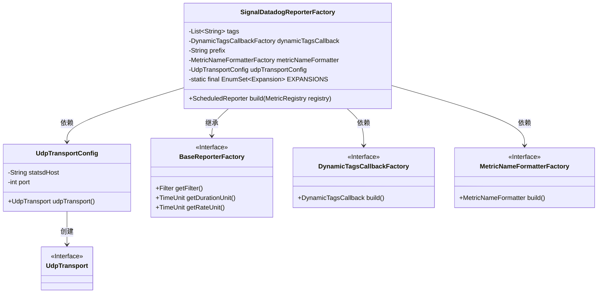
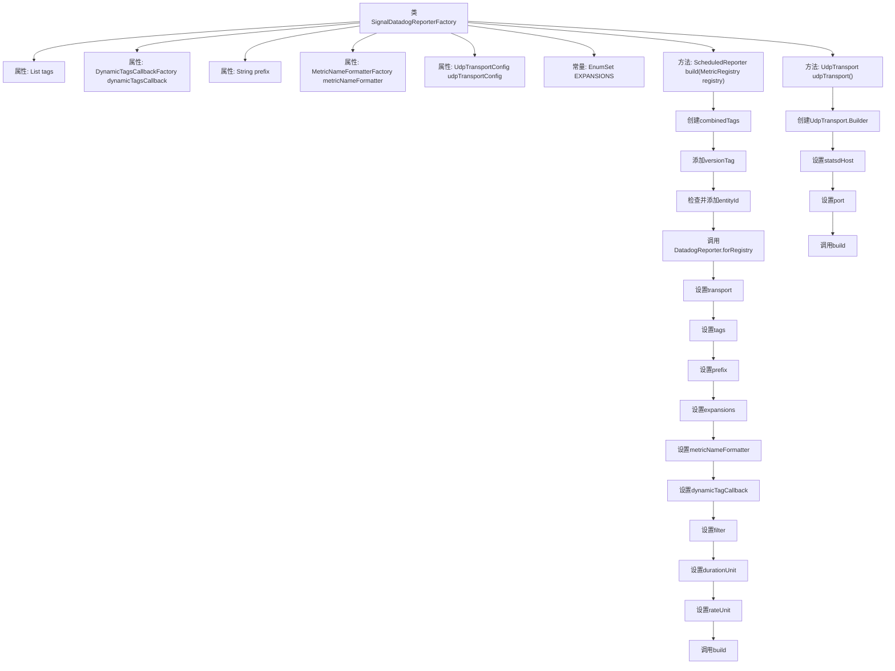

# 基础信息

|      |      |
|------|------|
| 名称 | SignalDatadogReporterFactory |
| 编码语言 | .java |
| 代码路径 | Signal-Server/service/src/main/java/org/whispersystems/textsecuregcm/metrics/SignalDatadogReporterFactory.java |
| 包名 | org.whispersystems.textsecuregcm.metrics |
| 依赖项 | ['com.codahale.metrics.MetricRegistry', 'com.codahale.metrics.ScheduledReporter', 'com.fasterxml.jackson.annotation.JsonProperty', 'com.fasterxml.jackson.annotation.JsonTypeName', 'io.dropwizard.metrics.common.BaseReporterFactory', 'jakarta.validation.Valid', 'jakarta.validation.constraints.Min', 'jakarta.validation.constraints.NotNull', 'java.util.ArrayList', 'java.util.EnumSet', 'java.util.List', 'org.apache.commons.lang3.StringUtils', 'org.coursera.metrics.datadog.DatadogReporter', 'org.coursera.metrics.datadog.DatadogReporter.Expansion', 'org.coursera.metrics.datadog.DefaultMetricNameFormatterFactory', 'org.coursera.metrics.datadog.DynamicTagsCallbackFactory', 'org.coursera.metrics.datadog.MetricNameFormatterFactory', 'org.coursera.metrics.datadog.transport.UdpTransport', 'org.whispersystems.textsecuregcm.WhisperServerVersion'] |
| 概述说明 | SignalDatadogReporterFactory类用于构建Datadog报告器，支持标签、前缀、UDP和格式化。 |

# 说明

SignalDatadogReporterFactory类的主要功能是构建Datadog报告器，支持多种配置选项。该类允许用户添加标签、设置前缀、使用UDP传输协议以及自定义指标格式化方式。通过这些功能，用户可以灵活地定制报告器的行为，确保数据能够准确且高效地传输到Datadog平台，满足不同监控需求。

# 类列表 Class Summary

| 名称   | 类型  | 说明 |
|-------|------|-------------|
| SignalDatadogReporterFactory | class | SignalDatadogReporterFactory类用于构建Datadog报告器，支持标签、前缀、UDP传输和指标格式化。 |

## 类 SignalDatadogReporterFactory

|      |      |
|------|------|
| 访问范围 | @JsonTypeName("signal-datadog");public |
| 类型 | class |
| 名称 | SignalDatadogReporterFactory |
| 说明 | SignalDatadogReporterFactory类用于构建Datadog报告器，支持标签、前缀、UDP传输和指标格式化。 |

### UML类图

**描述：**
`SignalDatadogReporterFactory` 是一个用于构建 `DatadogReporter` 的工厂类，继承自 `BaseReporterFactory`。它包含多个配置项，如 `tags`、`dynamicTagsCallback`、`prefix` 和 `metricNameFormatter`，并通过 `UdpTransportConfig` 配置 UDP 传输。`build` 方法根据这些配置项构建并返回一个 `ScheduledReporter` 实例。`UdpTransportConfig` 类负责创建 `UdpTransport` 实例，用于数据传输。

### 内部方法调用关系图

该流程图描述了`SignalDatadogReporterFactory`类的结构及其主要方法`build`和`udpTransport`的执行流程。`build`方法负责创建一个`ScheduledReporter`实例，通过一系列步骤设置相关参数并最终调用`build`方法生成实例。`udpTransport`方法则负责创建一个`UdpTransport`实例，通过设置`statsdHost`和`port`参数并调用`build`方法完成。

### 字段列表 Field List

| 名称  | 类型  | 说明 |
|-------|-------|------|
| tags = null | List<String> | JSON属性标记为私有字符串列表，初始值为空。 |
| dynamicTagsCallback = null | DynamicTagsCallbackFactory | 动态标签回调工厂属性定义为空。 |
| prefix = null | String | JSON属性映射，私有字符串变量prefix初始化为null。 |
| EXPANSIONS = EnumSet.of(      Expansion.COUNT,      Expansion.MIN,      Expansion.MAX,      Expansion.MEAN,      Expansion.MEDIAN,      Expansion.P75,      Expansion.P95,      Expansion.P99,      Expansion.P999  ) | EnumSet<Expansion> | 定义了包含统计扩展项的枚举集合。 |
| udpTransportConfig | UdpTransportConfig | UdpTransportConfig字段必须非空且有效。 |
| metricNameFormatter = new DefaultMetricNameFormatterFactory() | MetricNameFormatterFactory | 验证非空的度量名称格式化工厂，默认使用默认工厂实例。 |

### 方法列表 Method List

| 名称  | 类型  | 说明 |
|-------|-------|------|
| build | ScheduledReporter | 构建ScheduledReporter，整合版本和环境标签，配置DatadogReporter。 |

