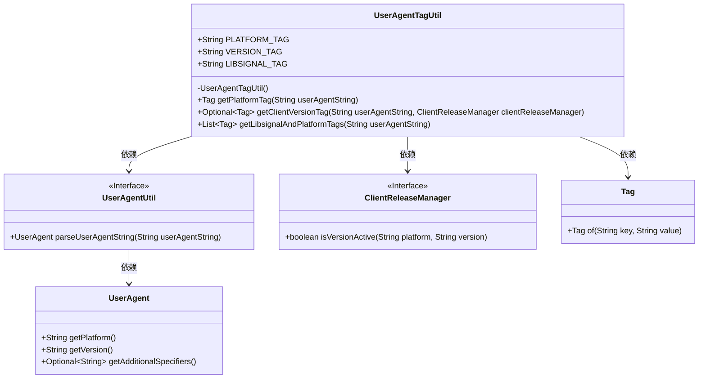
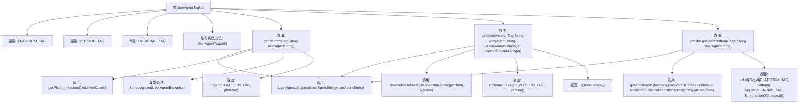

# 基础信息

|      |      |
|------|------|
| 名称 | UserAgentTagUtil |
| 编码语言 | .java |
| 代码路径 | Signal-Server/service/src/main/java/org/whispersystems/textsecuregcm/metrics/UserAgentTagUtil.java |
| 包名 | org.whispersystems.textsecuregcm.metrics |
| 依赖项 | ['io.micrometer.core.instrument.Tag', 'java.util.List', 'java.util.Optional', 'org.whispersystems.textsecuregcm.storage.ClientReleaseManager', 'org.whispersystems.textsecuregcm.util.ua.UnrecognizedUserAgentException', 'org.whispersystems.textsecuregcm.util.ua.UserAgent', 'org.whispersystems.textsecuregcm.util.ua.UserAgentUtil'] |
| 概述说明 | UserAgentTagUtil类解析用户代理字符串，生成平台、版本和libsignal标签。 |

# 说明

UserAgentTagUtil类的主要功能是解析用户代理字符串，并从中提取平台、版本和libsignal标签信息。通过解析用户代理字符串，该类能够生成相关的标签，帮助识别用户所使用的平台及其版本，以及libsignal的相关信息。这一过程对于理解和处理用户代理数据至关重要，尤其是在需要根据用户代理信息进行特定操作或分析的场景中。

# 类列表 Class Summary

| 名称   | 类型  | 说明 |
|-------|------|-------------|
| UserAgentTagUtil | class | UserAgentTagUtil类用于解析用户代理字符串，生成平台、版本和libsignal标签。 |

## 类 UserAgentTagUtil

|      |      |
|------|------|
| 访问范围 | public |
| 类型 | class |
| 名称 | UserAgentTagUtil |
| 说明 | UserAgentTagUtil类用于解析用户代理字符串，生成平台、版本和libsignal标签。 |

### UML类图

这段代码定义了一个 `UserAgentTagUtil` 工具类，用于从用户代理字符串中提取平台、客户端版本和 libsignal 相关的标签。该类依赖于 `UserAgentUtil` 来解析用户代理字符串，`ClientReleaseManager` 来验证客户端版本是否活跃，以及 `Tag` 类来创建标签。代码通过捕获 `UnrecognizedUserAgentException` 异常来处理无法识别的用户代理字符串，确保在异常情况下返回默认值或空值。

### 内部方法调用关系图

这段代码定义了一个`UserAgentTagUtil`工具类，用于解析用户代理字符串并生成相应的标签。类中包含三个静态方法：`getPlatformTag`用于获取平台标签，`getClientVersionTag`用于获取客户端版本标签，`getLibsignalAndPlatformTags`用于获取平台和libsignal标签。每个方法都通过`UserAgentUtil.parseUserAgentString`解析用户代理字符串，并根据解析结果生成相应的标签。代码还处理了`UnrecognizedUserAgentException`异常，确保在解析失败时返回默认值。

### 字段列表 Field List

| 名称  | 类型  | 说明 |
|-------|-------|------|
| PLATFORM_TAG = "platform" | String | 定义了一个静态常量字符串变量，标签为“platform”。 |
| VERSION_TAG = "clientVersion" | String | 定义常量VERSION_TAG，值为"clientVersion"。 |
| LIBSIGNAL_TAG = "libsignal" | String | LIBSIGNAL_TAG 定义为常量字符串 "libsignal"。 |

### 方法列表 Method List

| 名称  | 类型  | 说明 |
|-------|-------|------|
| getClientVersionTag | Optional<Tag> | 方法解析用户代理字符串，若版本有效则返回版本标签，否则返回空。 |
| getLibsignalAndPlatformTags | List<Tag> | 解析用户代理字符串，获取平台和libsignal信息，返回标签列表。 |
| getPlatformTag | Tag | 从用户代理字符串中提取平台标签，若无法识别则标记为"unrecognized"。 |

