# 基础信息

|      |      |
|------|------|
| 名称 | metrics |
| 编码语言 | .java |
| 代码路径 | Signal-Server/service/src/main/java/org/whispersystems/textsecuregcm/metrics |
| 包名 | Signal-Server.service.src.main.java.org.whispersystems.textsecuregcm.metrics |
| 概述说明 | 各类功能涵盖请求监控、内存管理、日志传输、性能分析、消息度量等，助力系统优化与稳定性提升。 |

# 说明

## 概述
该代码模块主要专注于系统的监控、统计和性能优化，涵盖了从请求处理、内存管理、日志记录到消息传递等多个方面的指标收集和分析。通过使用MeterRegistry、Logstash、Datadog等工具，模块能够实时监控系统的运行状态，帮助开发者和运维人员识别性能瓶颈、优化资源使用，并确保系统的稳定性和高效性。

## 主要业务场景
1. **请求监控与性能分析**：
   - `MetricsRequestEventListener` 和 `MetricsHttpChannelListener` 类用于捕获HTTP请求的路径、方法、状态码等信息，并通过MeterRegistry进行统计和分析，帮助优化请求处理性能。
   - `MetricsApplicationEventListener` 监听应用事件，处理非HTTP流量，确保在非HTTP场景下也能有效监控系统性能。

2. **内存管理与监控**：
   - `OperatingSystemMemoryGauge` 和 `FreeMemoryGauge` 类通过读取系统内存信息，实时监控内存使用情况，帮助优化内存管理和资源调度。
   - `GarbageCollectionGauges` 类记录垃圾收集的次数和时间，分析内存管理效率，识别潜在的性能瓶颈。

3. **日志记录与传输**：
   - `LogstashTcpSocketAppenderFactory` 类创建支持SSL加密和异步日志记录的Logstash TCP套接字日志追加器，确保日志传输的安全性和灵活性。

4. **消息传递与延迟监控**：
   - `MessageMetrics` 类度量消息传递过程中的账户UUID匹配情况和消息延迟，确保消息的准确性和传递效率。
   - `ReportedMessageMetricsListener` 类处理消息报告，记录源号码和国家代码，更新计数器，确保消息报告的可追溯性和完整性。

5. **WebSocket连接监控**：
   - `OpenWebSocketCounter` 类统计WebSocket连接情况，记录不同平台的连接数量和持续时间，为系统性能分析提供数据支持。

6. **应用状态监控**：
   - `ApplicationShutdownMonitor` 类监控应用程序的关闭状态，确保在多线程环境下安全记录和跟踪应用关闭状态。

7. **AWS SDK性能监控**：
   - `MicrometerAwsSdkMetricPublisher` 类发布与AWS SDK相关的指标，监控API调用性能，确保AWS SDK操作的高效性。

8. **用户代理解析**：
   - `UserAgentTagUtil` 类解析用户代理字符串，提取平台、版本和libsignal标签信息，帮助识别用户所使用的平台及其版本。

9. **指标注册表管理**：
   - `MicrometerRegistryManager` 类管理MeterRegistry的生命周期，确保注册表在停止时能够正确关闭，避免资源泄漏。
   - `MetricsUtil` 类配置和管理指标注册表，支持多种指标类型，并提供过滤器功能，灵活处理和监控指标数据。

通过以上功能，该模块为系统提供了全面的监控和优化支持，确保系统的高效运行和稳定性。

### 包内部结构视图

```mermaid
graph TD
    metrics --> MetricsRequestEventListener.java
    metrics --> OperatingSystemMemoryGauge.java
    metrics --> LogstashTcpSocketAppenderFactory.java
    metrics --> MicrometerRegistryManager.java
    metrics --> MessageMetrics.java
    metrics --> FreeMemoryGauge.java
    metrics --> ReportedMessageMetricsListener.java
    metrics --> ApplicationShutdownMonitor.java
    metrics --> TrafficSource.java
    metrics --> SignalDatadogReporterFactory.java
    metrics --> GarbageCollectionGauges.java
    metrics --> OpenWebSocketCounter.java
    metrics --> MetricsHttpChannelListener.java
    metrics --> MetricsApplicationEventListener.java
    metrics --> MetricsUtil.java
    metrics --> NoopAwsSdkMetricPublisher.java
    metrics --> UserAgentTagUtil.java
    metrics --> MicrometerAwsSdkMetricPublisher.java
```

该流程图展示了 `metrics` 文件夹下的所有文件及其层级关系。每个文件都直接隶属于 `metrics` 文件夹，没有进一步的子文件夹结构。这些文件主要涉及与监控、度量和日志相关的功能，涵盖了从内存使用、垃圾回收、WebSocket 计数到 AWS SDK 度量发布等多个方面。

# 文件列表 File List

| 名称   | 类型  | 说明 |
|-------|------|-------------|
| [MicrometerRegistryManager.java](MicrometerRegistryManager.md) | file | MicrometerRegistryManager负责管理MeterRegistry生命周期，确保停止时关闭注册表。 |
| [LogstashTcpSocketAppenderFactory.java](LogstashTcpSocketAppenderFactory.md) | file | LogstashTcpSocketAppenderFactory创建支持SSL、自定义字段和异步日志的TCP套接字日志追加器。 |
| [MetricsUtil.java](MetricsUtil.md) | file | MetricsUtil类用于配置管理指标注册表，支持多类型指标和过滤器。 |
| [MetricsHttpChannelListener.java](MetricsHttpChannelListener.md) | file | MetricsHttpChannelListener类监控HTTP请求，记录路径、方法、状态码和用户代理，通过MeterRegistry统计。 |
| [TrafficSource.java](TrafficSource.md) | file | 信息为空，无法生成概要描述。 |
| [MicrometerAwsSdkMetricPublisher.java](MicrometerAwsSdkMetricPublisher.md) | file | MicrometerAwsSdkMetricPublisher类发布AWS SDK指标，记录API调用及子指标。 |
| [UserAgentTagUtil.java](UserAgentTagUtil.md) | file | UserAgentTagUtil类解析用户代理字符串，生成平台、版本和libsignal标签。 |
| [NoopAwsSdkMetricPublisher.java](NoopAwsSdkMetricPublisher.md) | file | NoopAwsSdkMetricPublisher实现MetricPublisher接口，包含空publish和close方法。 |
| [MetricsApplicationEventListener.java](MetricsApplicationEventListener.md) | file | MetricsApplicationEventListener监听应用事件，处理非HTTP流量，返回MetricsRequestEventListener。 |
| [OpenWebSocketCounter.java](OpenWebSocketCounter.md) | file | OpenWebSocketCounter类统计WebSocket连接，按平台分类记录连接数和时长。 |
| [GarbageCollectionGauges.java](GarbageCollectionGauges.md) | file | 注册垃圾收集器指标，记录收集次数与时间。 |
| [SignalDatadogReporterFactory.java](SignalDatadogReporterFactory.md) | file | SignalDatadogReporterFactory类用于构建Datadog报告器，支持标签、前缀、UDP和格式化。 |
| [ApplicationShutdownMonitor.java](ApplicationShutdownMonitor.md) | file | ApplicationShutdownMonitor类监控应用关闭状态，用AtomicBoolean记录并通过Gauge注册到MeterRegistry。 |
| [ReportedMessageMetricsListener.java](ReportedMessageMetricsListener.md) | file | ReportedMessageMetricsListener处理消息报告，记录号码和国家代码，更新计数器并写日志。 |
| [FreeMemoryGauge.java](FreeMemoryGauge.md) | file | FreeMemoryGauge类实现MeterBinder接口，监控系统空闲内存。 |
| [MessageMetrics.java](MessageMetrics.md) | file | MessageMetrics类用于度量消息延迟和账户UUID匹配情况。 |
| [OperatingSystemMemoryGauge.java](OperatingSystemMemoryGauge.md) | file | 类OperatingSystemMemoryGauge实现MeterBinder，读取/proc/meminfo提取内存指标。 |
| [MetricsRequestEventListener.java](MetricsRequestEventListener.md) | file | MetricsRequestEventListener监听请求事件，记录路径、方法、状态码，并通过MeterRegistry统计。 |

