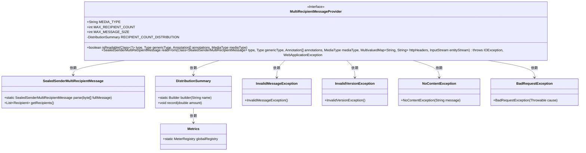
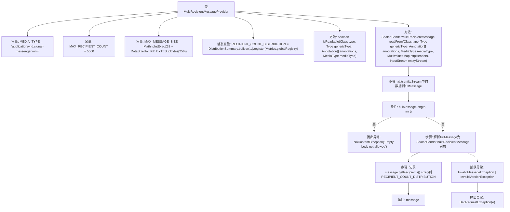

# 基础信息

|      |      |
|------|------|
| 名称 | MultiRecipientMessageProvider |
| 编码语言 | .java |
| 代码路径 | Signal-Server/service/src/main/java/org/whispersystems/textsecuregcm/providers/MultiRecipientMessageProvider.java |
| 包名 | org.whispersystems.textsecuregcm.providers |
| 依赖项 | ['org.whispersystems.textsecuregcm.metrics.MetricsUtil.name', 'io.dropwizard.util.DataSizeUnit', 'io.micrometer.core.instrument.DistributionSummary', 'io.micrometer.core.instrument.Metrics', 'jakarta.ws.rs.BadRequestException', 'jakarta.ws.rs.Consumes', 'jakarta.ws.rs.WebApplicationException', 'jakarta.ws.rs.core.MediaType', 'jakarta.ws.rs.core.MultivaluedMap', 'jakarta.ws.rs.core.NoContentException', 'jakarta.ws.rs.ext.MessageBodyReader', 'jakarta.ws.rs.ext.Provider', 'java.io.IOException', 'java.io.InputStream', 'java.lang.annotation.Annotation', 'java.lang.reflect.Type', 'org.signal.libsignal.protocol.InvalidMessageException', 'org.signal.libsignal.protocol.InvalidVersionException', 'org.signal.libsignal.protocol.SealedSenderMultiRecipientMessage'] |
| 概述说明 | MultiRecipientMessageProvider类处理多接收者消息，支持5000接收者和256KiB消息，验证媒体类型并解析。 |

# 说明

MultiRecipientMessageProvider类专门用于处理多接收者消息，支持最多5000个接收者和最大256KiB的消息大小。该类具备验证媒体类型的功能，并能够解析消息内容，确保消息格式和类型的正确性。通过高效处理大量接收者和较大消息，提升了消息传递的可靠性和效率。

# 类列表 Class Summary

| 名称   | 类型  | 说明 |
|-------|------|-------------|
| MultiRecipientMessageProvider | class | MultiRecipientMessageProvider类处理多接收者消息，支持最大5000接收者和256KiB消息，验证媒体类型并解析消息。 |

## 类 MultiRecipientMessageProvider

|      |      |
|------|------|
| 访问范围 | @Provider;@Consumes(MultiRecipientMessageProvider.MEDIA_TYPE);public |
| 类型 | class |
| 名称 | MultiRecipientMessageProvider |
| 说明 | MultiRecipientMessageProvider类处理多接收者消息，支持最大5000接收者和256KiB消息，验证媒体类型并解析消息。 |

### UML类图

这段代码定义了一个 `MultiRecipientMessageProvider` 类，该类实现了 `MessageBodyReader` 接口，用于处理多接收者消息的读取和验证。它通过 `readFrom` 方法从输入流中读取消息，并验证消息的有效性。如果消息无效，会抛出 `BadRequestException`。此外，该类还使用 `DistributionSummary` 来记录接收者数量的分布情况。

### 内部方法调用关系图

这段代码定义了一个`MultiRecipientMessageProvider`类，用于处理多接收者消息的读取和验证。它包含两个主要方法：`isReadable`用于检查消息是否可读，`readFrom`用于从输入流中读取并解析消息。如果消息为空，则抛出`NoContentException`；如果解析过程中出现错误，则抛出`BadRequestException`。此外，代码还通过`RECIPIENT_COUNT_DISTRIBUTION`记录了接收者数量的分布情况。

### 字段列表 Field List

| 名称  | 类型  | 说明 |
|-------|-------|------|
| MAX_RECIPIENT_COUNT = 5000 | int | 最大接收者数量为5000。 |
| MEDIA_TYPE = "application/vnd.signal-messenger.mrm" | String | 定义常量MEDIA_TYPE，值为"application/vnd.signal-messenger.mrm"。 |
| MAX_MESSAGE_SIZE = Math.toIntExact(32 + DataSizeUnit.KIBIBYTES.toBytes(256)) | int | 定义最大消息大小为32加256KiB的字节数。 |
| RECIPIENT_COUNT_DISTRIBUTION = DistributionSummary      .builder(name(MultiRecipientMessageProvider.class, "recipients"))      .publishPercentileHistogram(true)      .register(Metrics.globalRegistry) | DistributionSummary | 定义了一个静态的DistributionSummary对象，用于记录接收者数量的分布情况，并注册到全局指标库。 |

### 方法列表 Method List

| 名称  | 类型  | 说明 |
|-------|-------|------|
| isReadable | boolean | 方法检查媒体类型和类是否匹配，返回布尔值。 |
| readFrom | SealedSenderMultiRecipientMessage | 读取并解析密封发送的多接收者消息，验证内容并记录接收者数量。 |

